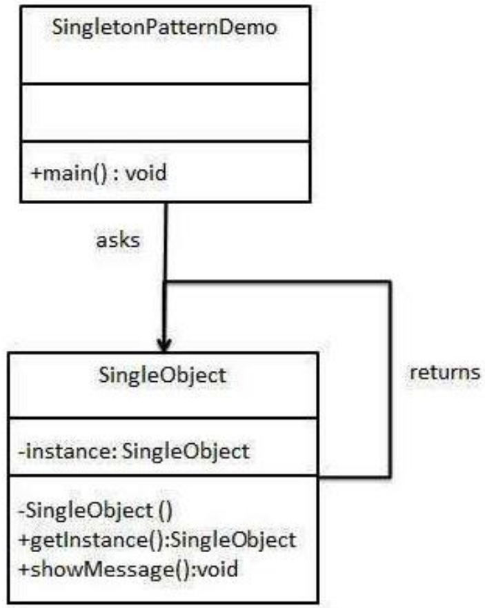
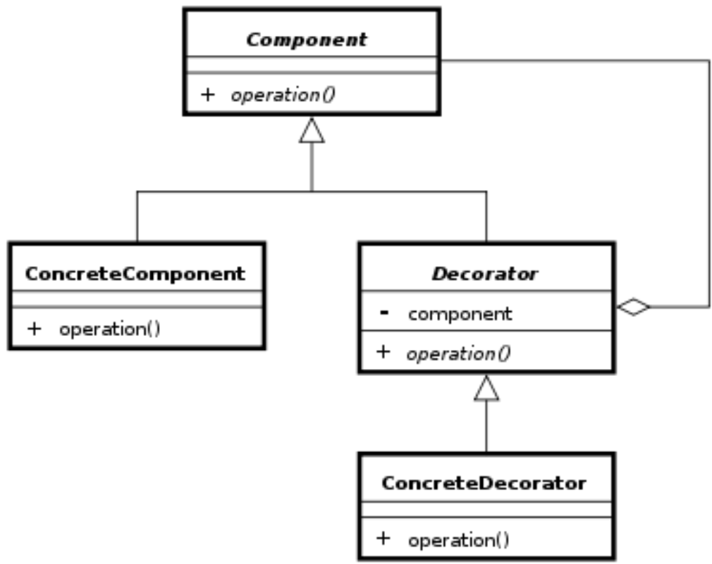
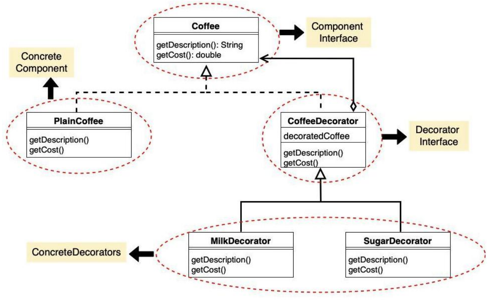
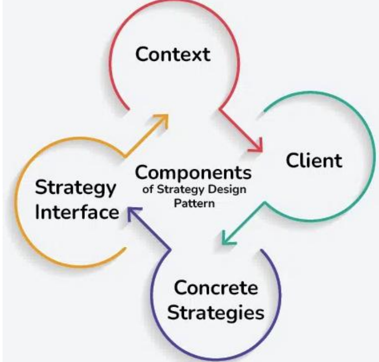

#  Design Patterns

Design patterns represent the best practices used by experienced object-oriented software developers. Design patterns are solutions to general problems that software developers faced during software development. These solutions were obtained by trial and error by numerous software developers over quite a substantial period of time.

##  Usage of Design Pattern

Design Patterns have two main usages in software development.

##  Common platform for developers

Design patterns provide a standard terminology and are specific to particular scenarios. For example, a singleton design pattern signifies the use of a single object so all developers familiar with single design pattern will make use of single object and they can tell each other that the program is following a singleton pattern.

##  Best Practices

Design patterns have evolved over a long period of time and they provide best solutions to certain problems faced during software development. Learning these patterns helps inexperienced developers to learn software design in an easy and faster way.

Types of Design Patterns in Java

Java design patterns are divided into three categories –

• Creational,

● Structural, and

● Behavioral design patterns.

###  1. Creational Design Patterns in Java

Creational design patterns are a subset of design patterns in software development. They deal with the process of object creation, trying to make it more flexible and efficient. It makes the system independent and how its objects are created, composed, and represented.

Types of Creational Design Patterns in Java:

###  1.1 Factory Method

Factory Method is a creational design pattern that provides an interface for creating objects in superclass, but subclasses are responsible to create the instance of the class.

###  1.2 Abstract Factory Method

Abstract Factory Method is a creational design pattern, it provides an interface for creating families of related or dependent objects without specifying their concrete classes.

#  1.3 Builder Method

Builder Method is a creational design pattern, it provides an interface for constructing an object and then have concrete builder classes that implement this interface to create specific

##  1.4 Prototype Method

Prototype Method is a creational design pattern,pattern it provides to create new objects with the same structure and initial state as an existing object without explicitly specifying their class or construction details.

1.

Singleton Method is a creational design pattern, it provides a class that has only one instance, and that instance provides a global point of access to it.

#  2. Structural Design Patterns in Java

Structural design patterns are a subset of design patterns in software development that focus on the composition of classes or objects to form larger, more complex structures. They help in organizing and managing relationships between objects to achieve greater flexibility, reusability, and maintainability in a software system.

Types of Structural Design Patterns in Java:

##  2.1 Adapter Method

Adapter Method is a structural design pattern, it allows you to make two incompatible interfaces work together by creating a bridge between them.

##  2.2 Bridge Method

Bridge Method is a structural design pattern, it is designed to separate an object's abstraction from its implementation so that the two can vary independently.

##  2.3 Composite Method

Composite Method is a structural design pattern, it's used to compose objects into tree structures to represent part-whole hierarchies. This pattern treats both individual objects and compositions of objects; it allows clients to work with complex structures of objects as if they were individual objects.

##  2.4 Decorator Method

The Decorator Method is a structural design pattern, it allows to add behavior to individual objects, either statically or dynamically, without affecting the behavior of other objects from the same class.

##  2.5 Facade Method

Facade Method is a structural design pattern, it provides a simplified, higher-level interface to a set of interfaces in a subsystem, making it easier for clients to interact with that subsystem.

#  2.6 Proxy Method

Proxy Method is a structural design pattern, it provides a substitute for an object, which can act as an intermediary or control access to the real object.

##  2.7 Flyweight Method

Flyweight Method is a structural design pattern, it is used when we need to create a lot of objects of a class. Since every object consumes memory space that can be crucial for low memory devices, flyweight design patterns can be applied to reduce the load on memory by sharing objects.

#  3. Behavioral Design Patterns in Java

Behavioral design patterns are a subset of design patterns in software development that deal with the communication and interaction between objects and classes. They focus on how objects and classes collaborate and communicate to accomplish tasks and responsibilities.

Types of Behavioral Design Pattern in Java:

##  3.1 Command Method

Command Method is a Behavioral Design Pattern, it promotes loose coupling between the sender (client) and the receiver (the object that performs the operation) and provides a way to support undoable operations.

###  3.2 Iterator Method

Iterator Method is a Behavioral Design Pattern, it provides a way to access elements of an aggregate object (a collection) sequentially without exposing the underlying representation of that collection.

####  3.3 Mediator Method

Mediator Method is a Behavioral Design Pattern, it promotes loose coupling between objects by centralizing their communication through a mediator object. Instead of objects directly communicating with each other, they communicate through the mediator, which encapsulates the interaction and coordination logic.

#  3.4 Memento Method

Momento Method is a Behavioral Design Pattern, it provides to save and restore the previous state of an object without revealing the details of its implementation.

##  3.5 Observer method

Observer Method is a Behavioral Design Pattern, it defines a one-to-many dependency between objects, so that when one object (the subject) changes state, all its dependents (observers) are notified and updated automatically.

#  3.6 State Method

State Method is a Behavioral Design Pattern, it allows an object to alter its behavior when its internal state changes.

##  3.7 Strategy Method

Strategy Method is a Behavioral Design Pattern, it defines a family of algorithms, encapsulates each one, and makes them interchangeable and it allows a client to choose an appropriate algorithm from a family of algorithms at runtime.

#  3.8 Template Method

Template Method is a Behavioral Design Pattern, it defines the skeleton of an algorithm in a method but lets subclasses alter some steps of that algorithm without changing its structure.

#  3.9 Visitor Method

Visitor Method is a Behavioral Design Pattern, it is used when you have a set of structured, hierarchical objects and you want to perform various operations on these objects without modifying their classes.

##  3.10 Null Object Method

Null Object Method is a Behavioral Design Pattern, it is used to handle the absence of a valid object by providing an object that does nothing or provides default behavior.

#  Singleton Design Pattern in Java

Singleton pattern is one of the simplest design patterns in Java. This type of design pattern comes under creational pattern as this pattern provides one of the best ways to create an object.

This pattern involves a single class which is responsible for creating an object while making sure that only a single object gets created. This class provides a way to access its only object which can be accessed directly without need to instantiate the object of the class.

##  Implementation

We're going to create a SingleObject class. SingleObject class has its constructor as private and has a static instance of itself.

SingleObject class provides a static method to get its static instance to the outside world. SingletonPatternDemo, our demo class will use the SingleObject class to get a SingleObject object.

There are two forms of singleton design pattern:

○ Early Instantiation: creation of instance at load time.

○ Lazy Instantiation: creation of instance when required.

#  How to create a Singleton design pattern?

To create the singleton class, we need to have a static member of class, private constructor and static factory method.

○ Static member: It gets memory only once because of static, it contains the instance of the Singleton class.

○ Private constructor: It will prevent instantiating the Singleton class from outside the class.

○ Static factory method: This provides the global point of access to the Singleton object and returns the instance to the caller.

#  Decorator

##  Decorator Design Pattern (also known as Wrapper)

The Decorator Design Pattern is a structural design pattern that allows behavior to be added to individual objects dynamically, without affecting the behavior of other objects from the same class. It involves creating a set of decorator classes that are used to wrap concrete components.

This pattern is useful when you need to add functionality to objects in a flexible and reusable way.

###  Key Components of the Decorator Design Pattern

● Component Interface: This is an abstract class or interface that defines the common interface for both the concrete components and decorators. It specifies the operations that can be performed on the objects.

● Concrete Component: These are the basic objects or classes that implement the Component interface. They are the objects to which we want to add new behavior or responsibilities.

● Decorator: This is an abstract class that also implements the Component interface and has a reference to a Component object. Decorators are responsible for adding new behaviors to the wrapped Component object.

● Concrete Decorator: These are the concrete classes that extend the Decorator class. They add specific behaviors or responsibilities to the Component. Each Concrete Decorator can add one or more behaviors to the Component.

#  Example of Decorator Design Pattern

Suppose we are building a coffee shop application where customers can order different types of coffee. Each coffee can have various optional add-ons such as milk, sugar, whipped cream, etc. We want to implement a system where we can dynamically add these add-ons to a coffee order without modifying the coffee classes themselves.

#  Task:

Assume that you have a burger shop where you sell three types of burger. There is an option for the customers to add extra cheese with the burger by paying extra money. Now, your task is to develop a system, where users will order and get a normal burger and also can get a cheesy burger by adding extra cheese according to their choice.

#  Strategy Pattern

In Strategy pattern, a class behavior or its algorithm can be changed at run time. This type of design pattern comes under behavior pattern.

In Strategy pattern, we create objects which represent various strategies and a context object whose behavior varies as per its strategy object. The strategy object changes the executing algorithm of the context object.

##  Components of the Strategy Design Pattern

###  1. Context

The Context is a class or object that holds a reference to a strategy object and delegates the task to it.

● The Context maintains a reference to a strategy object and calls its methods to perform the task, allowing for interchangeable strategies to be used.

###  2. Strategy Interface

The Strategy Interface is an interface or abstract class that defines a set of methods that all concrete strategies must implement.

● It serves as a contract, ensuring that all strategies adhere to the same set of rules and can be used interchangeably by the Context.

● By defining a common interface, the Strategy Interface allows for decoupling between the Context and the concrete strategies, promoting flexibility and modularity in the design.

###  3. Concrete Strategies

Concrete Strategies are the various implementations of the Strategy Interface. Each concrete strategy provides a specific algorithm or behavior for performing the task defined by the Strategy Interface.

● Concrete strategies encapsulate the details of their respective algorithms and provide a method for executing the task.

● They are interchangeable and can be selected and configured by the client based on the requirements of the task.

#  4. Client

The Client is responsible for selecting and configuring the appropriate strategy and providing it to the Context.
