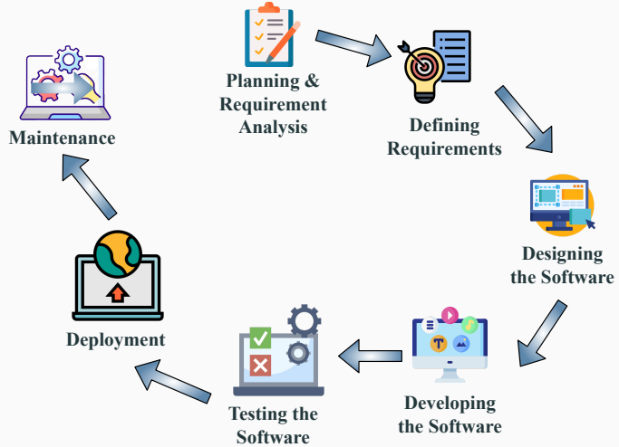

##  Introduction to Software Engineering

#  Table of contents

1. Software Development Life Cycle

2. General Principles of Software Engineering

#  Software Development Life Cycle

##  Need for SDLC

● Developing s/w in a disciplined and systematic manner

• Helps while working in a team.

Suppose a software development issue is divided into various parts and the parts are assigned to the team members. From then on, suppose the team representative is allowed the freedom to develop the roles assigned to them in whatever way they like. It is possible that one representative might start writing the code for his part, another might choose to prepare the test documents first, and some other engineer might begin with the design phase of the roles assigned to him. This would be one of the perfect methods for project failure.

#  SDLC Life Cycle i

Figure 1: There are seven major steps in the software development life cycle

#  Planning and requirement analysis

● Most important and necessary stage in SDLC.

• Business analyst and Product manager will set up a meeting with the client and gather the requirements, like what the customer wants to build, who will be the end user, what is the objective of the product.

• Feasibility Study: Assessment of the practicality of a proposed project. It helps decision-makers determine whether or not a proposed project or investment is likely to be successful.

#  Defining Requirements

● Once the requirement is understood, the SRS (Software Requirement Specification) document is created.

● Contains all the product requirements to be constructed and developed during the project life cycle.

#  Designing the Software

● This phase is the product of last two stages.

• Bring down all the knowledge of requirement and analysis and design the software.

#  Developing the Project

• The actual development begins.

• Developers follow the coding guidelines defined by the management and use various programming tools to develop the software.

#  SDLC Life Cycle  ii

##  Testing

• Tested against the requirements to make sure that the products are solving the needs addressed and gathered during the requirements stage.

##  Deployment

● Once the software is certified, and no bugs or errors are stated, then it is deployed.

##  Maintenance

• In this stage, the client starts using the developed systems, then the real issues come up and requirements are solved from time to time.

#  General Principles of Software Engineering

David Hooker proposed seven principles that focus on software engineering.

| Principle |
| --- |
| A principle is a kind of rule, belief, or idea that guides you |

##  The First Principle: The Reason It All Exists

● A software system exists for one reason: to provide value to its users.

● Before specifying a system requirement/noting a piece of system functionality/determining the hardware platforms or development processes, ask yourself questions such as: "Does this add real value to the system?"

The Second Principle: Keep It Simple, Stupid!

● All design should be as simple as possible, but no simpler

● Having a more easily understood and easily maintained system

##  The Third Principle: Maintain the Vision

● A clear vision is essential to the success of a software project

• Compromising the architectural vision of a software system weakens and will eventually break even the well-designed systems

##  The Fourth Principle: What You Produce, Others Will Consume

● Always specify, design, and implement knowing someone else will have to understand what you are doing.

· Design, keeping the implementers in mind

● Code with concern for those that must maintain and extend the system.

##  The Fifth Principle: Be Open to the Future

● Systems must be ready to adapt to any changes: specification can change any moment, or any hardware platforms can be obsolete in just a few months!

#  The Sixth Principle: Plan Ahead for Reuse

● Build the software so that the code and design can be reused as necessary

• Planning ahead for reuse reduces the cost and increases the value of both the reusable components and the systems into which they are incorporated.

#  General Principles of Software Engineering v

##  The Seventh principle: Think!

• Placing clear, complete thought before action almost always produces better results.

• When you think about something, you are more likely to do it right and also gain knowledge about how to do it right again.

● If you do think about something and still do it wrong, it becomes a valuable experience.

#  Any Questions??

