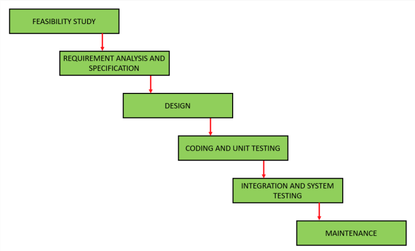
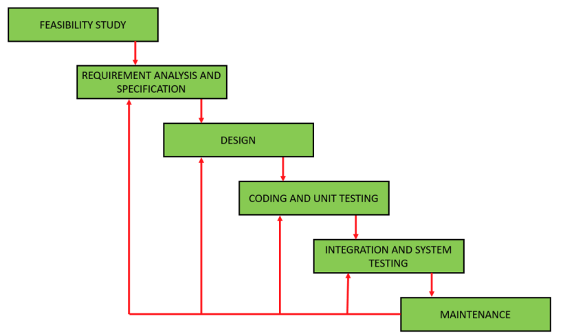

##  Lecture 4: Software Process Models

#  Table of contents

1. Introduction

2. The Waterfall Model

3. Application of Waterfall Model

4. Advantages of Waterfall Model

5. Disadvantages of Waterfall Model

6. Iterative Waterfall Model

7. Advantages of Iterative Waterfall Model

8. Disadvantages of Iterative Waterfall Model

#  Introduction

• Software Process: A software process is a set of related activities that leads to the production of a software product.

● Software process model is a simplified representation of a software process.

#  The Waterfall Model

· First SDLC model

· Output of current phase = Input for the next phase

● Next phase is started only after the defined set of goals are achieved for previous phase and it is signed off

Figure 1: The Waterfall Model (Ref: geeksforgeeks)

##  Feasibility Study

Assessment of the practicality of a proposed project. It helps decision-makers determine whether or not a proposed project or investment is likely to be successful.

##  Requirements Analysis and Specification

● System's services, constraints, and goals are established by consultation with system users.

● They are then defined in detail and serve as a system specification.

##  System and Software Design

● Transform the requirements gathered in the SRS into a suitable form which permits further coding in a programming language.

• Define the overall software architecture together with high level and detailed design.

##  Coding and Unit Testing

● The system is first developed in small programs called units, which are integrated in the next phase.

· Unit testing is done in this phase.

##  Integration and System Testing

● All the units developed in the previous phase are integrated into a system after testing of each unit.

● Post integration the entire system is tested for any faults and failures.

##  Maintenance and Operation

● This is the longest life cycle phase.

· The system is installed and put into practical use.

· Maintenance: Correcting errors which were not discovered in earlier stages of the life cycle, improving the implementation of system units and enhancing the system's services as new requirements are discovered.

#  Application of Waterfall Model

##  Waterfall Model: Application

Some situations where the use of Waterfall model is most appropriate are:

• Clear, well documented and fixed requirements

● Requirements are unlikely to change radically during system development

* Dynamic technology and tools are not used

• No ambiguous requirements

● Project is short

#  Advantages of Waterfall Model

##  Advantages of Waterfall Model

● Model is simple and easy to understand.

· Requirements are simple and explicitly declared.

● Requirements remain unchanged during the entire project development.

● Start and end points for each phase is fixed, which makes it easy to cover progress

● The release date for the complete product, as well as its final cost, can be determined before development.

• Works well for small projects.

#  Disadvantages of Waterfall Model

##  Disadvantages of Waterfall Model

● Model is not suitable for more significant and complex projects.

● Can't accept the changes in requirements during development.

● It becomes tough to go back to the phase. For example, if the application has now shifted to the coding phase, and there is a change in requirement, it becomes tough to go back and change.

• Since the testing done at a later stage, it does not allow identifying the challenges and risks in the earlier phase, so the risk reduction strategy is difficult to prepare.

· No working software is produced until late during the life cycle.

#  Iterative Waterfall Model

· Improved version of Classic Waterfall Model.

● Same as Waterfall model with some changes are made to increase the efficiency of the software development.

• Main difference from the classical Waterfall model: Provides feedback paths from every phase to its preceding phases, which is the main difference from the classical Waterfall model.

● When errors are detected at some later phase, these feedback paths allow correcting errors committed by programmers during some phases. The feedback paths allow the phase to be reworked in which errors are committed and these changes are reflected in the later phases.

• There is no feedback path to the stage – feasibility study, because once a project has been taken, does not give up the project easily.

Figure 2: Iterative Waterfall Model (Ref: geeksforgeeks)

#  Advantages of Iterative Waterfall Model

| Feedback Path |
| --- |
| In the classical waterfall model, there are no feedback paths, so there is no mechanism for error correction. But in the iterative waterfall model feedback path from one phase to its preceding phase allows correcting the errors that are committed and these changes are reflected in the later phases. |

| Simple |
| --- |
| Very simple to understand and use. |

| Separation of Phases |
| --- |
| The clear separation of phases allows for better planning and management of the project, as each phase has specific goals and deliverables. |

| Well-organized |
| --- |
| Less time is consumed on documenting and the team can spend more time on development and designing. |

#  Disadvantages of Iterative Waterfall Model

##  Difficult to Incorporate Change Requests

The major drawback of the iterative waterfall model is that all the requirements must be clearly stated before starting the development phase. Customers may change requirements after some time but the iterative waterfall model does not leave any scope to incorporate change requests that are made after the development phase starts.

##  Incremental Delivery Not Supported

In the iterative waterfall model, the full software is completely developed and tested before delivery to the customer. There is no scope for any intermediate delivery. So, customers have to wait a long for getting the software.

##  Overlapping of Phases Not Supported

Iterative waterfall model assumes that one phase can start after completion of the previous phase, But in real projects, phases may overlap to reduce the effort and time needed to complete the project.

##  Risk Handling Not Supported

Projects may suffer from various types of risks. But the Iterative waterfall model has no mechanism for risk handling.

##  Limited Customer Interactions

Customer interaction occurs at the start of the project at the time of requirement gathering and at project completion at the time of software delivery. These fewer interactions with the customers may lead to many problems as the finally developed software may differ from the customers' actual requirements.

#  Any Questions??

