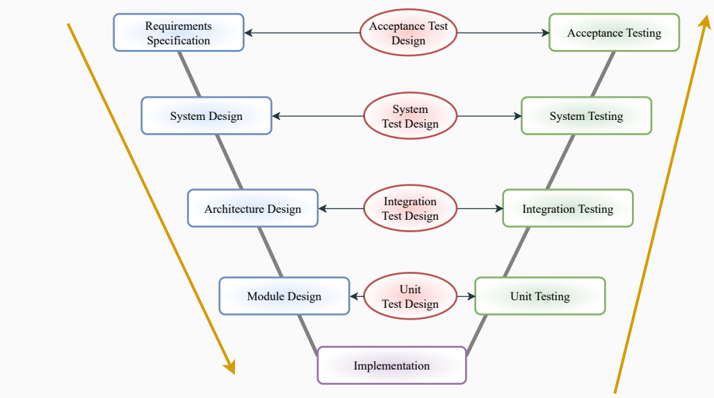
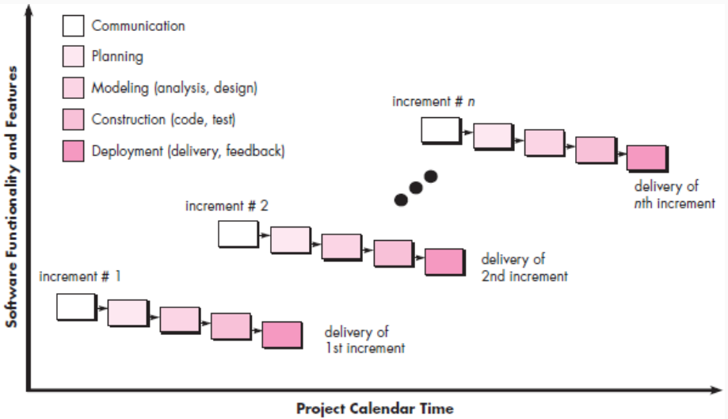

##  Lecture 5: Software Process Models

#  Table of contents

1. Verification vs Validation

2. V Shaped Model

3. Application of V Shaped Model

4. Advantages of V Shaped Model

5. Disadvantages of V Shaped Model

6. Incremental Model

7. Application of Incremental Model

8. Advantages of Incremental Model

9. Disadvantages of Incremental Model

#  Verification vs Validation

| Verification |
| --- |
| Verification: Process of determining if the software is designed and developed as per the specified requirements. |
| Static analysis method (review) is done without executing code. |
| Validation |
| Validation: Process of checking if the software (end product) has met the client's true needs and expectations. |
| Dynamic analysis method (functional, non-functional testing) is done by executing code. |

| Verification | Validation |
| --- | --- |
| Verification is the process of evaluating the artifacts of software development in order to ensure that the product being developed will comply to the standards. | Validation is the process of validating that the developed software product conforms to the specified business requirements. |
| It is a static process of analysing the documents and not the actual end product. | It involves dynamic testing of a software product by running it. |
| Verification is a process oriented approach. | Validation is a product-oriented approach. |
| Answers the question – “Are we building the product right?” | Answers the question – “Are we building the right product?” |
| Errors found during verification require lesser cost/resources to get fixed as compared to be found during the validation phase. | Errors found during validation require more cost/resources. Later the error is discovered higher is the cost to fix it. |
| It involves activities like document review, test case review, walk-throughs, inspection etc. | It involves activities like functional testing, automation testing etc. |

##  V Shaped Model

· Known as Verification and Validation model

● Extension of Waterfall Model

● Linear like Waterfall model: Next phase will start only if the preceding phase is completed

● Testing is associated with every phase of the lifecycle

● Verification Phase: Requirements Analysis, System Design, Architecture Design, Module Design

● Validation: Unit Testing, Integration, System, Acceptance testing

● Testing of s/w is planned in parallel with corresponding phase of development

##  Requirements analysis

● Management tries to understand the requirements from customer perspective

● Before closing this phase Plan of acceptance testing should be done

● Once the s/w is ready the user will test for acceptance.

· Output: Mutually agreed requirement document

##  System Design

• Analyse the documents

● Conduct feasibility study

· Design the overall system

· Example: Design of the whole building (3 storey)

· Output: High level system design

● Design contains high level picture of complete system: user, software, hardware, interfaces and database

● Before closing this phase Plan of system testing should be done

● System testing is done just before the product release

#  V Shaped Model

##  Architecture Design

· Analyze High level system design

· Generate High level software design

· Example: Design of the each floor of the building

● Take all technical decisions: programming language, communication protocols memory etc

● Before closing this phase Plan of integration testing should be done

##  Module Design

● S/w developer design individual modules

· Generate low level design documents

● Before closing this phase Plan of unit testing should be done

#  Application of V Shaped Model

##  Application of V Shaped Model

· When the requirement is well defined and not ambiguous.

• Small to medium-sized projects where requirements are clearly defined and fixed.

• Should be chosen when sample technical resources are available with essential technical expertise.

#  Advantages of V Shaped Model

##  Advantages of V Shaped Model

● Simple and easy to Understand.

● Testing Methods like planning, test designing happens well before coding.

● This saves a lot of time. Hence a higher chance of success over the waterfall model.

• Avoids the downward flow of the defects.

● Works well for small plans where requirements are easily understood.

#  Disadvantages of V Shaped Model

##  Disadvantages of V Shaped Model

● Not suitable for complex and object oriented projects.

● If any changes happen in the midway, then the test documents along with the required documents, has to be updated.

• Need crystal clear Documents.

• Very rigid and least flexible

#  Incremental Model

● Requirements divided into multiple standalone modules

· Module by module working

● Every subsequent release of the module adds function to the previous release

● Each module goes through the communication, planning, modeling, constriction and deployment phases

· First increment is often a core product

• Customer feedback form core system is addressed during later increments

● This process is repeated following the delivery of each increment, until the complete product is produced

· Customer interaction maximum

#  Application of Incremental Model

##  Applications of Incremental Model

● A project has a lengthy development schedule.

· When Software team are not very well skilled or trained.

● When the customer demands a quick release of the product.

• You can develop prioritized requirements first.

#  Advantages of Incremental Model

##  Advantages of Incremental Model

• Errors are easy to be recognized

• Easier to test and debug

· Tolerate changing requirements

· Balance cost and manpower

· Simple to manage risk because it is handled during its iteration

● The client gets important functionality early

#  Disadvantages of Incremental Model

| Disadvantages of Incremental Model |
| --- |
| • Need for good planning |
| • Actual cost may exceed the estimated cost |
| • A problem in one unit needs to be corrected in all units, which takes a lot of time |

#  Any Questions??

