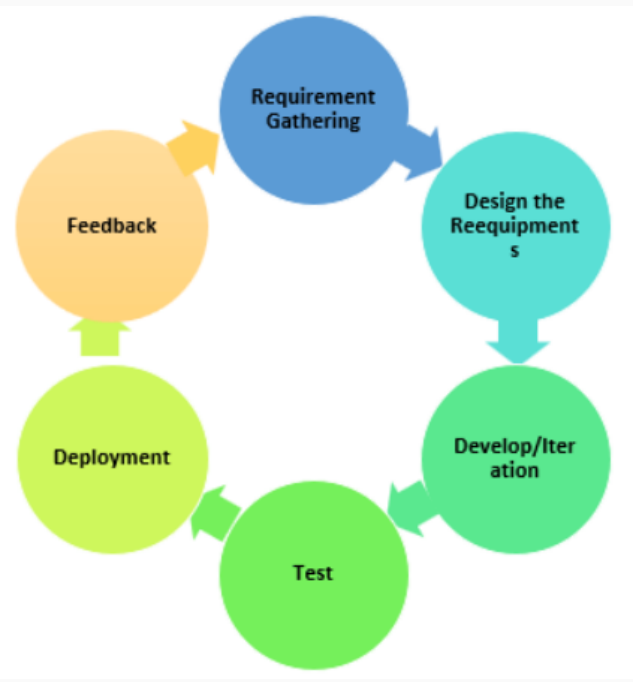
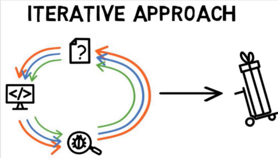
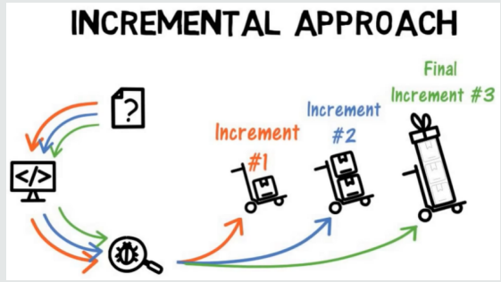
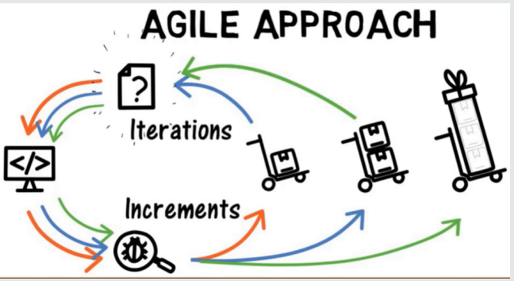
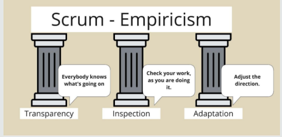
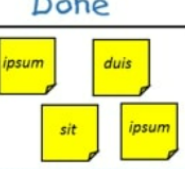
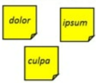
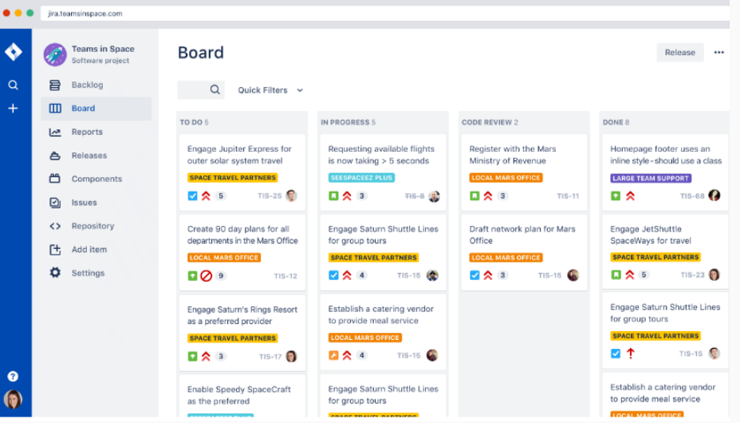

##  Lecture 6: Software Process Models

#  Table of contents

1. Agile Model

2. Agile: Incremental or Iterative?

3. SCRUM: An Agile Approach

#  Agile Model

##  Agile Methodology

● Iterative and Incremental approach to software development.

● Small incremental builds presented in multiple iterations to the end-user and other stakeholders for their feedback.

● Based on the feedback, changes are incorporated in the next iterations of the build on the basis of their priority.

##  Requirements Gathering

• Define requirements

• Feasibility study

· Explain business opportunities

· Plan the time and effort needed to build the project

##  Design the Requirements

● Create the design based on requirements

###  Develop/Iteration

• Product, design, and development teams start working, and the product will undergo different stages of improvement using simple and minimal functionality.

#  Test

● Quality Assurance team checks the system's performance and reports bugs during this phase.

##  Deployment

● Initial product is released to the user.

#  Feedback

● The team receives feedback about the product and works on correcting bugs based on the received feedback.

Agile: Incremental or Iterative?

#  Agile: Incremental or Iterative?

● Both Incremental and Iterative!!

#  Iterative Approach

● Starts with very basic features

• Refines them in subsequent iterations to deliver the product

· Until all customer requirements are met

#  Agile Model iii

##  Incremental Approach

● Starts with important features: first increment

· Adding new features in increments

● Until the final product is delivered

##  Agile Approach

· Deliver smaller increments as well as refine through iterations

#  Incremental approach

• Focuses on delivering stable, working releases of a software product

● Each release adds new features or functionality

● Development plan is pre-defined and may be more rigid

• Customer feedback is typically gathered at the end of each increment

● Suitable for larger, more structured development projects

● Can be used by larger, more traditional development teams that may be organized around specific functional areas or disciplines

#  Agile Approach

• Focuses on delivering value to the customer in the form of working software as quickly as possible

· Then iterates and improves upon it based on customer feedback

● Development plan is flexible and adaptable, with short iterations or sprints

• Customer involvement and collaboration is a high priority throughout the development process

● More suitable for dynamic and rapidly changing development environments

• Usually involves small, self-organizing, cross-functional teams that work closely together to deliver working software

#  Agile vs Incremental Model iii

##  Agile vs Incremental Model

Overall, while both approaches involve iterative development and the delivery of working software in increments, the incremental approach is more suitable for larger and more structured development projects, while the Agile approach is better suited to dynamic and rapidly changing development environments.

#  Example

Suppose a company wants to develop a new mobile app that allows users to track their daily water intake. The company has two options for the development approach: an incremental approach or an Agile approach.

#  Incremental Approach

● Create a development plan outlining three increments, each increment adding new functionality.

· First increment: develop a basic app allowing users to input their daily water intake.

• Second increment: Add features (reminders and notifications) to help users remember to drink water.

• Third increment: Add social sharing features to allow users to share their progress with friends.

● Work on each increment in a sequential manner, with each increment building on the previous one.

● Also use an iterative approach within each increment to refine and improve the functionality.

#  Agile Approach

· The team works in short sprints.

· First increment: develop a basic app allowing users to input their daily water intake.

● Work closely with the product owner to ensure that the app meets the needs of the users.

• In subsequent sprints, the team continues to develop and refine the app based on user feedback and evolving requirements.

#  Agile vs Incremental Summary

##  Summary

• Agile approach places a greater emphasis on flexibility and customer involvement, as the development team can adjust the development plan and priorities based on feedback from users and stakeholders.

● The incremental approach, on the other hand, is more structured and pre-defined, with a clear plan for each increment of development.

• The incremental approach and the Agile approach both involve iterative development and the delivery of working software in increments, but the Agile approach places a greater emphasis on flexibility, collaboration, and customer involvement.

#  Advantages of Agile Methodology

##  Advantages

• Very much suited for projects where requirements and the end product is not very clear.

● Promotes customer satisfaction as their feedbacks and changes are embraced.

● Reduces risk factors as early deliverables are made visible to the end-users.

● Exhaustive planning is not required at the beginning of the development process.

• Easy to manage with minimal rules and more flexibility.

● Dividing the project into incremental deliverable builds leads to more focus on the quality of the product.

#  Disadvantages of Agile Methodology

##  Disadvantages

• As it is highly customer-centric, so it can pose a problem when the customer does not have a clear understanding of the product and process.

• Lack of formal documentation and designing leads to a very high dependency on individuals for training and other tasks.

● For complex projects, the resource requirement and effort are difficult to estimate.

• Frequent deliverables, feedback, and collaboration can be very demanding for some customers.

● Because of the ever-evolving features, there is always a risk of the ever-lasting project.

#  SCRUM: An Agile Approach

#  Definition

Agile framework for managing and completing complex projects.

#  SCRUM!!

• People often ask, “Is Scrum an acronym for something?” and the answer is NO.

• It is actually inspired by a scrum in the sport of rugby. In rugby, the team comes together in what they call a scrum to work together to move the ball forward.

• It involves up to eight players from each team, known as the pack or forward pack, binding together in three rows and interlocking with the three opposing teams front row.

• In this context, Scrum is where the team comes together to move the product forward.

#  Key Idea

· Break down complex projects into smaller, manageable pieces.

● Increments of valuable work are delivered in short cycles of one month or less, which are called Sprints.

● Each sprint starts with a planning meeting where the team decides what work will be completed during the sprint.

• Team works on the identified tasks throughout the sprint, and at the end of the sprint, they hold a review meeting to demonstrate what they have completed and receive feedback.

#  SCRUM Events

Events that create regularity and minimize other meetings.

● Sprint - short cycles of one month or less, during which the work is done; the Sprint contains all of the other Scrum events; a new Sprint starts immediately after the conclusion of the previous Sprint.

● Sprint Planning - event dedicated to planning out the work that will take place during the Sprint.

• Daily Scrum - event held every day where the Developers inspect the progress toward the Sprint Goal, uncover anything that may be getting in their way and adapt accordingly.

#  SCRUM Events Cont.

Sprint Review - event held at the end of the Sprint where the Scrum Team and key stakeholders review what was accomplished in the Sprint and what has changed in their environment; next, attendees collaborate on what to do next.

Sprint Retrospective - the Scrum team gets together during this event to talk about how the last Sprint went and identify the most helpful changes to improve their effectiveness.

#  Major roles in SCRUM

• Scrum is built around three main roles: the product owner, the Scrum Master, and the development team.

• Product owner (typically a business representative who has a good understanding of the product and its users) is responsible for defining and prioritizing the product backlog, which is a list of all the features and requirements for the product.

• The Scrum Master is responsible for ensuring that the Scrum process is followed correctly, and for helping the team to remove any obstacles that might be blocking progress.

● The development team is responsible for delivering the working product increment at the end of each sprint.

#  Three pillars of SCRUM

##  Three pillars of SCRUM

• Scrum is an empirical process, where decisions are based on observation, experience and experimentation.

● Empiricism is the idea that all learning comes from only experience and observations.

#  Three Pillars of SCRUM i

##  Transparency

• The scrum team needs to have transparency around its team agreements, the ways of collaboration within and beyond the team, as well as the company vision and strategy and how the product increment contributes to them.

● For inspection to occur, transparency is paramount.

• Without transparency, inspection will be a waste of time and resources — even more time and resources will be spent in vain executing decisions based on an inspection without transparency.

#  Inspection

• We inspect the progress toward the agreed product goal and the current sprint goal often and thoroughly. This creates early visibility into challenges in the product increment or the development process.

● For any adaptation, inspection is paramount.

• Without inspection, adaptation will be a waste of time and resources. Your team may spend an entire sprint in vain executing decisions based on an adaptation without inspection.

#  Three Pillars of SCRUM iii

##  Adaptation

• As soon as inspection reveals the need to adapt the product increment or the development, process changes should be made.

● The scrum team decides the necessary actions and executes them.

• The surrounding organization must empower the scrum team to expedite the development and the evolution of the development process.

#  SCRUM Artifacts

##  SCRUM Artifacts

• Scrum artifacts allow Scrum teams to work toward their sprint goal.

● The artifacts provide and capture key information at each sprint checkpoint to ensure everything remains on track.

There are three types of artifacts in SCRUM.

#  Product Backlog

• An evolving, ordered list of what is needed to improve the product

● The changes cover anything from general maintenance to technical work, fixes, features addition, and more.

● Commitment: Product Goal - the target the team plans against

#  Sprint Backlog

• A highly visible list of work that is the Developer’s plan for the Sprint, which may evolve as they learn

● To figure out what to work on first and prioritize tasks, the development team checks the sprint backlog.

● Has all the tasks the Scrum team needs to complete in a particular sprint.

· Commitment: Sprint Goal - the single objective of the Sprint.

#  SCRUM Artifacts iii

| Sprint Backlog | Sprint Backlog | Sprint Backlog | Sprint Backlog |
| --- | --- | --- | --- |
| Forecast | To-Do | In-Progress |  |
| Fix My Profile 5 |  |  |  |
| Filter Service Tickets 8 |  |   culpa |  |
| Quick Tips    |  |  |  |

#  Product Increment

● It's the output of each sprint and provides a releasable version of the product.

• You can deliver as often as needed during the Sprint and are not limited to only one release per Sprint.

● Commitment: Definition of Done - the description of what it takes for an Increment to be considered complete.

#  Jira

• Jira is a popular project management tool developed by Atlassian that helps teams organize, track, and manage their work.

• Jira allows users to create and track tasks, issues, bugs, and other types of work items, assign them to team members, and set due dates and priorities.

#  Some More Implementation of Agile Approach

· Kanban

· Extreme Programming (XP)

• Crystal

#  Any Questions??

