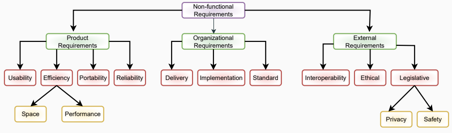

##  Lecture 7: Requirement Engineering

#  Table of contents

1. Requirement Engineering

2. SRS Document

#  Requirement Engineering

##  Definition

Requirement engineering (RE) is the process of defining, documenting, and maintaining the requirements of a software system.

RE provides appropriate mechanism to understand.

| RE |
| --- |
| · What the customer desires |
| · Analysing the needs |
| · Assessing feasibility |
| · Negotiating a reasonable solution |
| · Specifying the solution clearly |
| · Validating the specification |
| · Managing the requirement |

#  Types of Requirement Engineering

##  User Requirements

User requirements are statements in a natural language plus diagrams, of what services the system is expected to provide and the constraints under which it must operate.

##  System Requirements

● System requirement sets out the system functions, service and operational constraints in detail. The system requirement document (functional specification) should be precise. It should define exactly what is to be implemented.

· 2 questions: What (What the user wants) and How (how do we do it).

#  Types of System Requirements

There are three types of system requirements.

Functional Requirements
What? (what should we implement) is the functional requirement.
Statement of services the system should provide.

Non-functional Requirements
How? (How should we implement) is the non-functional requirement.
These requirements describe how well the system must perform, in terms of characteristics such as reliability, usability, performance, scalability, maintainability, and security.

##  Domain Requirements

• Domain requirements are a type of software requirement that describe specific features or capabilities that are unique to a particular application domain. A domain is a specific area of expertise or knowledge, such as healthcare, finance, or manufacturing, and domain requirements are those requirements that are specific to that domain.

• For example, a healthcare domain requirement might specify that the software needs to be able to store and manage patient records, or that it must adhere to certain regulatory requirements related to patient confidentiality.

#  Types of Non-functional Requirements

This is a 5 step process.

##  Feasibility Study

● Three types of Feasibility

● Technical Feasibility: Whether enough technical support is available or not.

● Operational Feasibility: How easily can we operate or maintain the software.

• Economic Feasibility: Whether the necessary software can generate financial profits for an organization.

##  Requirement Elicitation and Analysis

· Requirement gathering and analysis Phase.

● The requirements are analyzed to identify inconsistencies, defects, omission, etc.

• There are several techniques that can be used to elicit requirements.

· Interviews: One-on-one conversations with stakeholders

• Surveys: Questionnaires distributed to stakeholders to gather information about their needs and expectations.

• Focus Groups: These are small groups of stakeholders.

· Prototyping: Creating a working model of the software system.

##  Software Requirement Specification

* Documentation: functional, user, non-functional requirements documentation.

· Use various type of diagrams: use case, activity, ER diagram etc.

• Constraints and Acceptance criteria.

##  Software Requirement Validation

● After requirement specifications developed, the requirements discussed in this document are validated.

• The user might demand illegal, impossible solution or experts may misinterpret the needs.

##  Software Requirement Management

• Process of analyzing, documenting, tracking, prioritizing and agreeing on the requirement.

· Controlling the communication to relevant stakeholders.

#  Requirement Engineering Process

##  Software Requirement Management (Cont.)

• There are several key activities that are involved in requirements management, including:

• Tracking and controlling changes: Monitoring and controlling changes to the requirements throughout the development process, including identifying the source of the change, assessing the impact of the change, and approving or rejecting the change.

● Version control: This involves keeping track of different versions of the requirements document and other related artifacts.

● Traceability: Linking the requirements to other elements of the development process, such as design, testing, and validation.

● Communication: Ensuring that the requirements are communicated effectively to all stakeholders and that any changes or issues are addressed in a timely manner.

● Monitoring and reporting: Monitoring the progress of the development process and reporting on the status of the requirements.

#  SRS Document

#  Software Requirement Specification

##  What should be included in a SRS

• Introduction: This section provides an overview of the project, including the purpose of the system, its intended audience, and any other relevant background information.

- Functional Requirements: This section should outline the features and functionality of the software system, and the specific requirements for each.

● Non-functional Requirements: This section should detail the system's non-functional requirements such as performance, security, reliability, scalability, and usability.

· User Stories: A set of user stories that describe how the system should behave from a user's perspective.

##  What should be included in a SRS

• Use Cases: This section outlines various use cases for the system, describing how it should behave under different scenarios.

• Data Requirements: This section should detail any data that needs to be collected or processed by the system, as well as any data sources and formats.

• Assumptions and Constraints: This section should outline any assumptions made about the system and any constraints that might impact its development or use.

• System Architecture: This section should describe the overall system architecture, including hardware and software components.

#  What should be included in a SRS

##  Software Requirement Specification

· Design Constraints: This section should outline any design constraints for the system, such as compatibility with existing systems or adherence to industry standards.

• Testing Requirements: This section should describe the testing requirements for the system, including test cases and test scenarios.

#  Software Requirement Specification i

##  What should not be included in a SRS

● Implementation details: The SRS document should focus on the requirements for the system, rather than specific implementation details.

● Technology choices: While the system architecture should be outlined, specific technology choices should be left to the development team.

• Project Management Details: SRS documents should focus on defining the system requirements, and should not include project management details like timelines, budgets, or staffing.

· User Interface Details: While the SRS document may include descriptions of user interactions with the system, specific user interface details should be left to the design team.

#  Any Questions??

