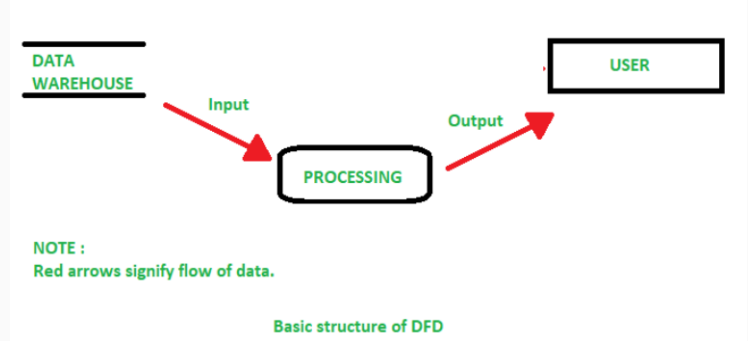
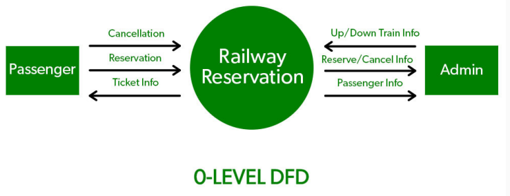
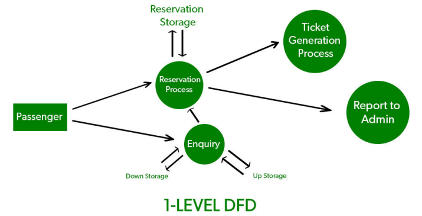
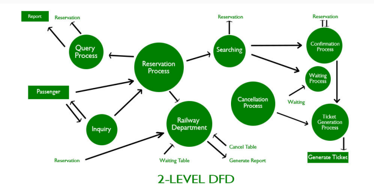

Lecture 8: Data Flow Diagrams

#  Table of contents

1. Data Flow Diagrams

2. Components of DFD

3. Symbols used in DFD

4. Levels in Data Flow Diagrams (DFD)

#  Data Flow Diagrams

#  ata Flow Diagrams

##  Data Flow Diagrams (DFD)

● Definition: Visual representation of the information flows within a system.

● It shows how data enters and leaves the system, what changes the information, and where data is stored.

· It shows how a system is divided into smaller pieces

● Objective: Show the scope and boundaries of a system as a whole

· Also called as a data flow graph or bubble chart.

#  Components of DFD

The Data Flow Diagram has 4 components:

##  Process

• Input to output transformation in a system takes place because of process function.

• Symbols of a process: rectangular with rounded corners, oval, rectangle or a circle.

• Process is named a short sentence, in one word or a phrase to express its essence.

##  Data Flow

• Describes the information transferring between different parts of the systems.

• Symbol of a Data Flow: Arrow

##  Warehouse

● The data is stored in the warehouse for later use.

· Symbol of a Warehouse: Two horizontal lines

● The warehouse can be a data file, a folder with documents, an optical disc, a filing cabinet.

Terminator
* An external entity that stands outside of the system and communicates with the system.
* Example: Organizations like banks, groups of people like customers or different departments of the same organization, which is not a part of the model system and is an external entity.

#  Rules for creating DFD

##  Rules for creating DFD

● A single DFD can have a maximum of nine processes and a minimum of three processes.

• The name of the entity should be unique, easy and understandable without any extra assistance(like comments).

● The processes should be numbered or put in ordered list to be referred easily.

● The DFD should maintain consistency across all the DFD levels.

#  Symbols used in DFD

#  Symbol used in DFD

● Square Box: Defines source or destination of the system. Also called entity and represented by rectangle.

• Arrow or Line: Identifies the data flow i.e. it gives information to the data that is in motion.

• Circle or bubble chart: Represents as a process that gives us information. It is also called processing box.

● Open Rectangle: Data store. In this data is store either temporary or permanently.

#  Levels in Data Flow Diagrams(DFD)

#  Levels in Data Flow Diagrams (DFD)

##  Levels in Data Flow Diagrams (DFD)

Levels of DFD are as follows:

● 0-level DFD: Represents the entire system as a single bubble and provides an overall picture of the system.

● 1-level DFD: Represents the main functions of the system and how they interact with each other.

● 2-level DFD: Represents the processes within each function of the system and how they interact with each other.

#  0-level DFD

##  0-level DFD

● Also known as fundamental system model/context diagram.

● Represents the entire software requirement as a single bubble with i/p and o/p.

• Abstraction view, showing the system as a single process with its relationship to external entities

#  1-level DFD

##  1-level DFD

● Context diagram is decomposed into multiple bubbles/processes.

· Highlight the main functions of the system

● Breakdown the high-level process of 0-level DFD into subprocesses.

#  2-level DFD

##  2-level DFD

● One step deeper into parts of 1-level DFD.

● Can be used to plan or record the specific/necessary detail about the system's functioning

#  Any Questions??

