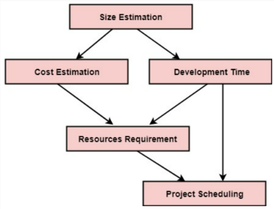
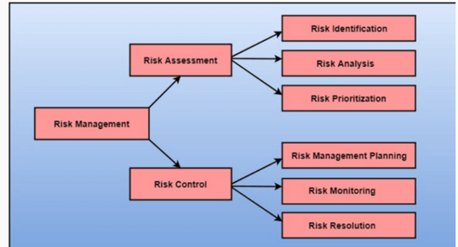

##  Lecture 9: Software Project Management

#  Table of contents

1. Software Project Management

2. Risk Management

#  Software Project Management

#  Software Project Management (SPM)

##  What is SPM?

· Art and discipline of planning and supervising software projects

• Goal: Enable the team (developers, QA, system team etc) to work effectively towards successful completion of a project.

• Project Manager: Who has the overall responsibility for the planning, design, execution, monitoring, controlling and closure of a project.

• Various factors make this job very complex (e.g. Changeability, Complexity, Uniqueness, Possibility of multiple solutions etc.)

#  Prerequisite of software project management

There are three needs for software project management:

· Time

· Cost

· Quality

It is an essential part of the software organization to deliver a quality product, keeping the cost within the client's budget and deliver the project as per schedule.

#  SPM Activities

Software Project Management consists of many activities (Performed by the Project Manager)

| SPM Activities |
| --- |
| Project Planning: Task performed before the construction of the product starts. |
| Scope Management: Define what we should do and what we shouldn't. |

Software Project Management consists of many activities (Performed by the Project Manager)

##  SPM Activities

· Estimation management:

● Figure out the size(line of code), efforts, time as well as cost of s/w development

· Size: Line of code

● Effort: How big team required based on the size of project

● Time: When size and efforts are estimated, the time required to develop the software can easily determine.

• Cost: Size of software, Quality, Hardware, Communication, Training, Additional Software and tools, Skilled manpower

Software Project Management consists of many activities (Performed by the Project Manager)

· Scheduling Management:

●All the activities to complete in the specified order and within time slotted to each activity

● Project managers perform following compulsory activities:

· Find out multiple tasks and correlate them.

● Divide time into units.

· Assign the respective number of work-units for every job.

· Calculate the total time from start to finish.

• Break down the project into modules.

Software Project Management consists of many activities (Performed by the Project Manager)

##  SPM Activities

● Project Resource Management:

● Project Risk Management

· Identification, analyzing and preparing the plan for predictable and unpredictable risk

• Example: The Experienced team leaves the project, and the new team joins it, Changes in requirement, Change in technologies and the environment, Market competition.

Software Project Management consists of many activities (Performed by the Project Manager)

| SPM Activities |
| --- |
| Project Communication Management:Essential Part.Communication must be clear and understood.Miscommunication can create a big blunder in the project. |

#  Skills Required for a PM

Software Project Management consists of many activities (Performed by the Project Manager)

##  PM Skills

Skills required for Project manager

· Managerial skills

· Technical skills

• Problem solving skills

· Coping skills

· Conceptual skills

· Leadership skills

· Communication skill

#  Software Project Planning

Software Project planning starts before technical work starts.

##  Project Planning

● Estimation (Cost, Duration, Effort)

● Staff Management (organize, recruit, shift etc)

· Scheduling manpower and resources

· Risk Management

● Quality Assurance Plan

##  Project Planning

· Size: Crucial parameter for the estimation of other activities.

● Resources requirement: Based on cost and development time.

● Project schedule: Controlling and monitoring the progress of the project, dependent on resources development time.

#  Risk Management

#  Risk

• A problem that could cause some loss or threaten the progress of the project, but which has not happened yet.

• These potential issues might harm cost, schedule or technical success of the project and the quality of software device, or project team morale.

● Risk Management: System of identifying addressing and eliminating these problems before they can damage the project.

• Example: Staff storage, because we have not been able to select people with the right technical skills is a current problem, but the threat of our technical persons being hired away by the competition is a risk.

#  Software Risk Management

##  Risk Management Strategies

• Reactive: Tries to reduce damage from potential threats by assuming those threats will happen eventually (Car insurance in case of accidents)

• Proactive: Identifies threats and aims to prevent those threats from ever happening in the first place (wearing helmet, seat belt, not talking via phone etc)

There are three main classifications of risks which can affect a software project

#  Types of Risks

● Project Risks: Budgetary, schedule, personnel, resource (skilled resource left job), and customer-related problems.

· Technical Risks:

• Potential method, implementation, interfacing, testing, and maintenance issue.

● Incomplete specification, changing specification, technical uncertainty, and technical obsolescence.

● Most technical risks appear due to the development team's insufficient knowledge about the project.

• Business Risks: Contain risks of building an excellent product that no one need, losing budgetary or personnel commitments, etc.

#  Types of Risks - Example

● - In 2005 Denver International Airport set out to create the most sophisticated luggage handling systems in the world. The project was soon deemed to be far more complex than anyone was anticipating and delayed for 16 months at a cost of $560 m. - Project Risk

· Ford was ready to release the Edsel, the market had already moved on to compact cars and the Edsel was a flop. - Business Risk

● On January 28 1986, the Challenger Space Shuttle exploded just 76 seconds after take off. - Technical Risk

#  Software Risk Management Activities

#  What is Risk Assessment

● Process to identify potential risks and analyze what could happen if a hazard occurs.

• It includes identifying, analyzing and prioritizing the risks.

#  Risk Identification

The project organizer needs to anticipate the risk in the project as early as possible to reduce the impact of risk by making effective risk management planning.

#  Risk Analysis

• Consider every identified risk and make a perception of the probability and seriousness of that risk.

• Rely on your perception and experience of previous projects and the problems that arise in them.

• The probability of the risk might be determined as very low (0 – 10%), low (10 – 25%), moderate (25 – 50%), high (50 – 75%) or very high (75%+).

• The effect of the risk might be determined as catastrophic (threaten the survival of the plan), serious (would cause significant delays), tolerable (delays are within allowed contingency), or insignificant.

#  Risk Prioritization

· Rank the risks in terms of their damage and control them based on priorities.

· Example: Rare risks get less priority.

· p = r * s where,

$r$ = The possibility of a risk coming true,

s = The consequence of the issues relates to that risk,

p = Priority with which the risk must be controlled.

#  What is Risk Control

● Determine appropriate ways to eliminate the hazard, or control the risk when the hazard cannot be eliminated.

• Includes Risk management planning, Risk monitoring, Risk Resolution (Various strategies are analyzed to find the best alternative to resolve risk).

· Three main methods:

• Avoid the risk: Examples: Discussing with the client to change the requirements to decrease the scope of the work, giving motivation to the engineers to avoid the risk of human resources turnover, etc.

● Transfer the risk: Getting the risky element developed by a third party, buying insurance cover, etc.

• Risk reduction: Planning method to include the loss due to risk. For instance, if there is a risk that some key personnel might leave, new recruitment can be planned.

#  Any Questions??

