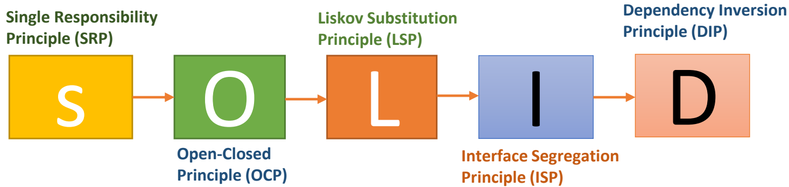
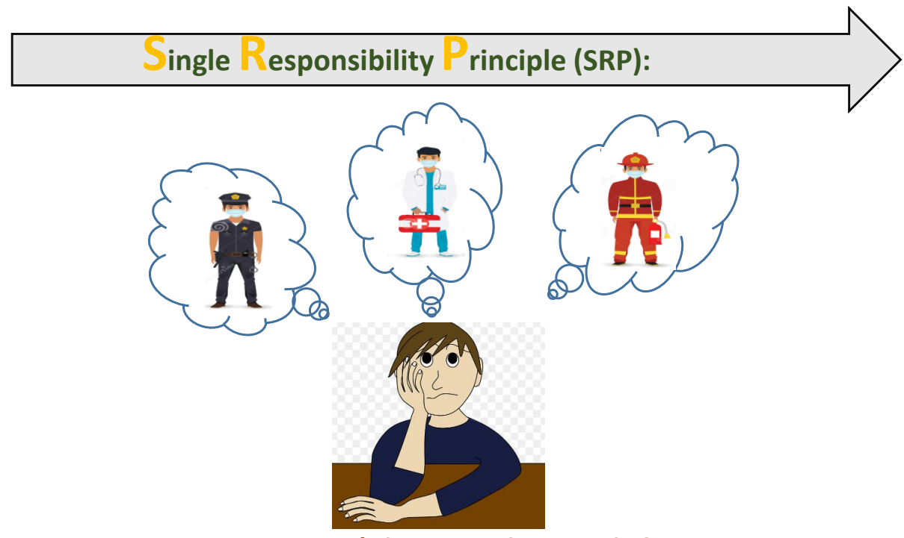
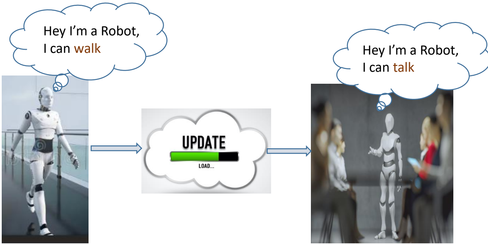
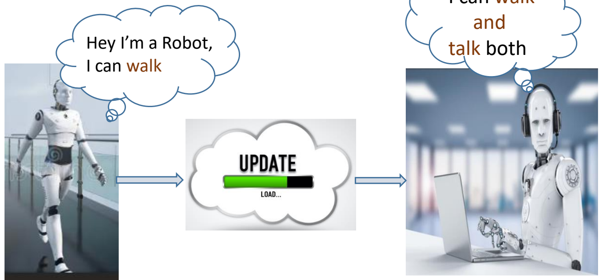
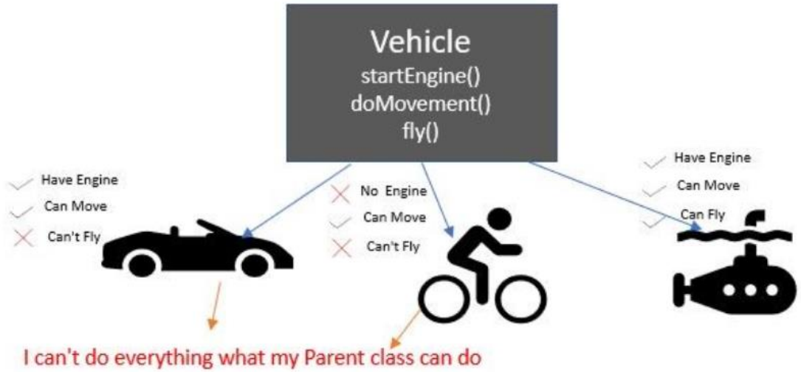
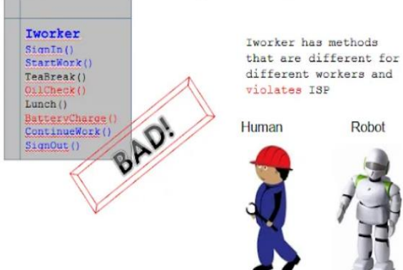
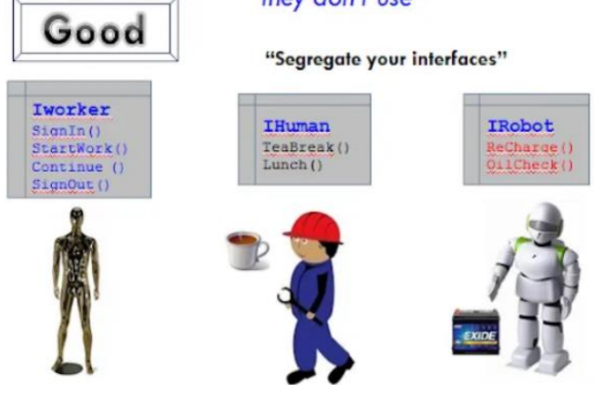
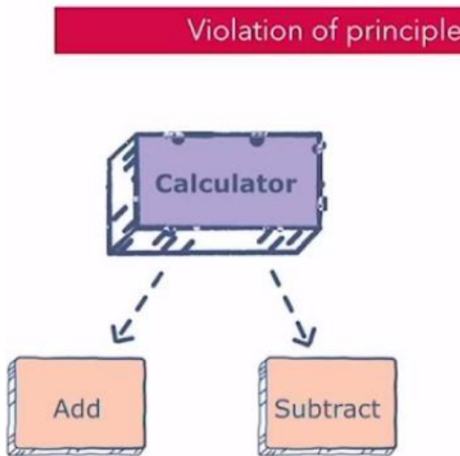
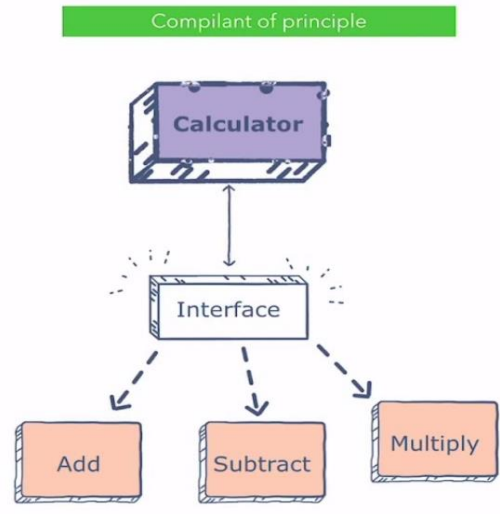

The S.O.L.I.D principles are a set of five design principles that help software developers create more maintainable, flexible, and scalable software systems. They were introduced by Robert C. Martin (also known as Uncle Bob) in the early 2000s.

Following SOLID principles might make your codebase bigger at first. But in the long run, they help developers change their code without messing things up.



You can't be everything, right?

The Single esponsibility rinciple states that a class, module, or function should have only one reason to change, meaning it should do one thing.

SRP encourages the separation of concerns, making the code more modular and scalable. This principle is one of the five SOLID principles of object-oriented design and is an important aspect of creating clean, maintainable, and scalable code.

#  Let's see Twitter Account Creation with Single Responsibility Principle:

Consider a use case where a user wants to register with Twitter. The steps Twitter takes to register are user are:

● Twitter asks users to register with signup forms.

● Twitter stores the user object in their database, which contains User details - email, name, password, and other metadata etc.

● Twitter sends a welcome message to the user.

Let us declare a class that does the above steps.

```
  public class TwitterRegistration {
    public void register() {
        // step 1
        System.out.println("Fill signup form");
        // step 2
        System.out.println("Store account details in database");
        // step 3
        System.out.println("Send a welcome message");
    }
  }
```

When we make an account on Twitter, we need to do three things. But, the code we have right now does all of these things together in one class called TwitterRegistration. This breaks the Single Responsibility Principle (SRP).

#  Refactoring for SRP

Using the SRP principle, we divide the above TwitterRegistration class into three different classes, each having a single and only one responsibility.

```
// Account Registration
class TwitterAccountRegister {
    public void registerUser() {
        // step 1
        System.out.println("fill account internal details");
    }
}
```

```
// Database handshakes
class AccountRepository {
    public void createUser() {
        // step 2
        System.out.println(" Auth Success!");
        System.out.println("Store user data into database");
    }
}
```

```
// Notification Service
class NotificationService {
    public void sendNotification() {
        // step 3
        System.out.println("Send out welcome message");
    }
}
```

Finally, after refactoring the above classes. We first allow the TwitterAccountService to create a couple of objects for AccountRepository and NotificationService to register users with Twitter.

```
// Execution Class or Main class
public class TwitterAccountRegister {
    public static void main(String[] args) {
        TwitterAccountService service = new TwitterAccountService();
        service.registerUser();
    }
}
// Account Registration Service
class TwitterAccountService {
    AccountRepository repository = new AccountRepository();
    NotificationService notificationService = new NotificationService();
    public void registerUser() {
        // step 1
        System.out.println("fill account internal details");
        repository.createUser();
        notificationService.sendNotification();
    }
}
// Notification Service
class NotificationService {
    public void sendNotification() {
        // step 3
        System.out.println("Send out welcome message");
    }
}
// Database handshakes
class AccountRepository {
    public void createUser() {
        // step 2
        System.out.println("Signup Success!! Registered");
        System.out.println("Store user data into database");
    }
}
```

In above TwitterAccountService is doing all three tasks. The primary responsibility is to fill in account details in account details and delegate the other responsibilities to other classes.

#  Open-Closed Principle (OCP)

The Open/Closed Principle (OCP) is one of the SOLID principles of object-oriented design, which encourages the code to be open for extension but closed for modification.

##  Before OCP (Violation of OCP):



##  After OCP (Violation of OCP):



#  Before OCP (Violation of OCP):

Imagine you have a class called PaymentProcessor that handles payments for your e-commerce application. Initially, it only supports credit card payments:

```
public class PaymentProcessor {
    func processCreditCardPayment() {
        // Code to process credit card payment
    }
}
```

Later on, you decide to extend your application to support PayPal payments. To do this, you have to modify the existing PaymentProcessor class:

```
public class PaymentProcessor {
    public void processCreditCardPayment() {
        // Code to process credit card payment
    }
    public void processPayPalPayment() {
        // Code to process PayPal payment
    }
  }
```

In this "before" example, you violated the Open/Closed Principle because you had to modify the existing class to add support for a new payment method. This can introduce bugs and affect the stability of your existing codebase.

#  After OCP (Compliance with OCP):

To stick to the Open/Closed Principle, you can use an abstraction (e.g., a protocol) and create separate classes for each payment method without modifying the existing code:

```
    interface PaymentProcessing {
        void processPayment();
    }
    class CreditCardPaymentProcessor implements PaymentProcessing {
        @Override
        public void processPayment() {
          // Code to process credit card payment
    }
    }
    class PayPalPaymentProcessor implements PaymentProcessing {
        @Override
        public void processPayment() {
          // Code to process PayPal payment
    }
    }
```

With this approach, we've introduced an interface PaymentProcessing, and created specific classes for each payment method that implement this interface. Now, if you need to add a new payment method, you can simply create a new class that implements the PaymentProcessing interface, and you won't need to modify the existing code in the payment processor classes. This makes your code more flexible and easier to extend in the future.

The Liskov Substitution Principle (LSP) states that objects of a superclass should be replaceable with objects of its subclasses without affecting the correctness of the program. In simpler terms, it means that derived classes should be able to replace their base class without breaking the program's functionality.



Lets understand with example where we violate Liskov Substitution Principle. Suppose we have a parent class called "TransportationDevice" with attributes like speed and name. It also has startEngine() and startMovement() methods. If we have to implement functionality of Car, we can derive a child class out of this and add concrete implementation of both methods as car has engine so we can start it and car can also do movement.

But on other hand, we have to implement functionality of another transport device called Bicycle, then we can derive this class from TransportationDevice class and implement functionality for startMovement() as Bicycle can move. But Bicycle does not have engine then startEngine() method is irrelevant for Bicycle class.

As parent class is abstract class, Bicycle class will simply have empty implementation of this method or may throw some exception as its unsupported functionality. Here we have violation of Liskov substitution as startEngine() method can't be implemented in subclass. This means subclass can't have behavior same as its parent class. Hence we need to fix it by making inheritance in better way.

#  Lets understand with below code snippet:

```
public abstract class TransportationDevice{
String name;
double speed;

public String getName() {
return name;
}

public void setName(String name) {
this.name = name;
}

public double getSpeed() {
return speed;
}

void setSpeed(double speed) {
this.speed = speed;
}

public abstract void startEngine();

public abstract void startMovement();
}
```

With LSP violation, see below child classes:

```
public class Car extends TransportationDevice{
  @Override
  public void startEngine() {
  System.out.println("Engine of car started");
  }

  @Override
  public void startMovement() {
  System.out.println("Movement of Car started");
  }
  }
  public class Bicycle extends TransportationDevice {
  @Override
  public void startEngine() {
  // cant implement this method as there is no Engine in bicycle
  // leave it without implementation or throw exception
  }

  public void startMovement() {
  System.out.println("Movement of bicycle started");
  }
  }
```

This violates the Liskov Substitution Principle (LSP) because it breaks the contract defined by the superclass (TransportationDevice). According to LSP, subclasses should be substitutable for their base classes without altering the correctness of the program. In this case, a method startEngine() is defined in the superclass (TransportationDevice), and all subclasses are expected to implement it. However, Bicycle violates this expectation by providing an empty implementation for startEngine(), which doesn't make sense for a bicycle since it doesn't have an engine.

To address this issue, lets create a proper hierarchy to implement OCP principle correctly by following LSP principle as below:

```
public class TransportationDevice{
  String name;
  double speed;
  public String getName() {
    return name;
  }
  public void setName(String name){
    this.name = name;
  }
  public double getSpeed() {
    return speed;
  }
  void setSpeed(double speed) {
    this.speed = speed;
  }
}
public class DeviceWithoutEngine extends TransportationDevice {
  public void startMoving(){
    System.out.println("Basic functionality of moving for device without engine");
  }
}
public class DeviceWithEngine {
  public void startEngine(){
    System.out.println("Basic engine start functionality");
  }
}
```

Implementing child classes with only relevant functionality for them by inheriting from more relevant parent class:

```
public class Car extends DeviceWithEngine{
    @Override
    public void startEngine(){
      super.startEngine();
        System.out.println("Starting engine of car");
    }
  }
```

Now Bicycle class need not override irrelevant method:

```
public class Bicycle extends DeviceWithoutEngine{
    @Override
    public void startMoving(){
        super.startMoving();
        System.out.println("Movement of cycle started");
    }
  }
```

In above code, we created proper hierarchy by keeping only common attributes in main parent class i.e TransportationDevice class. Then we created two specialized child classes viz. DeviceWithEngine and DeviceWithoutEngine. This helps us to better implement hierarchy of transport devices based on their attributes and behaviors. No child class is forced here to implement unwanted behavior. We can always save reference of Bicycle class in DeviceWithoutEngine class i.e we can substitute reference of child class here in parent class as child class has all those behaviors which are there in parent class.

In above code snippet objects of a superclass are replaceable with objects of its subclasses without breaking the application.

Interface egregation Principle (ISP):

The Interface Segregation Principle (ISP) suggests that a class should not be forced to implement methods it doesn't need. In other words, a class should have small, focused interfaces rather than large, monolithic ones. This helps to avoid unnecessary dependencies and ensures that classes only implement the methods they actually need.

Interface Segregation Principle

"Clients should not be forced to depend upon interfaces that they don't use"



Interface Segregation Principle

Clients should not be forced to depend upon interfaces that they don't use"



#  Before Applying ISP:

```
  interface PaymentMethod {
      void processCreditCardPayment();
      void processPayPalPayment();
  }
    class CreditCardPayment implements PaymentMethod {
      @Override
      public void processCreditCardPayment() {
          // Code to process a credit card payment
      }
    @Override
      public void processPayPalPayment() {
          // This method is not relevant for credit card payments
      }
  }
```

In this example, the CreditCardPayment class is forced to implement the processPayPalPayment method even though it doesn't use it. This violates the Interface Segregation Principle (ISP) because the class is required to have unnecessary methods, which goes against the principle of segregating interfaces.

#  After Applying ISP:

To adhere to the ISP, you can create separate interfaces for different payment methods:

```
interface CreditCardPayment {
    void processCreditCardPayment();
}

interface PayPalPayment {
    void processPayPalPayment();
}
```

Now, when implementing a credit card payment class, you only need to conform to the relevant interface:

```
class CreditCardPaymentProcessor implements CreditCardPayment {
  @Override
  public void processCreditCardPayment() {
      // Code to process a credit card payment
  }
  }
```

With this approach, you follow the ISP by allowing classes to implement only the methods they actually need. This makes the code more focused, easier to understand, and avoids the burden of implementing unnecessary methods.

The Dependency Inversion Principle (DIP) is one of the SOLID principles of object-oriented design. It suggests that high-level modules should not depend on low-level modules, but both should depend on abstractions.





#  Before DIP:

Suppose you have a simple scenario where you have a LightBulb class, and you want to create a Switch class that can control the bulb:

```
class LightBulb {
    public void turnOn() {
        // Code to turn on the bulb
    }
    public void turnOff() {
        // Code to turn off the bulb
    }
}
class Switch {
    private LightBulb bulb;
    public Switch(LightBulb bulb) {
        this.bulb = bulb;
    }
    public void operate() {
        // Code to operate the bulb (e.g., turn it on or off)
        bulb.turnOn();
    }
}
```

In this example, the Switch class depends directly on the LightBulb class, creating tight coupling.

#  After DIP:

```
interface Switchable {
    void turnOn();
    void turnOff();
}
class LightBulb implements Switchable {
    @Override
    public void turnOn() {
        // Code to turn on the bulb
    }
    @Override
    public void turnOff() {
        // Code to turn off the bulb
    }
}
class Switch {
    private Switchable device;
    public Switch(Switchable device) {
        this.device = device;
    }
    public void operate() {
        // Code to operate the device (e.g., turn it on or off)
        device.turnOn();
    }
}
```

In this updated example, the Switch class now relies on the Switchable interface instead of the specific LightBulb class. This follows the Dependency Inversion Principle, which makes it easier to swap devices without altering the Switch class.

By using this principle, you can easily add new devices (like a fan or a TV) without needing to change the Switch class. This approach reduces the interdependence between classes, making the code more flexible and adaptable.
