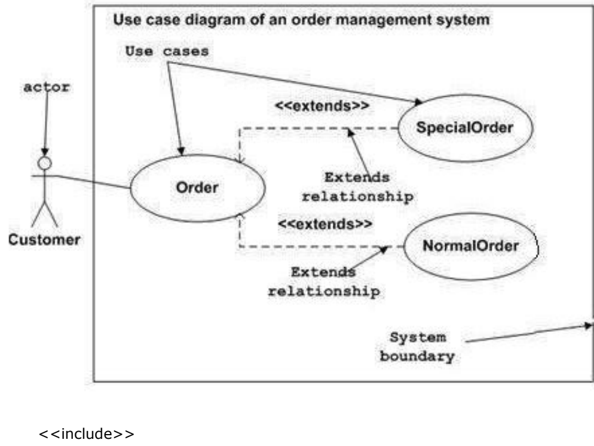
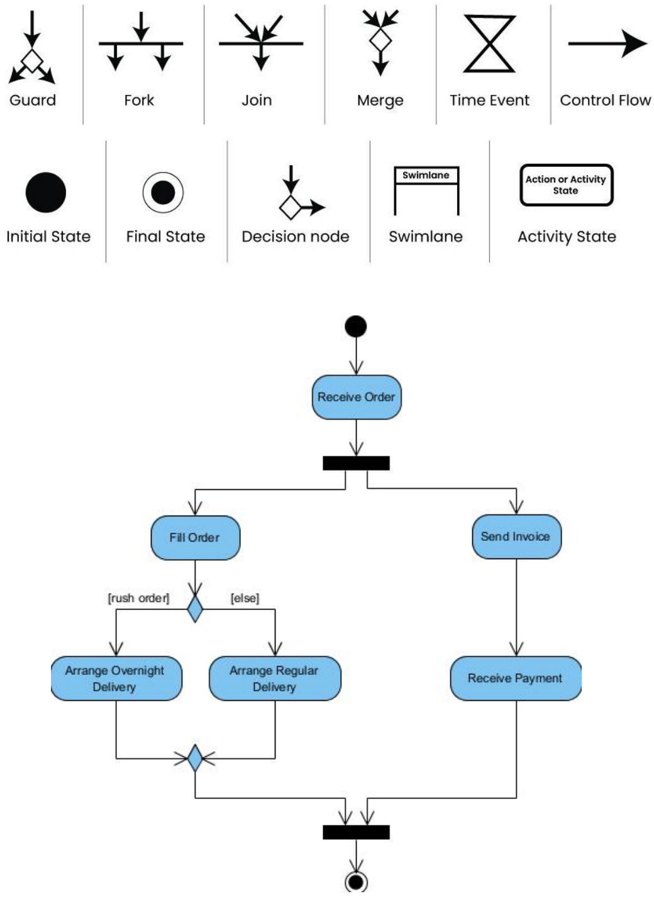
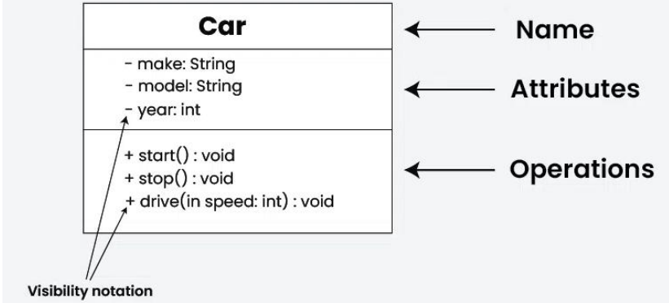
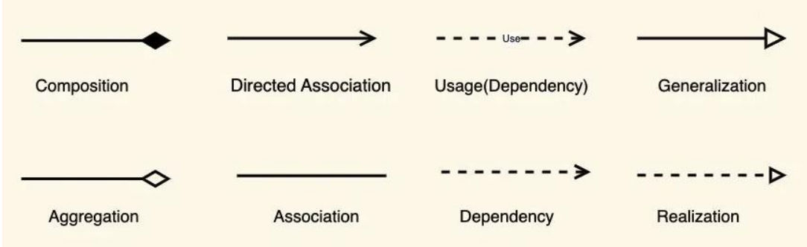
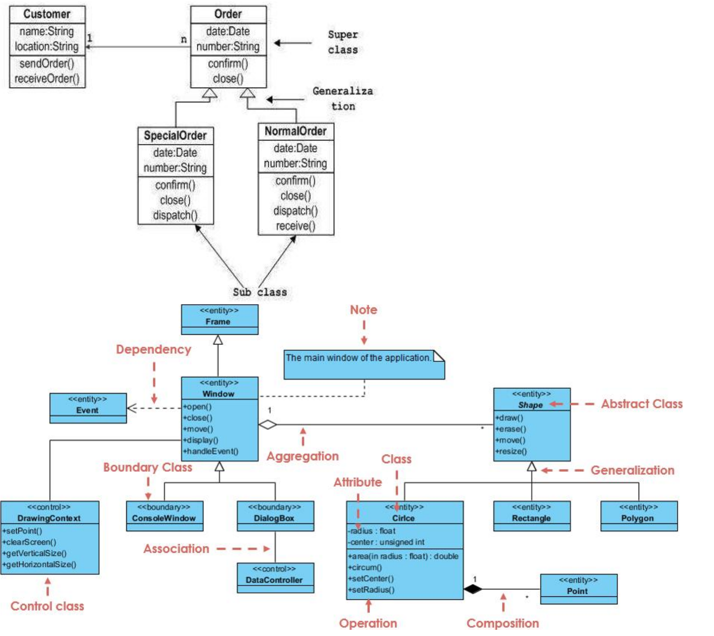
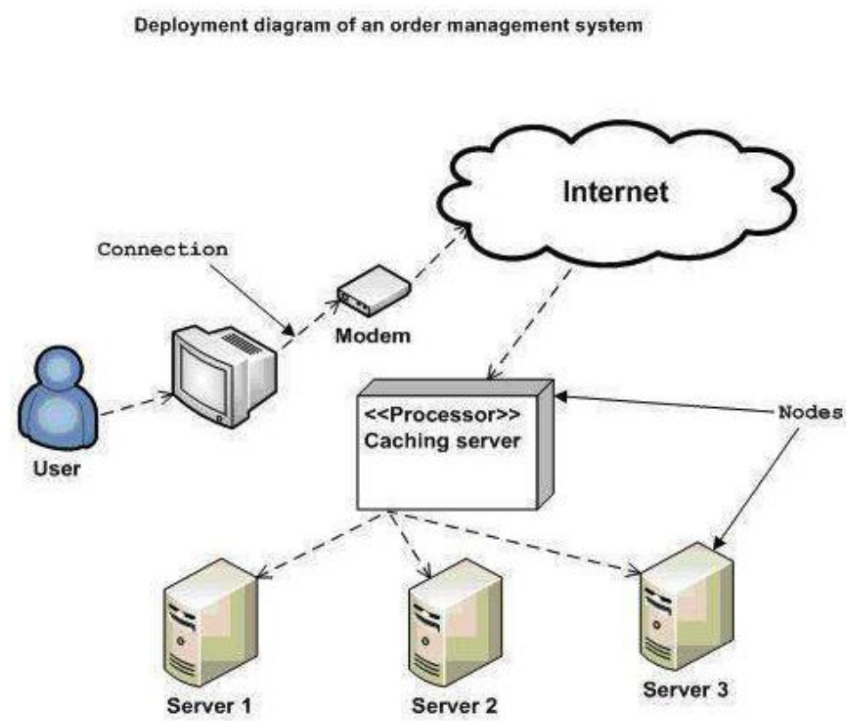

#  UML

UML (Unified Modeling Language) is a standard language for specifying, visualizing, constructing, and documenting the components of software and non-software systems. UML was created by the Object Management Group (OMG) and UML 1.0 specification draft was proposed to the OMG in January 1997.

● UML stands for Unified Modeling Language.

● UML is different from the other common programming languages such as C++, Java, COBOL, etc.

● UML is a pictorial language used to make software blueprints.

● UML can be described as a general purpose visual modeling language to visualize, specify, construct, and document software system.

● Although UML is generally used to model software systems, it is not limited within this boundary. It is also used to model non-software systems as well.For example, the process flow in a manufacturing unit, etc.

UML is not a programming language but tools can be used to generate code in various languages using UML diagrams. UML has a direct relation with object oriented analysis and design.

##  Goals of UML

A picture is worth a thousand words, this idiom absolutely fits describing UML. Object-oriented concepts were introduced much earlier than UML. At that point of time, there were no standard methodologies to organize and consolidate the object-oriented development. It was then that UML came into picture.

UML diagrams are not only made for developers but also for business users, common people, and anybody interested to understand the system. The system can be a software or non-software system. Thus it must be clear that UML is not a development method rather it accompanies processes to make it a successful system.

In conclusion, the goal of UML can be defined as a simple modeling mechanism to model all possible practical systems in today's complex environment.

Any complex system is best understood by making some kind of diagrams or pictures. These diagrams have a better impact on our understanding.

There are two broad categories of diagrams and they are again divided into subcategories –

● Structural Diagrams

● Behavioral Diagrams

#  Structural Diagrams

The structural diagrams represent the static aspect of the system. These static aspects represent those parts of a diagram, which forms the main structure and are therefore stable.

These static parts are represented by classes, interfaces, objects, components, and nodes. The four structural diagrams are -

● Class diagram

● Object diagram

● Component diagram

● Deployment diagram

#  Behavioral Diagrams

Any system can have two aspects, static and dynamic. So, a model is considered as complete when both the aspects are fully covered.

Behavioral diagrams basically capture the dynamic aspect of a system. Dynamic aspect can be further described as the changing/moving parts of a system.

UML has the following five types of behavioral diagrams –

● Use case diagram

● Sequence diagram

● Collaboration diagram

● Statechart diagram

● Activity diagram

##  Use Case Diagram

Use case diagrams are a set of use cases, actors, and their relationships. They represent the use case view of a system.

A use case represents a particular functionality of a system. Use case diagrams are used to gather the requirements of a system including internal and external influences. These requirements are mostly design requirements. Hence, when a system is analyzed to gather its functionalities, use cases are prepared and actors are identified.

When the initial task is complete, use case diagrams are modelled to present the outside view.

In brief, the purposes of use case diagrams can be said to be as follows –

● Used to gather the requirements of a system.

● Used to get an outside view of a system.

● Identify the external and internal factors influencing the system.

● Show the interaction among the requirements are actors.

Order - - - - > login

#  Activity Diagram

Activity diagram describes the flow of control in a system. It consists of activities and links. The flow can be sequential, concurrent, or branched.

Activities are nothing but the functions of a system. Numbers of activity diagrams are prepared to capture the entire flow in a system.

Activity diagrams are used to visualize the flow of controls in a system. This is prepared to have an idea of how the system will work when executed.

Activity Diagram Notations: concurrent

#  Sequence/Interaction/Collaboration Diagram

A sequence diagram is an interaction diagram. From the name, it is clear that the diagram deals with some sequences, which are the sequence of messages flowing from one object to another.

Interaction among the components of a system is very important from implementation and execution perspective. Sequence diagram is used to visualize the sequence of calls in a system to perform a specific functionality.

The purpose of interaction diagram is –

● To capture the dynamic behaviour of a system.

● To describe the message flow in the system.

● To describe the structural organization of the objects.

● To describe the interaction among objects.

Resource: https://www.geeksforgeeks.org/unified-modeling-language-uml-sequence-diagrams/

#  Structural Diagrams

##  Class Diagram

Class diagrams are a type of UML (Unified Modeling Language) diagram used in software engineering to visually represent the structure and relationships of classes within a system i.e. used to construct and visualize object-oriented systems.

UML Class Notation

Relationships between classes

#  Deployment Diagrams

Deployment diagrams are used to visualize the topology of the physical components of a system, where the software components are deployed.

Deployment diagrams are used to describe the static deployment view of a system. Deployment diagrams consist of nodes and their relationships.

The term Deployment itself describes the purpose of the diagram. Deployment diagrams are used for describing the hardware components, where software components are deployed. Component diagrams and deployment diagrams are closely related.

Component diagrams are used to describe the components and deployment diagrams shows how they are deployed in hardware.

UML is mainly designed to focus on the software artifacts of a system. However, these two diagrams are special diagrams used to focus on software and hardware components. Most of the UML diagrams are used to handle logical components but deployment diagrams are made to focus on the hardware topology of a system. Deployment diagrams are used by the system engineers.

The purpose of deployment diagrams can be described as –

● Visualize the hardware topology of a system.

● Describe the hardware components used to deploy software components.

● Describe the runtime processing nodes.

##  How to Draw a Deployment Diagram?

Deployment diagrams are useful for system engineers. An efficient deployment diagram is very important as it controls the following parameters –

● Performance

● Scalability

● Maintainability

● Portability

Before drawing a deployment diagram, the following artifacts should be identified –

● Nodes

● Relationships among nodes

Following is a sample deployment diagram to provide an idea of the deployment view of order management systems. Here, we have shown nodes as -

● Monitor

- Modem

● Caching server

● Server

The application is assumed to be a web-based application, which is deployed in a clustered environment using server 1, server 2, and server 3. The user connects to the application using the Internet. The control flows from the caching server to the clustered environment.

The following deployment diagram has been drawn considering all the points mentioned above.

Deployment diagrams can be used –

● To model the hardware topology of a system.

● To model the embedded system.

● To model the hardware details for a client/server system.

● To model the hardware details of a distributed application.

● For Forward and Reverse engineering.
