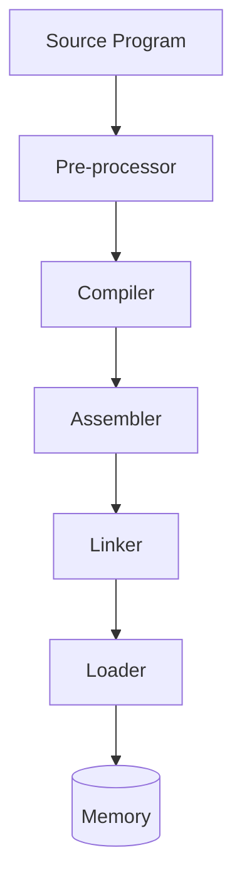
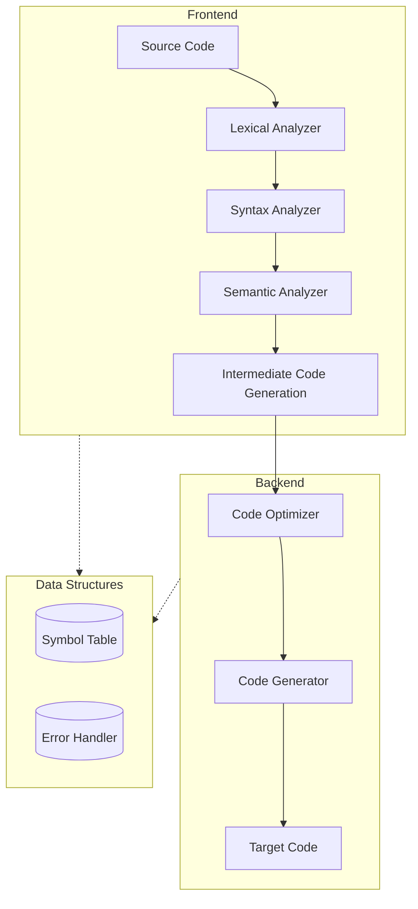

# 1. Introduction to Compilers

## Lecture 01: Language Processing System

A **Language Processing System (LPS)** is a system software that translates programs written in one language into another language.

### The LPS Pipeline



*   **Pre-processor:** Processes the source program before compilation. Handles macros (`#define`), includes (`#include`), and removes comments.
*   **Compiler:** Translates high-level language into object code. Checks syntax and semantic errors. Produces object file.
*   **Assembler:** Converts assembly language into machine language.
*   **Linker:** Links object files and library files together. Creates an executable file.
*   **Loaders:** Loads the executable program into main memory. Prepares the program for execution.

---

## Compiler vs. Interpreter

| Feature | Compiler | Interpreter |
| :--- | :--- | :--- |
| **Translation Method** | Translates the entire program at once. | Translates source code line by line. |
| **Execution Speed** | Faster execution; program runs after full compilation. | Slower, because translating happens during execution. |
| **Error Handling** | Shows errors after compiling the whole code. | Shows errors immediately line by line. |

---

## What is a Compiler?
**Definition:** A compiler is a program that translates an entire source code into machine code before running it.

### Common Types of Compilers
1. Single-pass compiler
2. Two-pass compiler
3. Multi-pass compiler
4. Cross compiler

#### 1. Single Pass Compiler
A single-pass compiler reads, analyzes, and translates the source program in one pass only.
*   **Characteristics:**
    *   Reads the source code only once.
    *   Fast compilation.
    *   Limited error detection.
    *   Little or no code optimization.
    *   Requires that variables be declared before use.
*   **Example:** Pascal (early version), FORTRAN (early version).

#### 2. Two Pass Compiler
A two-pass compiler processes the source program twice to generate machine code.
*   **First Pass:** Analyzes the source program, builds symbol table, and checks syntax and semantic errors.
*   **Second Pass:** Uses the information from the first pass to generate object code and perform limited optimization.

#### 3. Multi-Pass Compiler
A multi-pass compiler is a compiler that scans and processes the source program more than two times to generate efficient machine code. It typically breaks the process down into distinct phases:
1.  Lexical analysis
2.  Syntax analysis
3.  Semantic analysis
4.  Optimization
5.  Code generation
*   **Example:** GCC, Java.

#### 4. Cross Compiler
A cross compiler is a compiler that runs on one computer system (host machine) but generates machine code for another computer system (target machine).

---

## Lecture 02: Phases of a Compiler

The compilation process is divided into two main parts: the **Frontend** (analysis) and the **Backend** (synthesis). These parts consist of 6 distinct phases.



### 1. Lexical Analysis (Scanner)
Converts source program into a sequence of tokens.
*   Removes white spaces and comments.
*   Groups characters into tokens (Keywords, identifiers, operators, constants).

**Example:**
`int a = 10;`
*   `int` $\rightarrow$ keyword
*   `a` $\rightarrow$ identifier
*   `=` $\rightarrow$ operator
*   `10` $\rightarrow$ constant
*   `;` $\rightarrow$ separator

### 2. Syntax Analysis (Parser)
Checks whether the token sequence follows the grammar rules of the language.
*   Builds parse tree or syntax tree.
*   Detects syntax errors (missing semicolon, wrong structure).

**Example of Syntax Error:**
`int a = ;` (Syntax Error: missing operand)

### 3. Semantic Analysis
Checks the meaning of the program.
*   Type checking.
*   Variable declaration checking.
*   Compatibility of operations.

**Example of Semantic Error (Type Mismatch):**
```c
int a;
a = "hello"; // Type mismatch error
```

### 4. Intermediate Code Generator
Converts the source program into an Intermediate Representation (IR).
*   Machine independent.
*   Makes optimization easier.

**Example (Three Address Code):**
Max one operator and two operands per statement.
If we have: `a = b + c + d`
It converts to:
```
x = y + z
a = b + x
```
*(Note: Using x, y, z to split the operation)*

### 5. Code Optimization
Improves the intermediate code to make it faster and more efficient.
*   Removes unnecessary statements.
*   Reduces execution time.
*   Reduces memory usage.

**Example:**
Before optimization:
```c
x = 5 * 1
x = 5
```
After optimization:
```c
x = 5
y = x
y = 5
```

### 6. Code Generation
Converts optimized intermediate code into machine code.
*   Selects registers.
*   Generates target machine instructions.
*   **Output:** Executable program.

---

### Supporting Data Structures
*   **Symbol Table:** Stores information about variables, functions, data types, scope, etc.
*   **Error Handler:** Detects, reports, and recovers from errors during compilation.
