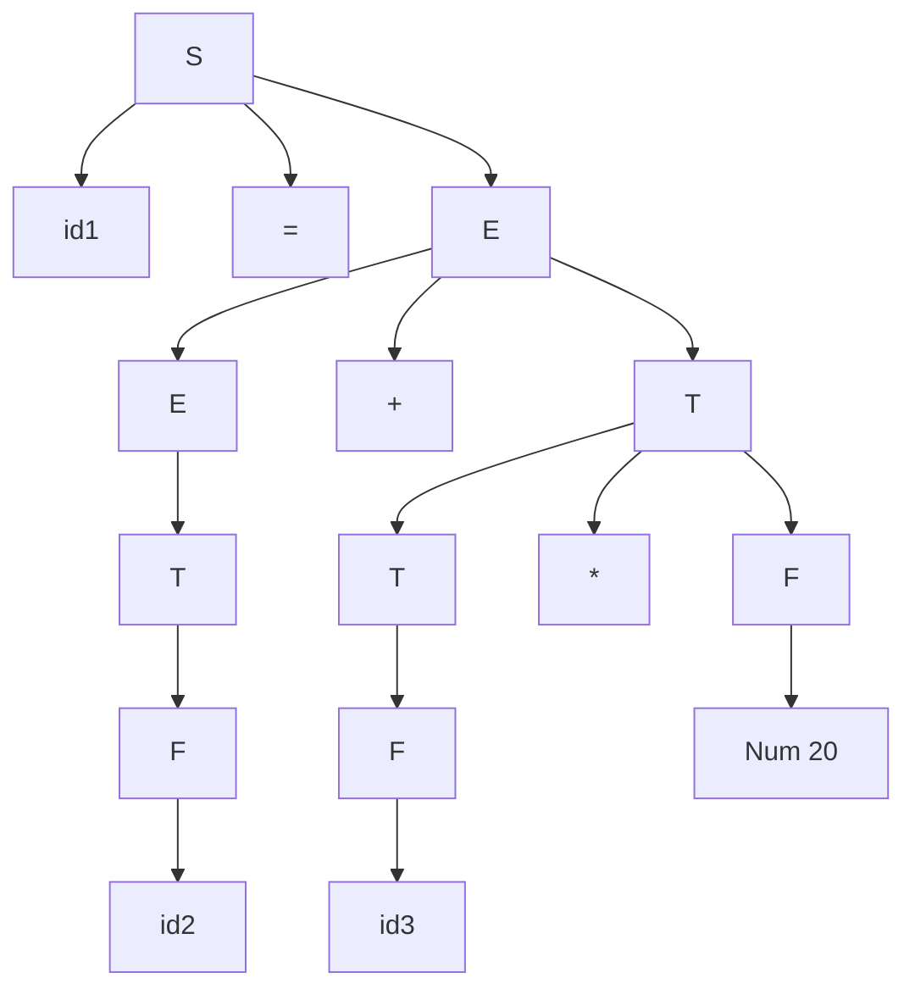
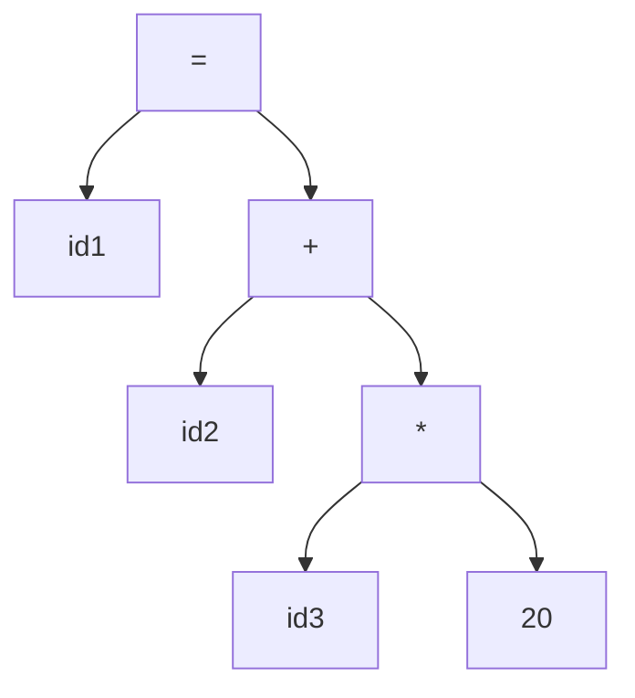
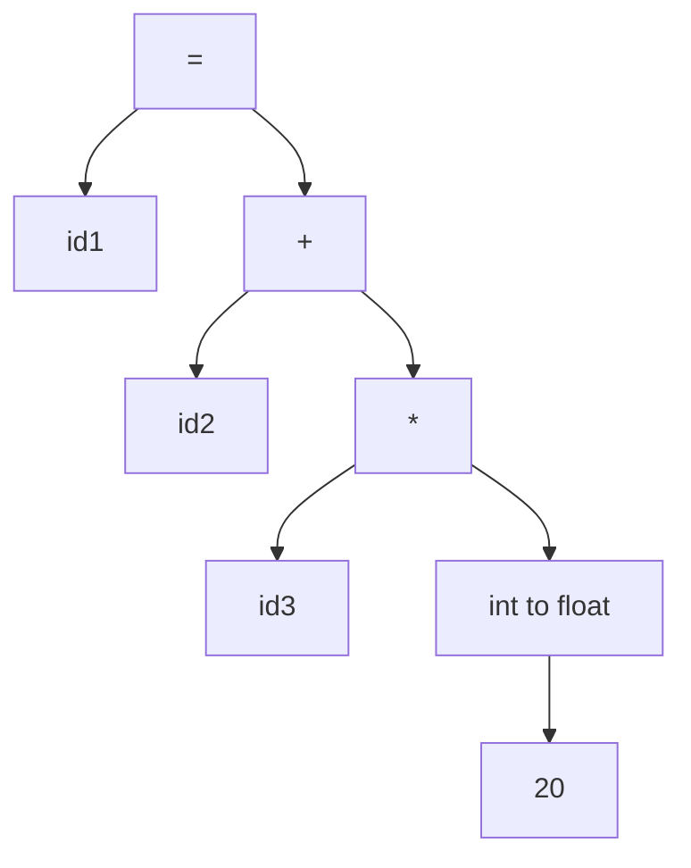
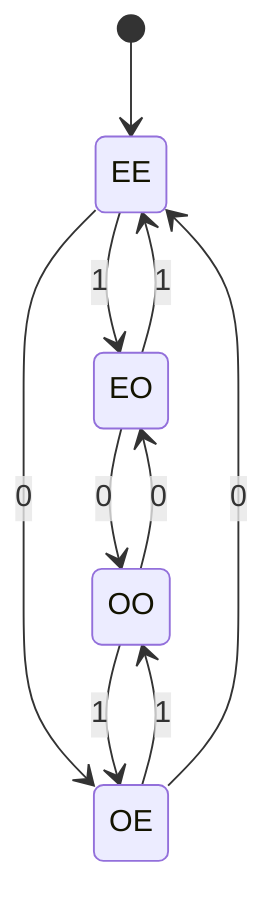

# 2. Lexical Analysis and Automata

## Lecture 03: Lexical Analysis

Lexical Analysis converts the high-level input program into a sequence of tokens.
*   Lexical analysis can be implemented with a **DFA (Deterministic Finite Automaton)**.
*   The output is a sequence of tokens that is sent to the parser for syntax analysis.

### What is a Token?
A lexical token is a sequence of characters that can be treated as a unit in the grammar of the programming language.
*   **Type token:** `id`, `number`, `real`, etc.
*   **Punctuation token:** `if`, `void`, `return`, `;`, etc.
*   **Alphabetic token:** Keywords.

### Full Example Trace
Consider the following source code:
```c
float total, capital, rate;
total = capital + rate * 20;
```

#### 1. Lexical Analysis (Scanner)
The scanner identifies the variables and creates a **Symbol Table**:

| Serial No. | Variable Name | Type |
| :--- | :--- | :--- |
| 01 | `capital` | `float` |
| 02 | `total` | `float` |
| 03 | `rate` | `float` |

Tokens generated for the assignment statement:
`id(total) = id(capital) + id(rate) * 20`
$\Rightarrow$ `id1 = id2 + id3 * 20`

#### 2. Syntax Analysis (Parser)
Given the following grammar:
$S \rightarrow id = E$
$E \rightarrow E + T \mid T$
$T \rightarrow T * F \mid F$
$F \rightarrow id \mid Num$

**Parse Tree:**


**Syntax Tree:** (A more compact representation without all grammar derivations)


#### 3. Semantic Analyzer
Checks types. The integer `20` must be cast to `float` before multiplying with `float rate`.


#### 4. Intermediate Code Generator
Generates 3-address code:
```
t1 = int_to_float(20)
t2 = id3 * t1
t3 = id2 + t2
id1 = t3
```

#### 5. Code Optimizer
Reduces redundancy:
```
t1 = id3 * 20.0
id1 = id2 + t1
```

#### 6. Code Generator
Translates into assembly:
```assembly
LDA  id3        ; Load id3 into Register 1
MUL  #20.0      ; Multiply by 20.0
LDA  id2        ; Load id2 into Register 2
ADD  R2         ; Add R1 and R2
STR  id1        ; Store result into id1
```

---

## Lecture 04: Deterministic Finite Automaton (DFA)

**What is a DFA?**
A DFA is a theoretical machine used in automata theory to recognize patterns and languages. It is used in compiler design, lexical analysis, and pattern matching.

It is defined by **5 tuples**:
*   $Q$ = Finite set of states
*   $\Sigma$ = Finite set of input symbols
*   $\delta$ = Transition function
*   $q_0$ = Initial state
*   $F$ = Set of final states

**Acceptability of a string by DFA:**
A string is accepted by a DFA if, after processing all input symbols starting from the initial state, the DFA reaches a final state. If it doesn't reach a final state, the string is rejected.

### Example DFA
Consider a DFA with states $q_1, q_2, q_3, q_4$ where $q_1$ is both the initial and final state.

| State | Input `0` | Input `1` |
| :---: | :---: | :---: |
| $\rightarrow *q_1$ | $q_3$ | $q_2$ |
| $q_2$ | $q_4$ | $q_1$ |
| $q_3$ | $q_1$ | $q_4$ |
| $q_4$ | $q_2$ | $q_3$ |

**Transitions trace for `110101`:**
*   $\delta(q_1, 110101) \rightarrow \text{reads } 1 \rightarrow \text{goes to } q_2$
*   $\delta(q_2, 10101) \rightarrow \text{reads } 1 \rightarrow \text{goes to } q_1$
*   $\delta(q_1, 0101) \rightarrow \text{reads } 0 \rightarrow \text{goes to } q_3$
*   $\delta(q_3, 101) \rightarrow \text{reads } 1 \rightarrow \text{goes to } q_4$
*   $\delta(q_4, 01) \rightarrow \text{reads } 0 \rightarrow \text{goes to } q_2$
*   $\delta(q_2, 1) \rightarrow \text{reads } 1 \rightarrow \text{goes to } q_1$
Since it ends at $q_1$ (a final state), the string is **accepted**.

### Problem: DFA for Even 0s and Odd 1s
**Question:** Design one DFA which takes `0`s and `1`s as input string and accepts strings which have an even number of `0`s and an odd number of `1`s.

**Solution:**
There will be 4 cases/states:
*   `EE`: Even 0, Even 1 (Initial)
*   `EO`: Even 0, Odd 1 (Final/Accepted)
*   `OE`: Odd 0, Even 1
*   `OO`: Odd 0, Odd 1


*(The state `EO` is circled twice as the accepting state).*

---

## Lecture 05: Automata Conversion & Minimization

### NFA to DFA Conversion
When converting a Nondeterministic Finite Automaton (NFA) to a DFA, we map combinations of NFA states to single DFA states.

**Given NFA Transition Table:**
| State | Input `0` | Input `1` |
| :---: | :---: | :---: |
| $\rightarrow q_1$ | $q_1, q_2$ | $q_1$ |
| $q_2$ | $q_3$ | $q_2$ |
| $q_3$ | $q_4$ | $q_4$ |
| $*q_4$ | - | $q_3$ |

**Derived DFA Transition Table:**
| DFA State | Input `0` | Input `1` |
| :---: | :---: | :---: |
| $[q_1]$ | $[q_1, q_2]$ | $[q_1]$ |
| $[q_1, q_2]$ | $[q_1, q_2, q_3]$ | $[q_1, q_2]$ |
| $[q_1, q_2, q_3]$ | $[q_1, q_2, q_3, q_4]$ | $[q_1, q_2, q_4]$ |
| $*[q_1, q_2, q_3, q_4]$ | $[q_1, q_2, q_3, q_4]$ | $[q_1, q_2, q_3, q_4]$ |
| $*[q_1, q_2, q_4]$ | $[q_1, q_2, q_3]$ | $[q_1, q_2, q_3]$ |

---

### Minimization of Finite Automata
Minimizing a DFA involves combining equivalent states to create a minimal DFA (mDFA).

**Definition:**
Two states $q_1$ and $q_2$ are **equivalent** (denoted $q_1 \equiv q_2$) if for any input string $x$, both $\delta(q_1, x)$ and $\delta(q_2, x)$ lead to a final state, or both lead to a non-final state.

*   **k-equivalent ($k \ge 0$):** Two states are k-equivalent if this condition holds for all strings $x$ of length $k$ or less.

**Properties:**
1.  Equivalence and k-equivalence are equivalence relations (reflexive, symmetric, transitive).
2.  Patterns are denoted by $\Pi_k$. Elements of $\Pi_k$ are the k-equivalence classes.
3.  If $q_1$ and $q_2$ are k-equivalent for all $k \ge 0$, then they are equivalent.
4.  If $\Pi_n = \Pi_{n+1}$ for some $n$, the process terminates.

#### Minimization Example
Consider a DFA with 8 states ($q_1$ to $q_8$), where $q_3$ is the only final state.

| State | Input `0` | Input `1` |
| :---: | :---: | :---: |
| $\rightarrow q_1$ | $q_2$ | $q_6$ |
| $q_2$ | $q_7$ | $q_3$ |
| $*q_3$ | $q_1$ | $q_3$ |
| $q_4$ | $q_3$ | $q_7$ |
| $q_5$ | $q_8$ | $q_6$ |
| $q_6$ | $q_3$ | $q_7$ |
| $q_7$ | $q_7$ | $q_5$ |
| $q_8$ | $q_7$ | $q_3$ |

**Deriving Equivalence Classes:**
*   **0-equivalent ($\Pi_0$):** Separate non-final states from final states.
    $\Pi_0 = \{ \{q_1, q_2, q_4, q_5, q_6, q_7, q_8\}, \{q_3\} \}$
*   **1-equivalent ($\Pi_1$):** Check transitions of $\Pi_0$ sets on inputs 0 and 1.
    $\Pi_1 = \{ \{q_3\}, \{q_4, q_6\}, \{q_2, q_8\}, \{q_1, q_5, q_7\} \}$
*   **2-equivalent ($\Pi_2$):** Check transitions of $\Pi_1$ sets.
    $\Pi_2 = \{ \{q_3\}, \{q_4, q_6\}, \{q_2, q_8\}, \{q_1, q_5\}, \{q_7\} \}$
*   **3-equivalent ($\Pi_3$):** Check transitions of $\Pi_2$ sets.
    $\Pi_3 = \{ \{q_3\}, \{q_4, q_6\}, \{q_2, q_8\}, \{q_1, q_5\}, \{q_7\} \}$

Since **$\Pi_2 = \Pi_3$**, we stop. The equivalent states that can be merged are $\{q_4, q_6\}$, $\{q_2, q_8\}$, and $\{q_1, q_5\}$.

**Minimized Transition Table:**
| State | Input `0` | Input `1` |
| :---: | :---: | :---: |
| $\rightarrow [q_1, q_5]$ | $[q_2, q_8]$ | $[q_4, q_6]$ |
| $[q_2, q_8]$ | $[q_7]$ | $[q_3]$ |
| $[q_4, q_6]$ | $[q_3]$ | $[q_7]$ |
| $[q_7]$ | $[q_7]$ | $[q_1, q_5]$ |
| $*[q_3]$ | $[q_1, q_5]$ | $[q_3]$ |
