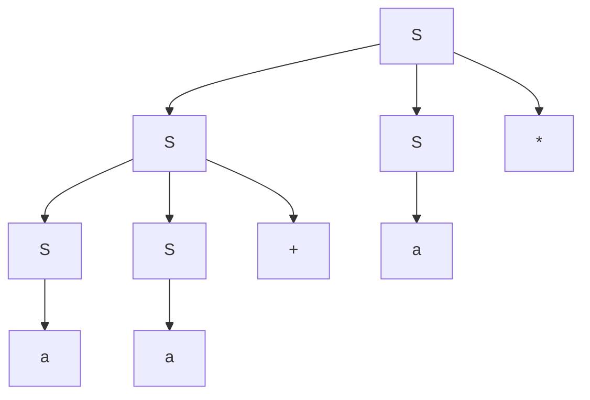

# 3. Syntax Analysis and CFG

## Lecture 06: Context Free Grammar (CFG)

A **Context Free Grammar (CFG)** is a formal grammar which is used to generate all the possible patterns of strings in a given formal language.

It is defined by four tuples: **$G = (V, T, P, S)$**
*   **$G$:** is a grammar, which consists of a set of production rules to generate the strings of a language.
*   **$T$:** is a finite set of **terminal** symbols.
*   **$V$:** is a finite set of **non-terminal** symbols.
*   **$P$:** is a set of **production rules**.
*   **$S$:** is the **start symbol**.

### Problem 1: Identifying Elements of a Grammar
**Question:** Identify the terminals, non-terminals, and start variable from the following grammar:
```
1. E -> E + T | T
   T -> T * F | F
   F -> (E) | id

2. S -> (L) | a
   L -> L , S | S
```

**Solution for Grammar 1:**
*   **Non-terminals ($V$):** $\{E, T, F\}$
*   **Terminals ($T$):** $\{+, *, (, ), id\}$
*   **Start Symbol ($S$):** $E$

### Problem 2: Constructing Grammars for Languages
**Question:** Given the languages, construct their grammars.

1.  **$L = \{a^n \mid n \ge 0\}$**
    *   Output strings: $\{\epsilon, a, aa, aaa, \dots\}$
    *   Production: **$A \rightarrow aA \mid \epsilon$**
2.  **$L = \{a^n b^n \mid n \ge 1\}$**
    *   Output strings: $\{ab, aabb, aaabbb, \dots\}$
    *   Production: **$A \rightarrow ab \mid aAb$**
3.  **$L = \{a^n \mid n \ge 1\}$**
    *   Output strings: $\{a, aa, aaa, \dots\}$ (Without $\epsilon$)
    *   Production: **$A \rightarrow a \mid aA$**
4.  **Set of all strings of length at least 2, starts with 'a' and ends with 'b'.**
    *   Output strings: $\{ab, aab, abab, \dots\}$
    *   Production: 
        **$S \rightarrow aAb$**
        **$A \rightarrow aA \mid bA \mid \epsilon$**

---

## Lecture 07: Leftmost and Rightmost Derivation in CFG

*   **Leftmost Derivation:** A derivation $A \Rightarrow^* w$ is called a leftmost derivation if we apply a production only to the **leftmost** variable at every step.
*   **Rightmost Derivation:** A derivation $A \Rightarrow^* w$ is called a rightmost derivation if we apply a production only to the **rightmost** variable at every step.

### Problem 3: Deriving `aabbaa`
**Question:** Consider the following grammar $G$:
$S \rightarrow aAS \mid a$
$A \rightarrow SbA \mid SS \mid ba$

For the input string `aabbaa`, show the leftmost and rightmost derivation.

**Solution:**
**a) Leftmost Derivation:**
*   $S \Rightarrow \textbf{aAS}$
*   $\Rightarrow a\textbf{SbA}S$
*   $\Rightarrow aa\textbf{bA}S$
*   $\Rightarrow aab\textbf{ba}S$
*   $\Rightarrow aabba\textbf{a}$

**b) Rightmost Derivation:**
*   $S \Rightarrow aA\textbf{S}$
*   $\Rightarrow a\textbf{A}a$
*   $\Rightarrow a\textbf{SbA}a$
*   $\Rightarrow aSb\textbf{ba}a$
*   $\Rightarrow a\textbf{a}bbaa$

### Problem 4: Deriving `aa+a*`
**Question:** Consider the context-free grammar:
$S \rightarrow SS+ \mid SS* \mid a$
Show how the string `aa+a*` can be generated by this grammar in leftmost and rightmost derivation, and construct a parse tree.

**Solution:**
**1) Leftmost Derivation (L.M):**
*   $S \Rightarrow \textbf{SS*}$
*   $\Rightarrow \textbf{SS+S*}$
*   $\Rightarrow \textbf{aS+S*}$
*   $\Rightarrow aa+\textbf{S*}$
*   $\Rightarrow aa+a*$

**2) Rightmost Derivation (R.M):**
*   $S \Rightarrow S\textbf{S*}$
*   $\Rightarrow \textbf{Sa*}$
*   $\Rightarrow S\textbf{S+a*}$
*   $\Rightarrow S\textbf{a+a*}$
*   $\Rightarrow aa+a*$

**3) Parse Tree:**

