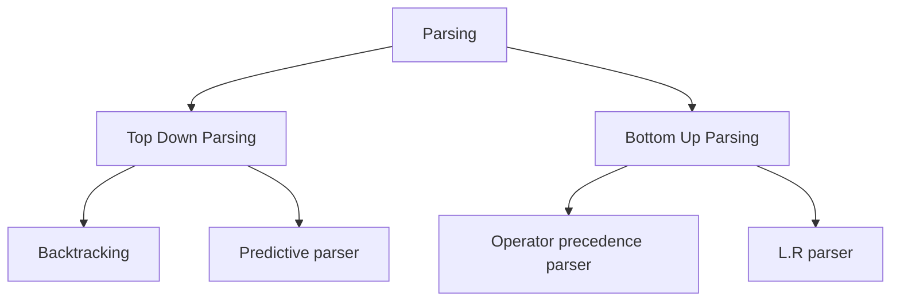

# 5. Bottom-Up Parsing

## Lecture 10: Parsing Hierarchy

Parsers can be generally divided into two broad categories:

### 1. Top-Down Parsing
*   The parser starts constructing the parse tree from the **start symbol** and tries to transform the start symbol to the input symbol string.
*   **Expansion** is the primary operation.
*   **Example Method:** LL Parse.
*   **Problem:** If the grammar is ambiguous (e.g., $E \rightarrow E+E \mid E*E \mid id$), a top-down approach can construct multiple valid parse trees for the same input string (like `id*id+id`), leading to ambiguity problems.

### 2. Bottom-Up Parsing
*   The parser starts with the **input symbol** and tries to construct the parse tree upwards to the **start symbol**.
*   **Reduction** is the primary operation (replacing a string of symbols with a non-terminal).
*   **Example Method:** LR Parse.

---

## Operator Precedence Parsing (O.P.P)

An Operator Precedence Parser is a bottom-up parser that can handle a specific class of grammars called **Operator Grammars**. This helps solve the ambiguity problem seen in standard top-down approaches for mathematical expressions.

**A grammar $G$ is an operator grammar if it has the following properties:**
1.  Productions shouldn't contain $\epsilon$ on their right side.
2.  There shouldn't be two adjacent non-terminals at the right side of any production.

**Example of converting to O.P.P Grammar:**
Given:
$E \rightarrow EAE \mid (E) \mid id$
$A \rightarrow + \mid - \mid *$
It has adjacent non-terminals ($EAE$). We must substitute $A$:
$E \rightarrow E+E \mid E*E \mid E-E \mid (E) \mid id$

### O.P.P Rules for Precedence
Here, $\theta_1$ and $\theta_2$ are operators.
1.  If the precedence of $\theta_1$ is higher than $\theta_2$, then $\theta_1 > \theta_2$.
2.  If the precedence of $\theta_1$ and $\theta_2$ are the same, check associativity:
    *   If left-associative: $\theta_1 > \theta_2$ and $\theta_2 > \theta_1$.
    *   If right-associative: $\theta_1 < \theta_2$ and $\theta_2 < \theta_1$.
3.  **Other Rules:**
    *   `id > $`
    *   `$` is less than everything: `$ < \theta`
    *   $id > \theta$ (id is greater than operators)
    *   $\theta < id$

---

## Lecture 11: Constructing Operator Precedence Parse

**Question:** Consider the grammar $E \rightarrow EAE \mid id$, $A \rightarrow + \mid *$
Construct the operator precedence table and parse the string: `id + id * id`

**Step 1:** Convert to precedence grammar.
$E \rightarrow E+E \mid E*E \mid id$

**Step 2:** Add `$` to both ends of the string and construct the table.
String becomes: `$ id + id * id $`
Terminal symbols: `{$, id, +, *}`

| | `id` | `+` | `*` | `$` |
| :--- | :--- | :--- | :--- | :--- |
| **`id`** | | $>$ | $>$ | $>$ |
| **`+`** | $<$ | $>$ | $<$ | $>$ |
| **`*`** | $<$ | $>$ | $>$ | $>$ |
| **`$`** | $<$ | $<$ | $<$ | |

**Step 3:** Parse the string using the following rules:
1.  Scan the string from left to right until the first `>` is encountered.
2.  Then scan backwards (to the left) over any `=` until a `<` is encountered.
3.  Handle the string between `<` and `>` by reducing it (replacing it with a non-terminal).
4.  Parsing is successful when you are left with `$ \dots $`.

**Parsing Trace:**
1. `$ < id > + < id > * < id > $`
2. Handle `< id >`. Reduce to $E$. (Wait, in OPP we only show terminals).
3. Result: `$ < + < id > * < id > $`
4. Handle `< id >`. 
5. Result: `$ < + < * < id > $`
6. Handle `< id >`.
7. Result: `$ < + < * > $`
8. Handle `< * >`. Reduce.
9. Result: `$ < + > $`
10. Handle `< + >`. Reduce.
11. Result: `$` (Success)

---

## Lecture 12: Stack Implementation of Shift-Reduce Parsing

A convenient way to implement a shift-reduce parser is to use a **stack** to hold grammar symbols and an **input buffer** to hold the string $w$ to be parsed. 
We use `$` to mark the bottom of the stack and also the right end of the input.
*   **Initially:** Stack is empty `$` , Input is `w $`.
*   **Successful Completion:** Stack has `$ S` (where $S$ is start symbol), Input is `$`.

### Primary Operations:
1.  **Shift:** The next input symbol is shifted onto the top of the stack.
2.  **Reduce:** The parser knows the right end of the handle is at the top of the stack. It must locate the left end of the handle within the stack and decide with what non-terminal to replace the handle.
3.  **Accept:** Parsing successfully completes.
4.  **Error:** A syntax error is detected.

### Shift-Reduce Trace Example
**Grammar:** $E \rightarrow E+E \mid E*E \mid id$
**String:** `id_1 + id_2 * id_3 $`

| Stack | Input | Action |
| :--- | :--- | :--- |
| `$` | `id_1 + id_2 * id_3 $` | Shift |
| `$ id_1` | `+ id_2 * id_3 $` | Reduce by $E \rightarrow id$ |
| `$ E` | `+ id_2 * id_3 $` | Shift |
| `$ E +` | `id_2 * id_3 $` | Shift |
| `$ E + id_2` | `* id_3 $` | Reduce by $E \rightarrow id$ |
| `$ E + E` | `* id_3 $` | Shift |
| `$ E + E *` | `id_3 $` | Shift |
| `$ E + E * id_3` | `$` | Reduce by $E \rightarrow id$ |
| `$ E + E * E` | `$` | Reduce by $E \rightarrow E * E$ |
| `$ E + E` | `$` | Reduce by $E \rightarrow E + E$ |
| `$ E` | `$` | **Accept** |
