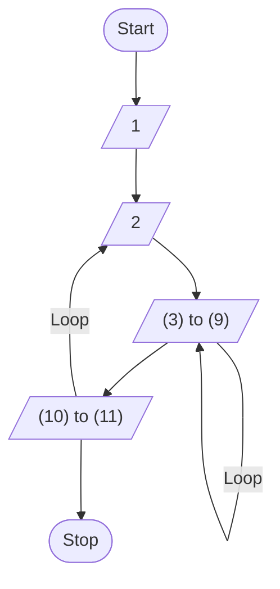

# 6. Intermediate Code and Optimization

## Lecture 13: Intermediate Code Generation

During compilation, the syntax tree or intermediate representation is transformed into instructions. We can express intermediate code in several ways. 

**Question:** Consider the following assignment statement:
$$A = -B * (C / D)$$

Express the expression using:
1.  Three-address code
2.  Quadruples
3.  Triples

### Solution:

#### 1. Three-Address Code
The expression is broken down into simple operations with at most three addresses (two operands and one result).

$$A = -B \times E$$
$$E = C / D$$

Translating to standard temporaries:
```
T1 = -B
T2 = C / D
T3 = T1 * T2
A = T3
```

#### 2. Quadruples
A quadruple is a record structure with four fields: `op`, `arg1`, `arg2`, and `result`.

| | `op` | `arg1` | `arg2` | `result` |
| :--- | :--- | :--- | :--- | :--- |
| **0** | `Uminus` | `B` | | `T1` |
| **1** | `/` | `C` | `D` | `T2` |
| **2** | `*` | `T1` | `T2` | `T3` |
| **3** | `=` | `T3` | | `A` |

#### 3. Triples
Triples use only three fields: `op`, `arg1`, and `arg2`. They avoid the use of explicit temporary variables by referring directly to the position of the statement that computes the value.

| | `op` | `arg1` | `arg2` |
| :--- | :--- | :--- | :--- |
| **(0)** | `Uminus` | `B` | |
| **(1)** | `/` | `C` | `D` |
| **(2)** | `*` | `(0)` | `(1)` |
| **(3)** | `=` | `A` | `(2)` |

---

## Code Optimization: Construction of Basic Blocks

**Algorithm:** Partition into Basic Blocks.
*   **Input:** A sequence of three-address statements.
*   **Output:** A list of basic blocks with three-address statements in exactly one block.

### Method

**1. We first determine the set of leaders. Rules are:**
*   **Rule I:** The first statement is a leader.
*   **Rule II:** Any statement which is a target statement of a conditional or unconditional `goto` is a leader.
*   **Rule III:** Any statement which immediately follows a conditional `goto` is a leader.

**2. Form the Basic Blocks:**
From one leader statement to the just prior statement of the next leader (if no such leader statement is present, then up to the last statement) will form a basic block.

---

### Basic Blocks & Control Flow Graph Example

**Question:** Consider the following intermediate code given below. Draw the control-flow graph and find the number of nodes and edges.
1. `i = 1`
2. `j = 1`
3. `t1 = 5 * i`
4. `t2 = t1 + j`
5. `t3 = 4 * t2`
6. `t4 = t3`
7. `a[t4] = -1`
8. `j = j + 1`
9. `if j <= 5 goto (3)`
10. `i = i + 1`
11. `if i < 5 goto (2)`

#### Partitioning into Blocks:
*   **Block 1:** Statement 1 (Leader by Rule I).
*   **Block 2:** Statement 2 (Leader by Rule II, target of `goto (2)`).
*   **Block 3:** Statements 3 to 9 (Statement 3 is a leader by Rule II, target of `goto (3)`).
*   **Block 4:** Statements 10 to 11 (Statement 10 is a leader by Rule III, immediately following a conditional `goto`).

#### Control-Flow Graph



**Solution:**
*   **Nodes:** 6 (Start, Block 1, Block 2, Block 3, Block 4, Stop)
*   **Edges:** 7
