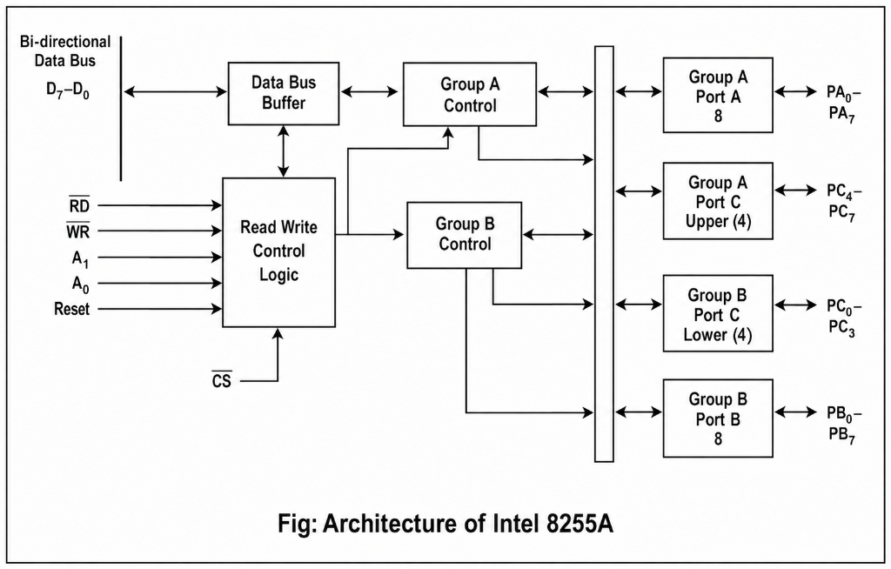
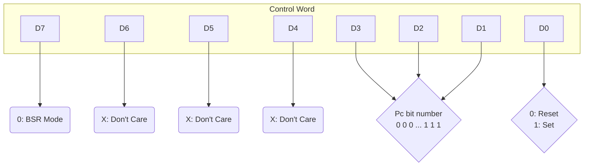
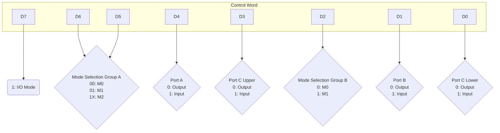
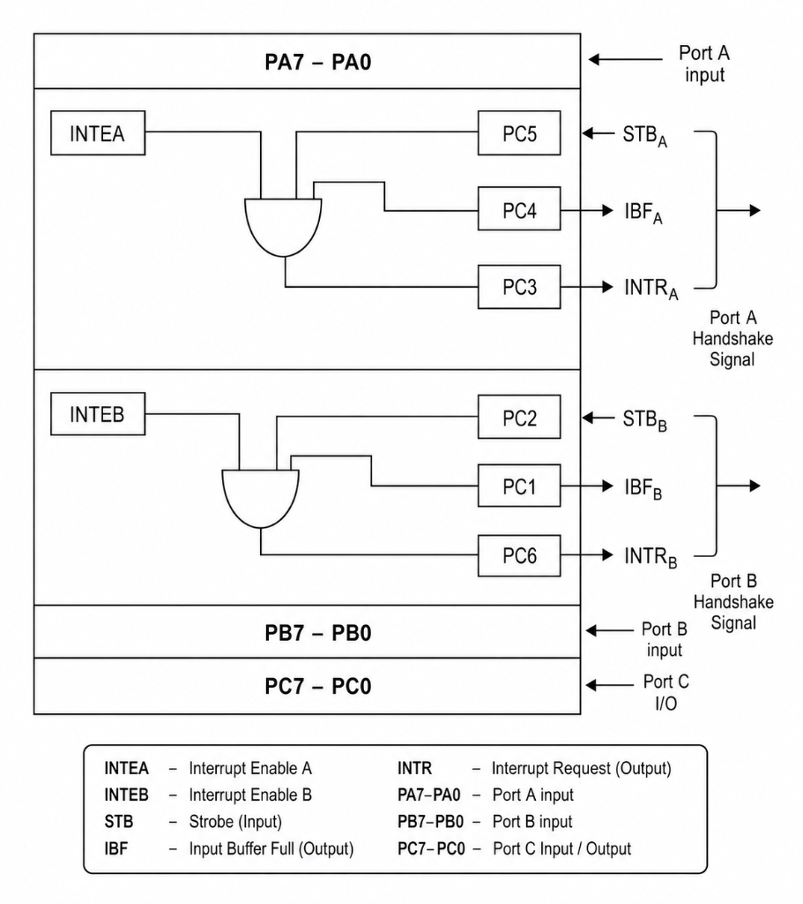
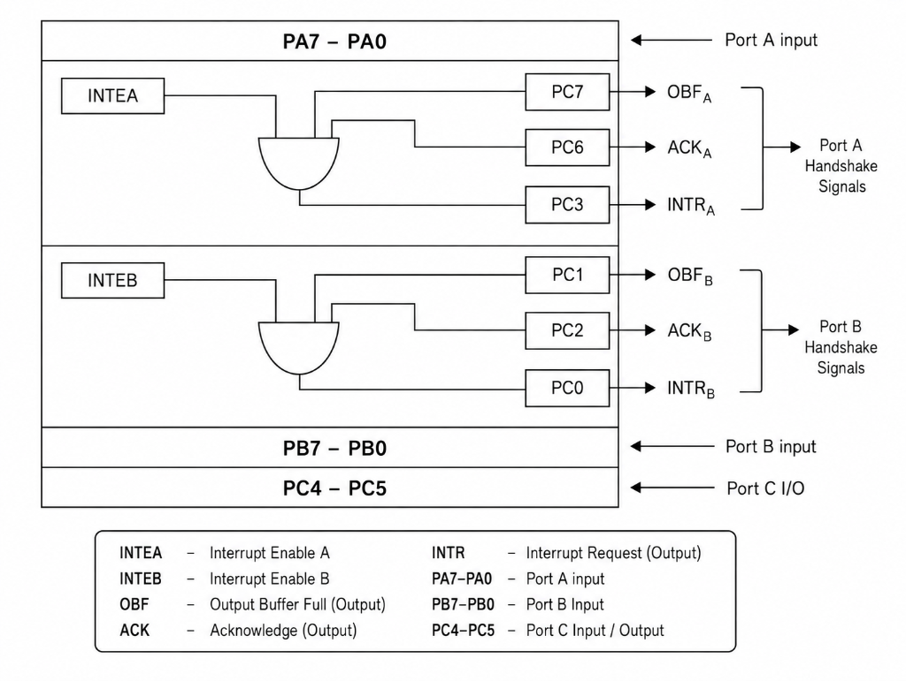
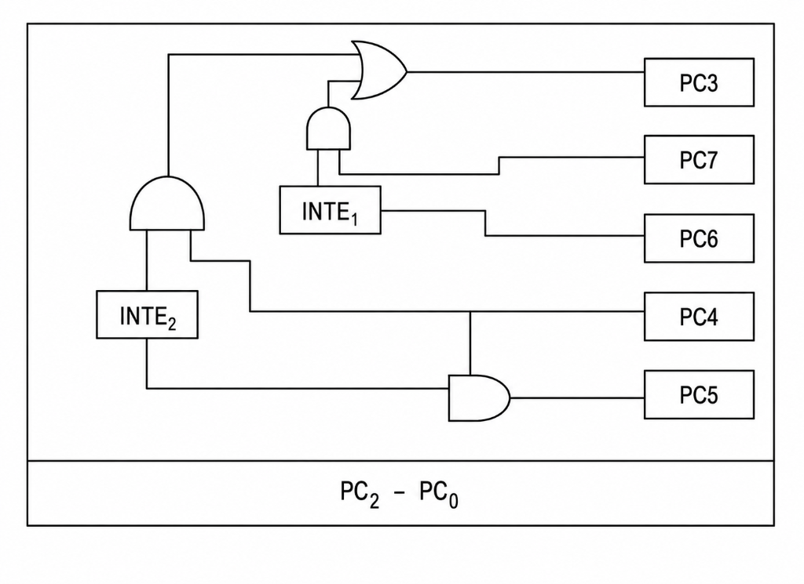
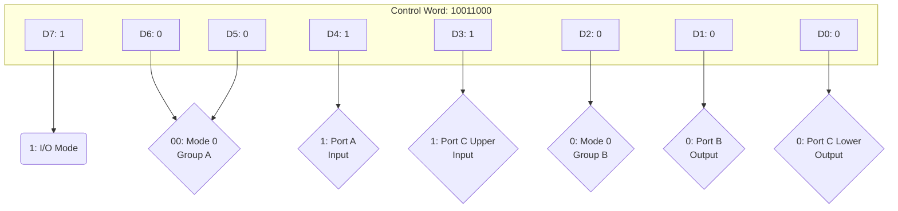
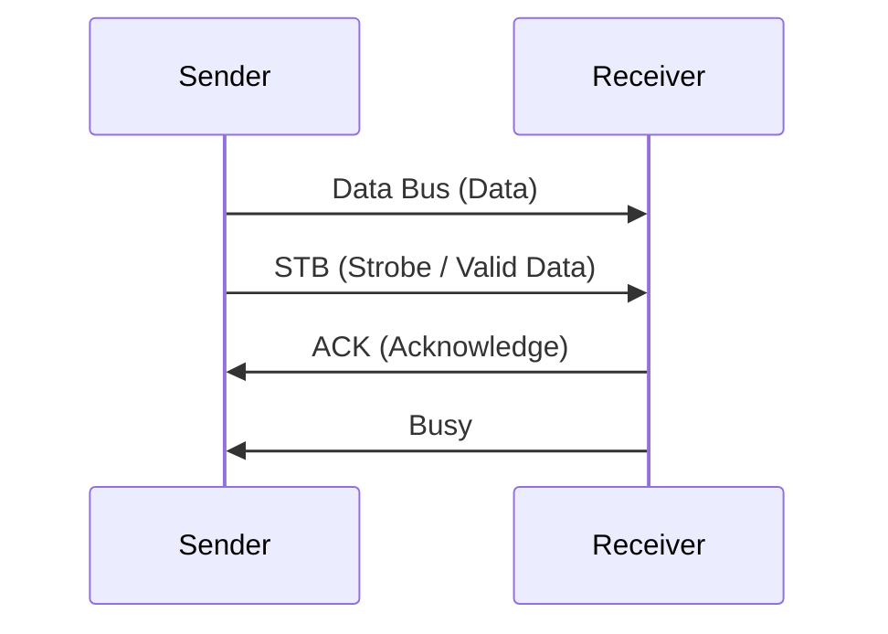
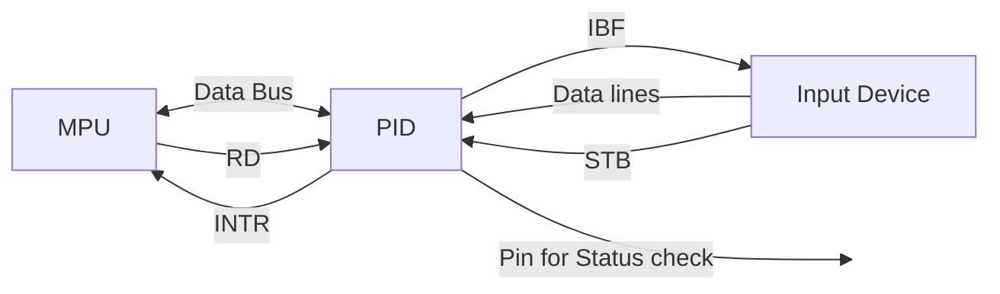
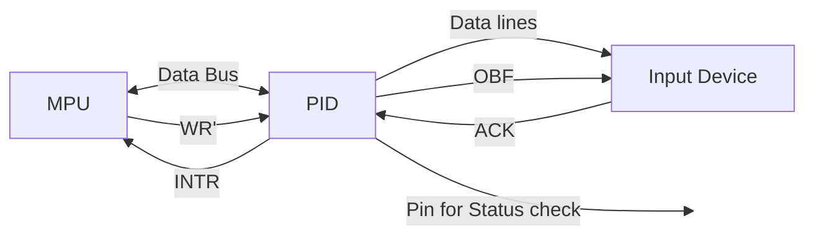

# Peripheral Interfacing & Architecture

## Peripheral
A **peripheral device** is a device that is connected to a computer system that is not part of the core computer system which provides input/output for a computer and serves as an arbitrary device.

### Classification
* **Input device** (Keyboard, mouse)
* **Output device** (monitors)
* **Storage device** (SSD, RAM)

### Why Peripheral is important?
Peripheral devices are the some important arbitrary part of computer that take information and allows the computer to put out information in visible form.
* Advantage
* Disadvantage

### Interfacing
An interactive stored boundary across two or more separate component of computer exchange information.

* Software $\longleftrightarrow$ Hardware
* Software $\longleftrightarrow$ Users

### Why interfacing is important?
**Programmable Peripheral Interface:**
PPI is a multiport device, the port may be programmed in a variety of ways as required by programmer.
* Intel 8255
* Intel 8255 A

---

## Architecture of Intel 8255A

---

## Pin description from figure

* **$D_7 - D_0$**
  * If **$D_7 = 0$** $\longrightarrow$ **BSR** $\longrightarrow$ Reset / Set
  * If **$D_7 = 1$** $\longrightarrow$ **I/O** $\longrightarrow$ Mode 0 / Mode 1 / Mode 2

### I/O Modes

**Mode 0:** Simple or basic I/O mode. Port A, B and C can work either as input or output function. The outputs are latched and inputs are not latched.

**Mode 1:** Handshake or strobed I/O. In this either Port A or Port B can work and Port C used for handshaking. Both input and output are latched.

**Mode 2:** Bidirectional I/O, in the mode only Port A will work, Port C can either mode 0 or mode 1, and port C used for handshaking.

---

## BSR (Bit Set Reset) Mode
This mode is used to set or reset the bits of Port C only and most significant bit ($D_7$) in Control register 0 or 1. The user set the bit. It remains set until unless user changes it.

### BSR Control Word Format

---

## I/O Control Word Format

*(Combined representation of the I/O Control Word)*

---

## Mode-1 Input Configuration and Status Word

### Status Word (Mode-1 Input)

| D7 | D6 | D5 | D4 | D3 | D2 | D1 | D0 |
| :---: | :---: | :---: | :---: | :---: | :---: | :---: | :---: |
| I/O | I/O | $IBF_A$ | $INTE_A$ | $INTR_A$ | $INTE_B$ | $IBF_B$ | $INTR_B$ |

---

## Mode-2 Output Configuration and Status Word

### Status Word (Mode-2 Output)

| D7 | D6 | D5 | D4 | D3 | D2 | D1 | D0 |
| :---: | :---: | :---: | :---: | :---: | :---: | :---: | :---: |
| $\overline{OBF_A}$ | $INTE_A$ | I/O | I/O | $INTR_A$ | $INTE_B$ | $\overline{OBF_B}$ | $INTR_B$ |

---

## Mode-3 Bidirectional Configuration

---

## Control Word Configuration Example

**Question:**
> Draw the bit definitions of control status words and determine the control word configuration for the Intel 8255A chip operating mode 0 with Port A and Port C (upper) set as input and Port B and Port C (lower) set as outputs.

**Answer:**

**Final Control Word:** `# 10011000` (or `0x98` in Hex)
*(Example 2 noted in class: `# 01011101`)*

---

## Strobe Signals & Handshaking

### Strobe Signals
A **strobe signal** is a control signal used to indicate the presence of valid data during communication.

### Handshaking
Handshaking is a process of establishing communication between two devices (sender and receiver). It ensures synchronization for data transfer similar to a friendly communication. It is used in computer systems to transfer data between two systems.

#### Types of Handshaking:
1. Source initiated
2. Destination initiated

#### Handshaking Concept

#### Input Handshaking Operation

#### Output Hand Shaking Operation

