# Classical Ciphers Examples

## Outline
- Playfair Cipher
- Hill Cipher
- Vigenère Cipher

## History of Playfair Cipher
- Playfair cipher is proposed by Charles Whetstone in 1889. But it was named for one of his friends Lord Lyon Playfair because he popularized its uses.
- Playfair Cipher is a polyalphabetic substitute cipher technique.
- As we know, Polyalphabetic Cipher is a substitution cipher in which the cipher alphabet for the plain alphabet may be different at different places during the encryption process.

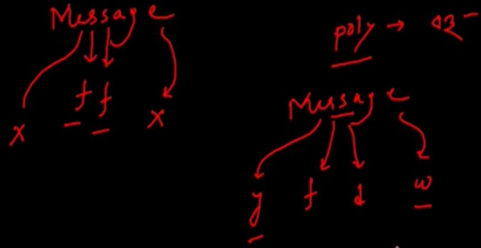

## Introduction to Playfair Cipher Technique
### The Playfair Cipher Encryption Algorithm consists of 2 steps

#### 1. Generate the key Square (5×5):
- The Playfair Cipher uses a 5×5 matrix of letters (the key table), which contains no duplicates. The letters I and J are treated as the same letter. We form the key table by placing the unique letters of the key in order, followed by the remaining letters of the alphabet. If the letters contain J, then J is replaced by I and vice versa.
- Let's take the key Instruction as an example. First, we write down the letters of this word in the first squares of a 5×5 matrix:

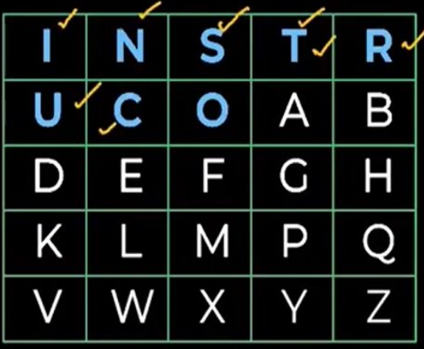
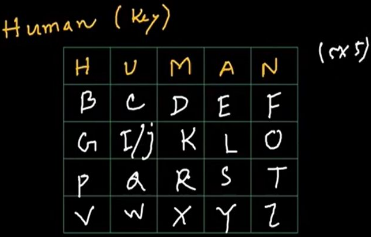

#### 2. Algorithm to encrypt the plain text:
- We move forward by splitting the message into pairs of letters (digraph). If a digraph contains identical consecutive letters, we insert X between them. Additionally, if the plaintext has an odd length, we append X at the end to form a complete digraph.
- For example, when dealing with the word MATTRESS, we divide the message into pairs of letters:
  `MA TT RE SS`
- Since the digraph TT contains identical consecutive letters, we insert X between them:
  `MA TX TR ES S`
- As the message has an odd length after insertion, we append X at the end to make it even:
  `MA TX TR ES SX`

### Encryption Rules
There are three rules for encrypting letters in the same pair.
- If both letters in the pair are in the same row of the key square, we replace each letter with the letter to it's right (wrapping around if necessary).
- If both letters in the pair are in the same column of the key square, we replace each letter with the letter below it (wrapping around if necessary).
- If the letters are in different rows and columns, we form a rectangle with the pair and replace each letter with the letter at the rectangle's opposite corner (moving only left or right).

### Applying the rules
Using the matrix with the keyword Instruction, let's find the row and column of each pair and apply the encryption rules to MATTRESS, whose pairs are: `MA TX TR ES SX`

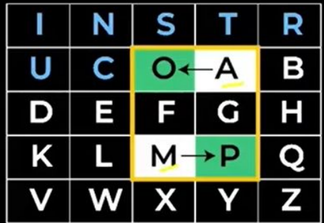

#### For MA
- Rule 03: If the letters are in different rows and columns, we form a rectangle with the pair and replace each letter with the letter at the rectangle's opposite corner.
- After applying the encryption rule to the $1^{st}$ letter pairs, we get,
  `MA → PO`

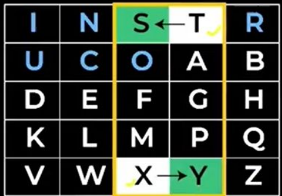

#### For TX
- Rule 03: After applying the encryption rule to the $2^{nd}$ letter pairs, we get,
  `TX → SY`

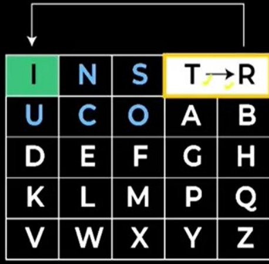

#### For TR
- Rule 01: If both letters in the pair are in the same row of the key square, we replace each letter with the letter to its right.
- After applying the encryption rule to the $3^{rd}$ letter pairs, we get,
  `TR → RI`

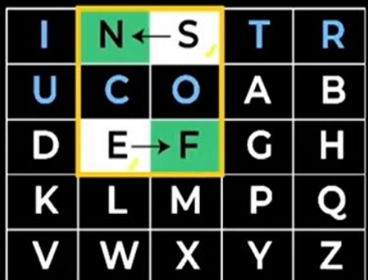

#### For ES
- Rule 03: After applying the encryption rule to the $4^{th}$ letter pairs, we get,
  `ES → FN`

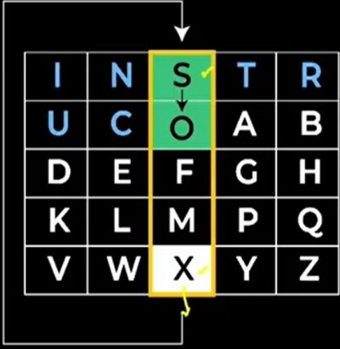

#### For SX
- Rule 02: If both letters in the pair are in the same column of the key square, we replace each letter with the letter below it.
- After applying the encryption rule to the $5^{th}$ letter pairs, we get,
  `SX → OS`

| MA | TX | TR | ES | SX |
| --- | --- | --- | --- | --- |
| PO | SY | RI | FN | OS |

After applying the encryption rules to all the letter pairs, we get: **POSYRIFNOS**

## Playfair Cipher Exam Type Example With Decryption
### Algorithm to decrypt the cipher text:
Generate the key Square (5×5) that is the same as that we have shown in Encryption Technique.
There are three rules for decrypting letters in the same pair.
- If both letters in the pair are in the same row of the key square, we replace each letter with the letter to its left (wrapping around if necessary).
- If both letters in the pair are in the same column of the key square, we replace each letter with the letter above it (wrapping around if necessary).
- If the letters are in different rows and columns, we form a rectangle with the pair and replace each letter with the letter at the rectangle's opposite corner (moving only left or right).

### Example
**Problem Statement:** Decrypt the given plain text using Playfair Cipher technique where,
- **Cipher text:** BYYBBRBYMTHKAU
- **keyword:** velocity

**Soln:** Let's take the key velocity First, we write down the letters of this word in the first squares of a 5×5 matrix:

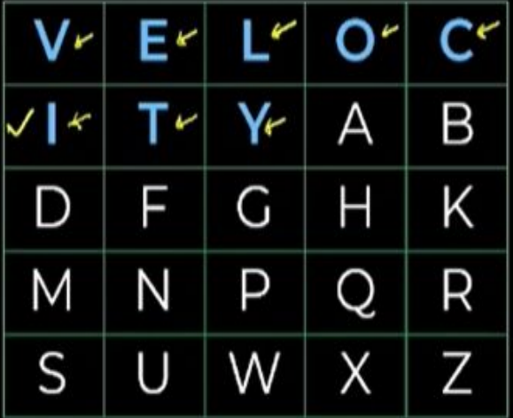

Using the matrix with the keyword Velocity, let's find the row and column of each pair and apply the decryption rules to BYYBBRBYMTHKAU, whose pairs are: `BY YB BR BY MT HK AU`

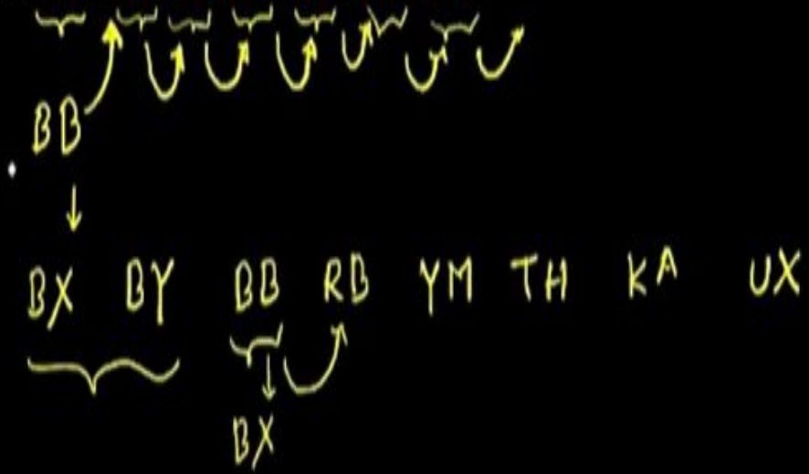

| V | E | L | O | C |
| --- | --- | --- | --- | --- |
| I | T | Y | A | B |
| D | F | G | H | K |
| M | N | P | Q | R |
| S | U | W | X | Z |

- **For BY:** `BY → AT`
- **For YB:** `YB → TA`
- **For BR:** `BR → CK`
- **For BY:** `BY → AT`
- **For MT:** `MT → NI`
- **For HK:** `HK → GH`
- **For AU:** `AU → TX`

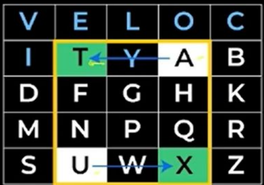

| BY | YB | BR | BY | MT | HK | AU |
| --- | --- | --- | --- | --- | --- | --- |
| AT | TA | CK | AT | NI | GH | TX |

After applying the decryption rules to all the letter pairs, we get **ATTACK AT NIGHTX**

## Hill Cipher
- Multi-letter cipher.
- Developed by Lester Hill in 1929.
- Encrypts a group of letters : digraph, trigraph or polygraph.

### Concepts to be known:
- Matrix arithmetic modulo 26.
- Square matrix.
- Determinant.
- Multiplicative inverse.

### The Hill Algorithm
This can be expressed as:
$$ \begin{aligned} C = E(K,P) &= P \times K \bmod 26 \\ P = D(K,C) &= C K^{-1} \bmod 26 = P \times K \times K^{-1} \bmod 26 \end{aligned} $$

$$ \begin{aligned} (C_1 C_2 C_3) &= (P_1 P_2 P_3) \begin{pmatrix} K_{11} & K_{12} & K_{13} \\ K_{21} & K_{22} & K_{23} \\ K_{31} & K_{32} & K_{33} \end{pmatrix} \bmod 26 \end{aligned} $$

$$ \begin{aligned} C_1 &= (P_1K_{11}+P_2K_{21}+P_3K_{31})\ \bmod\ 26 \\ C_2 &= (P_1K_{12}+P_2K_{22}+P_3K_{32})\ \bmod\ 26 \\ C_3 &= (P_1K_{13}+P_2K_{23}+P_3K_{33})\ \bmod\ 26 \end{aligned} $$

### Hill Cipher Example
**Question:** Encrypt "pay more money" using Hill cipher with key:
$$ \begin{pmatrix}17&17&5\\ 21&18&21\\ 2&2&19\end{pmatrix} $$

**Solution:**

| p | a | y | m | o | r | e | m | o | n | e | y |
| --- | --- | --- | --- | --- | --- | --- | --- | --- | --- | --- | --- |
| 15 | 0 | 24 | 12 | 14 | 17 | 4 | 12 | 14 | 13 | 4 | 24 |

Key = 3 × 3 matrix.
PT = pay mor emo ney

#### Encrypting: pay
$$ \begin{aligned} (C_1 C_2 C_3) &= (15 \ 0 \ 24) \begin{pmatrix} 17 & 17 & 5 \\ 21 & 18 & 21 \\ 2 & 2 & 19 \end{pmatrix} \bmod 26 \\ &= (15 \times 17 + 0 \times 21 + 24 \times 2 \quad 15 \times 17 + 0 \times 18 + 24 \times 2 \quad 15 \times 5 + 0 \times 21 + 24 \times 19) \bmod 26 \\ &= (303 \ 303 \ 531) \bmod 26 \\ &= (17 \ 17 \ 11) \\ &= (R \ R \ L) \end{aligned} $$

#### Encrypting: mor
$$ \begin{aligned} (C_1 C_2 C_3) &= (12 \ 14 \ 17) \begin{pmatrix} 17 & 17 & 5 \\ 21 & 18 & 21 \\ 2 & 2 & 19 \end{pmatrix} \bmod 26 \\ &= (12 \times 17 + 14 \times 21 + 17 \times 2 \quad 12 \times 17 + 14 \times 18 + 17 \times 2 \quad 12 \times 5 + 14 \times 21 + 17 \times 19) \bmod 26 \\ &= (532 \ 490 \ 677) \bmod 26 \\ &= (12 \ 22 \ 1) \\ &= (M \ W \ B) \end{aligned} $$

#### Encrypting: emo
$$ \begin{aligned} (C_1 C_2 C_3) &= (4 \ 12 \ 14) \begin{pmatrix} 17 & 17 & 5 \\ 21 & 18 & 21 \\ 2 & 2 & 19 \end{pmatrix} \bmod 26 \\ &= (4 \times 17 + 12 \times 21 + 14 \times 2 \quad 4 \times 17 + 12 \times 18 + 14 \times 2 \quad 4 \times 5 + 12 \times 21 + 14 \times 19) \bmod 26 \\ &= (348 \ 312 \ 538) \bmod 26 \\ &= (10 \ 0 \ 18) \\ &= (K \ A \ S) \end{aligned} $$

#### Encrypting: ney
$$ \begin{aligned} (C_1 C_2 C_3) &= (13 \ 4 \ 24) \begin{pmatrix} 17 & 17 & 5 \\ 21 & 18 & 21 \\ 2 & 2 & 19 \end{pmatrix} \bmod 26 \\ &= (13 \times 17 + 4 \times 21 + 24 \times 2 \quad 13 \times 17 + 4 \times 18 + 24 \times 2 \quad 13 \times 5 + 4 \times 21 + 24 \times 19) \bmod 26 \\ &= (348 \ 312 \ 538) \bmod 26 \\ &= (15 \ 3 \ 7) \\ &= (P \ D \ H) \end{aligned} $$

**Plaintext :** pay more money
**Ciphertext :** RRLMWBKASPDH

### Hill Decryption Algorithm
Decryption requires $K^{-1}$, the inverse matrix $K$.
$$K^{-1} = \frac{1}{\det K} \times \text{Adj K}$$

#### To find Det K, Adj K
To find the determinant of K:
$$ \begin{aligned} \text{Det}\begin{pmatrix} 17 & 17 & 5 \\ 21 & 18 & 21 \\ 2 & 2 & 19 \end{pmatrix} \bmod 26 &= 17(18 \times 19 - 2 \times 21) - 17(19 \times 21 - 2 \times 21) + 5(2 \times 21 - 2 \times 18) \bmod 26 \\ &= 17(342 - 42) - 17(399 - 42) + 5(42 - 36) \bmod 26 \\ &= 17(300) - 17(357) + 5(6) \bmod 26 \\ &= 5100 - 6069 + 30 \bmod 26 \\ &= -939 \bmod 26 \\ &= -3 \bmod 26 = 23 \end{aligned} $$

$$ K^{-1}=\frac{1}{23}\times\begin{pmatrix}14&25&7\\ 7&1&8\\ 6&0&1\end{pmatrix}\bmod 26 $$

### Example Matrix Adjugate
Let:
$$ A=\begin{bmatrix}1&2&3\\ 0&1&4\\ 5&6&0\end{bmatrix} $$

**Step 1: Find the cofactor of each element**
$$ \begin{aligned} C_{11}&=\begin{vmatrix}1&4\\ 6&0\end{vmatrix}=(1)(0)-(4)(6)=-24 \\ C_{12}&=-\begin{vmatrix}0&4\\ 5&0\end{vmatrix}=-(0-20)=20 \\ C_{13}&=\begin{vmatrix}0&1\\ 5&6\end{vmatrix}=(0)(6)-(1)(5)=-5\end{aligned} $$

$$ \begin{aligned} C_{21}&=-\begin{vmatrix}2&3\\ 6&0\end{vmatrix}=-(-18)=18\\ C_{22}&=\begin{vmatrix}1&3\\ 5&0\end{vmatrix}=-15\\ C_{23}&=-\begin{vmatrix}1&2\\ 5&6\end{vmatrix}=-(6-10)=4\end{aligned} $$

$$ \begin{aligned} C_{31}&=\begin{vmatrix}2&3\\ 1&4\end{vmatrix}=8-3=5\\ C_{32}&=-\begin{vmatrix}1&3\\ 0&4\end{vmatrix}=-4\\ C_{33}&=\begin{vmatrix}1&2\\ 0&1\end{vmatrix}=1\end{aligned} $$

**Step 2: Form the cofactor matrix**
$$ C=\begin{bmatrix}-24&20&-5\\ 18&-15&4\\ 5&-4&1\end{bmatrix} $$

**Step 3: Take the transpose**
$$ \operatorname{adj}(A)=C^T=\begin{bmatrix}-24&18&5\\ 20&-15&-4\\-5&4&1\end{bmatrix} $$

**Final Inverse Matrix:**
$$ K^{-1}=\begin{pmatrix}4&9&15\\ 15&17&6\\ 24&0&17\end{pmatrix} $$

This is demonstrated as:
$$ \begin{aligned} \begin{pmatrix}17&17&5\\21&18&21\\2&2&19\end{pmatrix} \begin{pmatrix}4&9&15\\15&17&6\\24&0&17\end{pmatrix} &= \begin{pmatrix}443&442&442\\858&495&780\\494&52&365\end{pmatrix} \bmod 26 \\ &= \begin{pmatrix} 1 & 0 & 0 \\ 0 & 1 & 0 \\ 0 & 0 & 1 \end{pmatrix} \end{aligned} $$

### Decrypting the previous example
**Question:** Decrypt "RRLMWBKASPDH" using Hill cipher with key:
$$ \begin{pmatrix}17&17&5\\ 21&18&21\\ 2&2&19\end{pmatrix} $$

**Solution:**
$$P = C \times K^{-1} \bmod 26$$

| R | R | L | M | W | B | K | A | S | P | D | H |
| --- | --- | --- | --- | --- | --- | --- | --- | --- | --- | --- | --- |
| 17 | 17 | 11 | 12 | 22 | 1 | 10 | 0 | 18 | 15 | 3 | 7 |

#### Decrypting: RRL
$$ \begin{aligned} (P_1 P_2 P_3) &= (17 \ 17 \ 11) \begin{pmatrix} 4 & 9 & 15 \\ 15 & 17 & 6 \\ 24 & 0 & 17 \end{pmatrix} \bmod 26 \\ &= (17 \times 4 + 17 \times 15 + 11 \times 24 \quad 17 \times 9 + 17 \times 17 + 11 \times 0 \quad 17 \times 15 + 17 \times 6 + 11 \times 17) \bmod 26 \\ &= (587 \ 442 \ 544) \bmod 26 \\ &= (15 \ 0 \ 24) \\ &= (P \ A \ Y) \end{aligned} $$

#### Decrypting: MWB
$$ \begin{aligned} (P_1 P_2 P_3) &= (12 \ 22 \ 1) \begin{pmatrix} 4 & 9 & 15 \\ 15 & 17 & 6 \\ 24 & 0 & 17 \end{pmatrix} \bmod 26 \\ &= (12 \times 4 + 22 \times 15 + 1 \times 24 \quad 12 \times 9 + 22 \times 17 + 1 \times 0 \quad 12 \times 15 + 22 \times 6 + 1 \times 17) \bmod 26 \\ &= (402 \ 482 \ 329) \bmod 26 \\ &= (12 \ 14 \ 17) \\ &= (M \ O \ R) \end{aligned} $$

#### Decrypting: KAS
$$ \begin{aligned} (P_1 P_2 P_3) &= (10 \ 0 \ 18) \begin{pmatrix} 4 & 9 & 15 \\ 15 & 17 & 6 \\ 24 & 0 & 17 \end{pmatrix} \bmod 26 \\ &= (10 \times 4 + 0 \times 15 + 18 \times 24 \quad 10 \times 9 + 0 \times 17 + 18 \times 0 \quad 10 \times 15 + 0 \times 6 + 18 \times 17) \bmod 26 \\ &= (472 \ 90 \ 456) \bmod 26 \\ &= (4 \ 12 \ 14) \\ &= (E \ M \ O) \end{aligned} $$

#### Decrypting: PDH
$$ \begin{aligned} (P_1 P_2 P_3) &= (15 \ 3 \ 7) \begin{pmatrix} 4 & 9 & 15 \\ 15 & 17 & 6 \\ 24 & 0 & 17 \end{pmatrix} \bmod 26 \\ &= (15 \times 4 + 3 \times 15 + 7 \times 24 \quad 15 \times 9 + 3 \times 17 + 7 \times 0 \quad 15 \times 15 + 3 \times 6 + 7 \times 17) \bmod 26 \\ &= (273 \ 186 \ 362) \bmod 26 \\ &= (13 \ 4 \ 24) \\ &= (N \ E \ Y) \end{aligned} $$

**Ciphertext :** RRLMWBKASPDH
**Plaintext :** pay more money

## Vigenère Cipher
- Designed by Blaise de Vigenère (16th century French Mathematician)
- Vigenère Cipher is a method of encrypting alphabetic text.
- It uses a simple form of polyalphabetic substitution.
- A polyalphabetic cipher is any cipher based on substitution, using multiple substitution alphabets.
- The encryption of the original text is done using the 26 by 26 Matrix or Vigenère table.

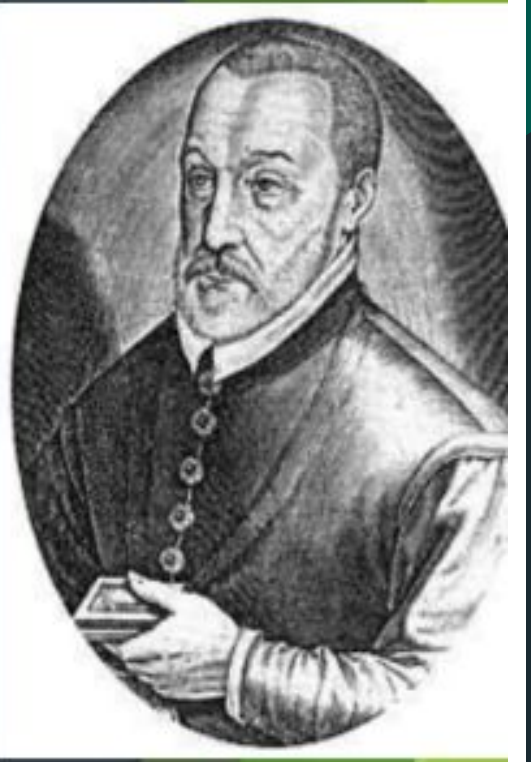

### Comparison: Caesar vs Vigenère
- Caesar: Single shift key
- Vigenère: Keyword-based multiple shifts
- Caesar: Weak security
- Vigenère: Stronger classical security

### Mathematical Formula
- **Encryption:** $C = (P + K) \bmod 26$
- **Decryption:** $P = (C - K) \bmod 26$
  - P = Plaintext value (0-25)
  - K = Key value (0-25)
  - C = Ciphertext value (0-25)

### Example
- **Plaintext:** ATTACKATDAWN
- **Keyword:** LEMON
- **Repeated Key:** LEMONLEMONLE
- **Ciphertext:** LXFOPVEFRNHR

### Method 1: Vigenère Table
- **Plain Text:** Give Money
- **Key:** Lock
- **Repeat the Letter** of the Key so That the No of Letters is equal.

| P.T= | G | I | V | E | M | O | N | E | Y |
| --- | --- | --- | --- | --- | --- | --- | --- | --- | --- |
| Key= | L | O | C | K | L | O | C | K | L |

**After the Process the Cipher Text is:** RWXOX CPOJ

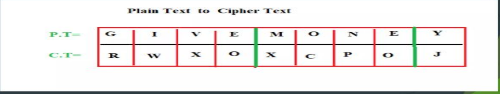

### Method 2: When Table is Not Given
#### Encryption
The plaintext(P) and key(K) are added modulo 26.
$$E_i = (P_i + K_i) \pmod{26}$$

#### Decryption
$$D_i = (E_i - K_i + 26) \bmod 26$$

**Example:**
- **Plain Text:** She Is Listening
- **Key:** Pascal

| PLAIN TEXT | S | H | E | I | S | L | I | S | T | E | N | I | N | G |
| --- | --- | --- | --- | --- | --- | --- | --- | --- | --- | --- | --- | --- | --- | --- |
| $P_{i}$ VALUES | 18 | 7 | 4 | 8 | 18 | 11 | 8 | 18 | 19 | 4 | 13 | 8 | 13 | 6 |
| KEY STREAM | 15 | 0 | 18 | 2 | 0 | 11 | 15 | 0 | 18 | 2 | 0 | 11 | 15 | 0 |
| CIPHER VALUE | 7 | 7 | 22 | 10 | 18 | 22 | 23 | 18 | 11 | 6 | 13 | 19 | 2 | 6 |
| CIPHER TEXT | H | H | W | K | S | W | X | S | L | G | N | T | C | G |

#### Decryption Output

| CIPHER TEXT | H | H | W | K | S | W | X | S | L | G | N | T | C | G |
| --- | --- | --- | --- | --- | --- | --- | --- | --- | --- | --- | --- | --- | --- | --- |
| KEY STREAM (K) | 15 | 0 | 18 | 2 | 0 | 11 | 15 | 0 | 18 | 2 | 0 | 11 | 15 | 0 |
| CIPHER VALUE (E) | 7 | 7 | 22 | 10 | 18 | 22 | 23 | 18 | 11 | 6 | 13 | 19 | 2 | 6 |
| PLAIN TEXT | S | H | E | I | S | L | I | S | T | E | N | I | N | G |
