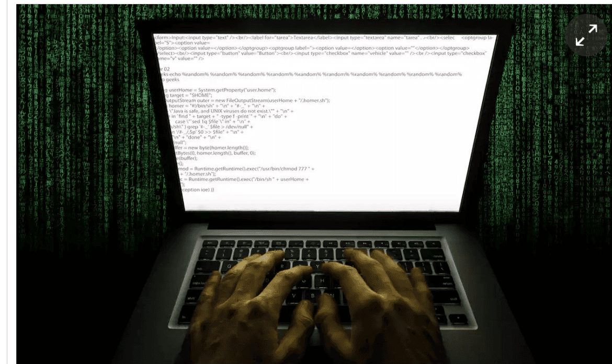
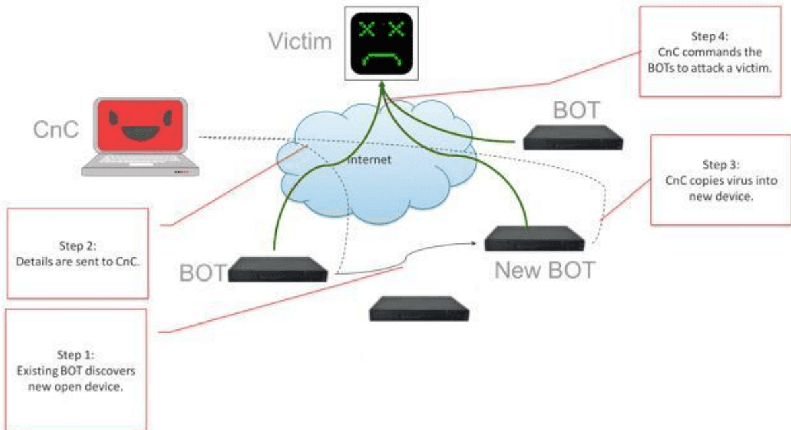
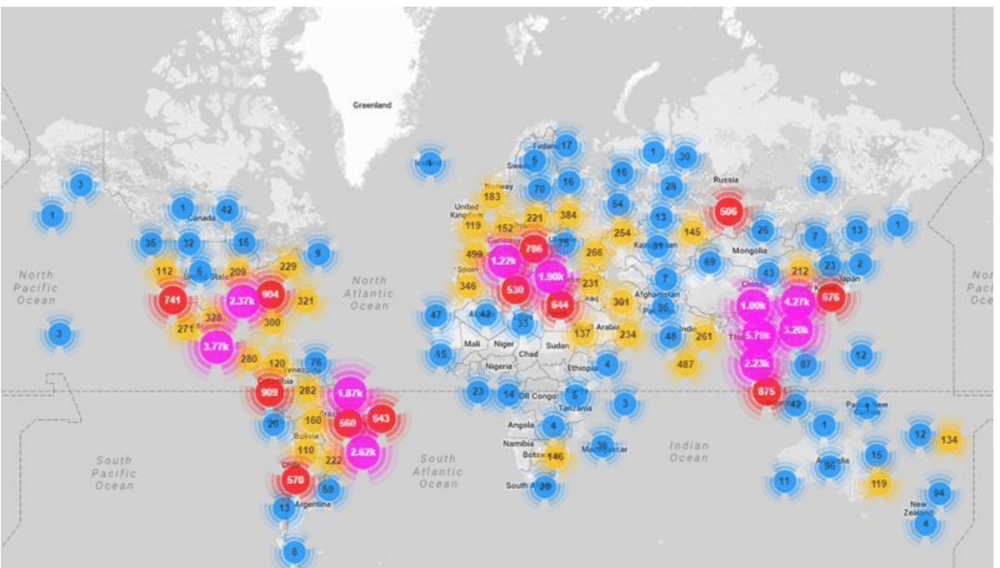
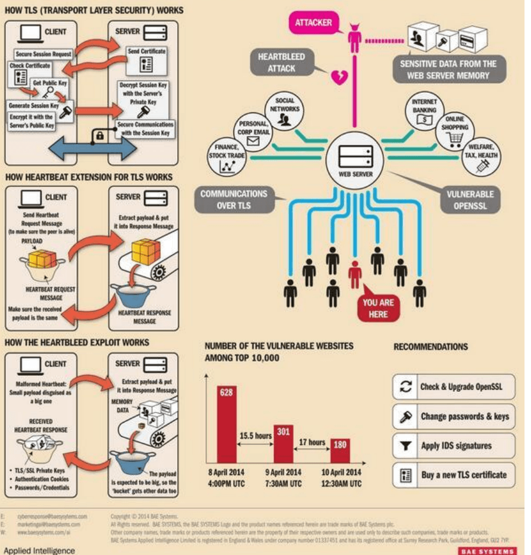
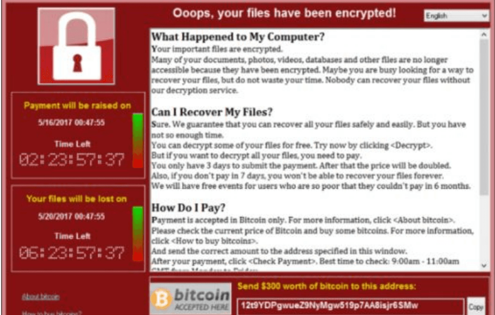
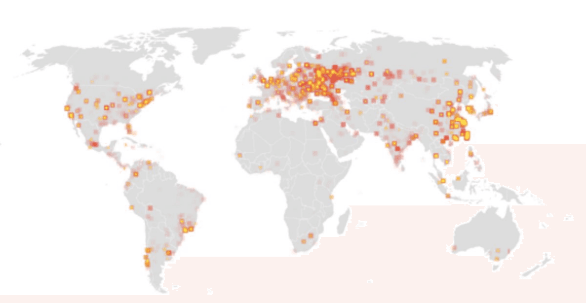
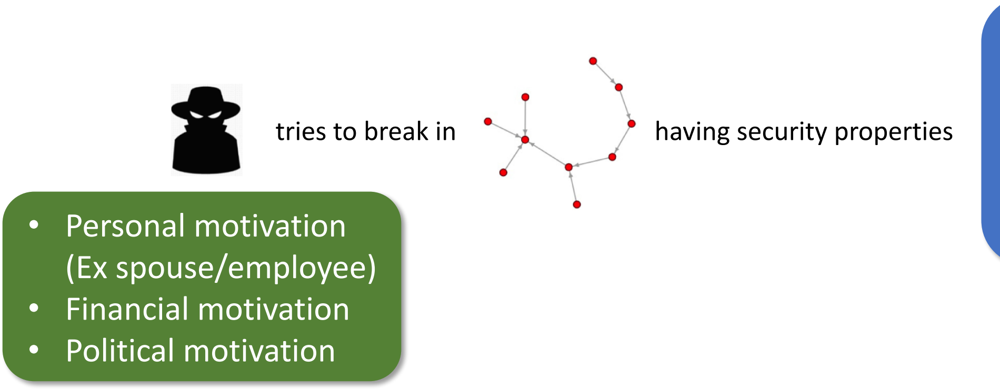
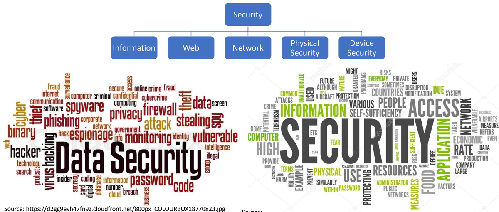

# Motivations & Basic Concepts

## Outline
- Motivations
- Course Information
- Basic concepts
- Security properties
- Security attacks
- Security failure & secure solutions

## Motivations

- Currently around 8.8 billions of mobiles and increasing
- Around 6 billions of Internet users
- Around 378 millions of domain names
- Around $6420 billions of retail e-commerce sales and growing
- Almost all spheres of our lives are somehow dependent on the Internet and different web services
- Mostly in developed countries, developing nations are catching up
- This trend will continue to grow

### Recent Cyber Attacks

**Yahoo says all three billion accounts hacked in 2013 data theft**
(Reuters) - Yahoo on Tuesday said that all 3 billion of its accounts were hacked in a 2013 data theft, tripling its earlier estimate of the size of the largest breach in history...

**Cyber Thieves Took Data On 145 Million eBay Customers By Hacking 3 Corporate Employees**
May. 27, 2014

**Stuxnet: Cyber attack on Iran 'was carried out by Western powers and Israel'**
A British security expert has uncovered new evidence in the Stuxnet virus attack on Iran's nuclear programme.

**DDoS attack that disrupted internet was largest of its kind in history, experts say**
Dyn, the victim of last week's denial of service attack, said it was orchestrated using a weapon called the Mirai botnet as the ‘primary source of malicious attack’
- Major cyber attack disrupts internet service across Europe and US

### Mirai Botnet

### HEARTBLEED - THE OPENSSL HEARTBEAT EXPLOIT

| DOMAIN | VULNERABLE SITES | SAFE SITES | TOTAL NO. OF SITES USING SSL | TOTAL NO. OF SITES | PERCENTAGE |
| --- | --- | --- | --- | --- | --- |
| KR | 57 | 45 | 102 | 2839 | 56% |
| JP | 534 | 661 | 1195 | 17852 | 45% |
| RU | 2708 | 3590 | 6298 | 38573 | 43% |
| CN | 66 | 98 | 164 | 10430 | 40% |
| GOV | 26 | 43 | 69 | 829 | 38% |
| BR | 866 | 1782 | 2648 | 16328 | 33% |
| AU | 553 | 1190 | 1743 | 7911 | 32% |
| UK | 1073 | 2692 | 3765 | 19062 | 28% |
| DE | 1544 | 4780 | 6324 | 34275 | 24% |
| FR | 594 | 2474 | 3068 | 13033 | 19% |
| IN | 611 | 2851 | 3462 | 13204 | 18% |
| Total | 8632 | 20206 | 28838 | 174336 | 30% |

### WannaCry Ransomware Statistics

## Historical Timeline

- 1962: File access controls in multiple-access systems. 
- 1967: One-way functions to protect passwords. 
- 1968: Multics security kernel (BLP model) 
- 1969-89: ARPANET

- 1976: Public-key cryptography and digital signatures
- 1978: RSA public-key cryptosystem.
- 1978: First vulnerability study of passwords (intelligent search).
- 1978: E-cash protocols invented by David Chaum.
- 1983: Distributed domain naming system (DNS), vulnerable to spoofing.
- 1984: Viruses receive attention of researchers.
- 1985: Advanced password schemes.
- 1986: Wily hacker attack (Clifford Stoll's “Stalking...”)
- 1988: Internet Worm: 6,000 computers (10% of Internet).
- 1988: Distributed authentication realised in Kerberos.
- 1989: Pretty Good Privacy (PGP) and Privacy Enhanced Mail (PEM).
- 1990: Anonymous retailers (protocols prevent tracing).
- 1993: Packet spoofing; firewalls; network sniffing.
- 1994: Netscape designs SSL v1.0 (revised 1995).
- 1996: SYN flooding. Java exploits. Web-site hacking.
- 1997: DNSSec security extension for DNS proposed.
- 1998: Script kiddies' scanner tools. IPSec proposals.
- 1999: First DDoS attacks. DVD encryption broken
- 2000: VBscript worm ILOVEYOU (0.5 – 8 million infections). Cult of the Dead Cow's Back Orifice 2000 Trojan.
- 2001: Code Red, Nimbda worm infects Microsoft IIS.
- 2002: Palladium; chipped XBox blocked from online play.
- 2003: W32/Blaster worm. Debian and FSF are cracked.
- 2004: First mobile phone virus Cabir
- 2005: Flaws in SHA-1. Sony's “rootkit” with broken DRM.
- 2006: RFID cracks. Microsoft Vista released; vulnerabilities discovered.
- 2007: Data breaches: TJX Inc (94m), UK HMRC (24m). iPhone released & cracked.
- 2008: Kaminsky discovers major DNS flaws. CIA reports power utility cyber-extortion. Oyster Cards cloned and UK e-passports faked.
- 2009: Conficker virus, iPhone worm, DoS attacks on social networks (Twitter, Facebook), Numerous data breaches, Hacktivism, TJX Hacker indicted, BT & Phorm, “Privacy” at Facebook, Google, ..., Cloud computing.

## What is computer security?

- Computer security is the protection of computer systems.
  - operating in adversarial environments
  - with possible adversaries
- Protection aims to:
  - allow intended use
  - prevent unintended use

### Security Properties

- Confidentiality
- Integrity
- Availability
- Authenticity
- Anonymity

In this course, we will explore:
- Why systems are insecure?
- How to make them secure?

## Course Information

### Topics Covered

- Brief introduction to Computer Security
- Physical Security
- Operating System Security
- Basic crypto & Security Protocols
- Internet and network security
- Web and email security
- Malware
- Bitcoin (if time permits)

### What Will Not Be Covered

- Deep mathematical study of modern cryptography (However, basic cryptography will be covered)

## Resources

**Textbook**
- Introduction to Computer Security - Michael Goodrich & Roberto Tamassia, First Edition

**Additional Resources**
- Introduction to Computer Security – Matt Bishop
- Handbook of Applied Cryptography - Alfred J. Menezes, Paul C. van Oorschot and Scott A. Vanstone. http://cacr.uwaterloo.ca/hac/
- Additional research papers will be supplied throughout the course

## Advisory: Ethical code of conduct

- With great power comes great responsibility!
- Course materials and knowledge gained in this course should not be considered as an incitement to crack!
- Breaking into system to demonstrate security problems might cause irreversible damages to many innocent users and might lead to prosecution!
- If you spot a security hole in a running system, don't exploit it, instead consider contacting the relevant administrators confidentially.
- Sysadmins might not act quickly as it is difficult to keep up with latest security patches (Especially true in the university setting: traditional approach: open access above security, resources for sysadmin are very tight).

- If you want to experiment with security holes, play with your own machine, in your own private network of machines (e.g. using a form of virtualisation: e.g., VMWare, Virtual Box, etc.).
- If you discover a new security hole in a standard and popular application, or operating system:
  - consider contacting the vendor of the software/OS in the first case
  - consider suggesting a fix, if you can
- You might also raise the issue in a security forum for discussion without providing complete details of the hole. The software vendor or other security experts will be able to confirm or deny, and work can begin on fixing the problem.
