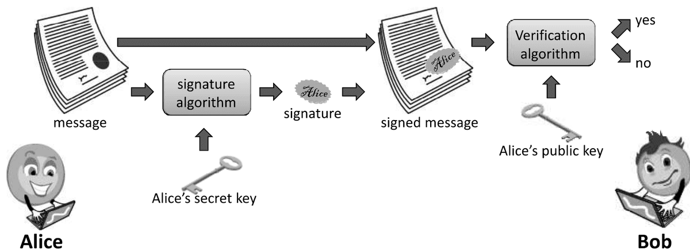
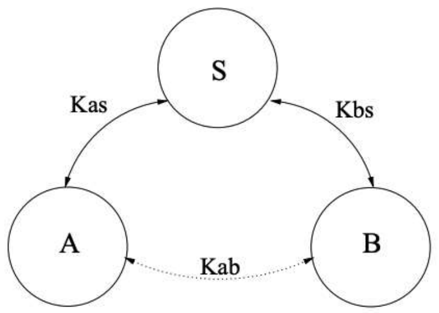

# Digital Signatures & Cryptographic Protocols

## Outline
- Digital signature
- Cryptographic protocols

## Digital signature
- A digital signature is a way for an entity to demonstrate the authenticity of a message by binding its identity with that message
- Alice uses her private key with a signature algorithm to produce a digital signature, $S_{\text{Alice}}(M)$, for a message, $M$
- Given Alice's public key, the message, $M$, and Alice's signature, $S_{\text{Alice}}(M)$.
- Bob verifies Alice's signature on M

### Digital signature: properties
- Three important properties that we would like to have for a digital-signature scheme are the following:
  - **Nonforgeability:** It should be difficult for an attacker, Eve, to forge a signature, $S_{\text{Alice}}(M)$, for a message, M, as if it is coming from Alice
  - **Nonmutability:** It should be difficult for an attacker, Eve, to take a signature, $S_{\text{Alice}}(M)$, for a message, $M$, and convert $S_{\text{Alice}}(M)$ into a valid signature on a different message, $N$
  - **Non-repudiation:** If a digital-signature scheme achieves these two properties, then it actually achieves nonrepudiation
- It should be difficult for Alice to claim she didn't sign a document, $M$, once she has produced a digital signature, $S_{\text{Alice}}(M)$, for that document

### RSA signature
- In RSA encryption system, Bob creates a public key, (e, n), so that other parties can encrypt a message
  $$ \begin{aligned} C = M^e \bmod n \end{aligned} $$
- In RSA signature, Bob instead signs a message, $M$, using his secret key, $d$
  $$ \begin{aligned} S = M^d \bmod n \end{aligned} $$
- **Verification:**
  - Is it true that $M = S^e \bmod n$?
- **Correctness**, $de \bmod \Phi(n) = 1$:
  $$ \begin{aligned} S^e \bmod n &= M^{de} \bmod n = M^{k\Phi(n)+1} \bmod n = M \cdot M^{k\Phi(n)} \bmod n \\ &= M \bmod n = M \end{aligned} $$
- Verification utilises the same RSA encryption and decryption algorithms using the same public key $(e, n)$

### RSA signature: security
- The nonforgeability of this scheme comes from the difficulty of breaking the RSA encryption algorithm
- To forge a signature from Bob on a message, M, an attacker, Eve, would have to produce $M^d \bmod n$, without knowing d
- RSA has an interesting property
- For example, an attacker Eve, has two valid signatures from Bob for two messages $M_1$ and $M_2$
  $$ \begin{aligned} S_1 = M_1^d \bmod n \quad \text{and} \quad S_2 = M_2^d \bmod n \end{aligned} $$
- Now, Eve can produce a new signature
  $$ \begin{aligned} S_1 \cdot S_2 \bmod n = (M_1 \cdot M_2)^d \bmod n \end{aligned} $$
- This would validate as a verifiable signature from Bob on the message $M_1 M_2$

### Hash function + Digital signature
- For practical purposes, the above descriptions of the RSA digital-signature schemes are not what one would use in practice
- The scheme is inefficient if the message, $M$, being signed is very long
- For instance, RSA signature creation involves an encryption of the message, $M$, using a private key
- For this reason, real-world digital-signature schemes are usually applied to cryptographic hashes of messages, not to actual messages
- Moreover, signing a hash value is more efficient than signing a full message

## Cryptographic protocols
- Almost everything that occurs on the Internet occurs via a protocol
- An Internet protocol is a structured dialogue among two or more parties using the Internet
- controlling the syntax, semantics, and synchronisation of communication, and
- designed to accomplish a communication-related function or goal
- A cryptographic protocol is a protocol using cryptographic mechanisms to accomplish some security-related function

### Thought experiment
- Consider the following scenario
- Your friend Ivan lives in a repressive country where the police spy on everything and open all the mails
- You need to send a valuable object to Ivan
- How can you get the item to Ivan securely?
- How do you think you can do it physically?
  - You will need a box with a hasp big enough for several locks
  - Put the item into the box, attach your lock to the hasp, and mail the box to Ivan
  - Ivan adds his own lock and mails the box back to you
  - You remove your lock and mail the box back to him
  - He now removes his lock and opens the box.
- The procedure just described could be regarded as a protocol

### Characteristics
- All cryptographic protocols share the following characteristics
  - several principals are exchanging messages
  - they are attempting to accomplish some security-related function.
  - they are operating in a hostile and insecure environment
- The protocol must be robust and reliable in the face of a determined attacker

### Goals
- Among the goals of cryptographic protocols are the following:
  - **Unicity:** secret shared by exactly two parties
  - **Integrity:** message arrived unmodified
  - **Authenticity:** message claim of origin is true
  - **Confidentiality:** message contents are inaccessible to an eavesdropper
  - **Non-repudiation of origin:** sender can't deny sending
  - **Non-repudiation of receipt:** receiver can't deny receiving

### Notation
- A protocol involves a sequence of message exchanges of the form
  $$ A \to B: M $$
- Meaning that principal A sends to principal B the message M
- Because of the distributed nature of the system and the possibility of malicious actors, there is typically no guarantee that
  - B receives the message
  - or is even expecting the message
- There's a “temporal” aspect to protocols
- Until and unless B receives the message, he can't respond to it
- In general, B won't be expecting the message unless he has already participated in earlier steps of the protocol

| Notations | Meaning |
| --- | --- |
| A | The name of an entity A |
| $r_{A}$ | Random value generated by A |
| $t_{A}$ | Timestamp generated by A |
| $(m_1 \cdot m_2 \dots m_n)$ | Concatenation of messages $m_1, m_2, \dots, m_n$ |
| $\{m\}_K$ or $E(K,m)$ | Message m encrypted with key K |
| H(m) | Message m hashed with hash function H() |
| $K_A$ / $K_A^{-1}$ | Public key/private key of A |

### Cryptographic protocols: an example
$$ \begin{aligned} 1. \quad A \to B&: \{\{K\}_{K_a^{-1}}\}_{K_b} \\ 2. \quad B \to A&: \{\{K\}_{K_b^{-1}}\}_{K_a} \end{aligned} $$
- Can you guess what is the protocol here?
- A shares with B a secret key K, and each party is authenticated to the other

### Attacks
- This is a partial list of attacks on protocols:
  - **Known-key attack:** attacker gains some keys used previously and uses this info in some malicious fashion
  - **Replay:** attacker records messages and replays them at a later time.
  - **Impersonation:** attacker assumes the identity of one of the legitimate parties in a network
  - **Man-in-the-Middle:** attacker interposes himself between two parties and pretends to each to be the other
  - **Interleaving attack:** attacker injects spurious messages into a protocol run to disrupt or subvert it

### Attackers
- The designer of a protocol should assume that an attacker can access all of the traffic and interact his own messages into the flow
- The protocol should be robust in the face of such a determined and resourceful attacker
- Remember this, two questions to ask of any step in any protocol
  1. What is the sender trying to say with this message?
  2. What is the receiver entitled to believe after receiving the message?

## Needham-Schroeder protocol
- Many existing protocols are derived from one proposed by Needham and Schroeder (1978)
- N-S is a shared-key authentication protocol designed to generate and propagate a session key
- i.e., a shared key for subsequent symmetrically encrypted communication
- Note that there is no public key infrastructure (PKI) in place
- There are three principals:
  - A and B: two principals desiring mutual communication, and
  - S: a trusted key server, also known as Trusted Third Party (TTP)
- It is assumed that A and B already have secure symmetric communication with S using keys $K_{as}$ and $K_{bs}$ respectively
- N-S protocol is used to establish the shared key $K_{ab}$ between A and B

### Nonces
- N-S uses nonces (short for "numbers used once")
- randomly generated values included in messages
- If a nonce is generated and sent by A in one step and returned by B in a later step
- A knows that B's message is fresh and not a replay from an earlier exchange
- We use the notation $N_a$ to denote a nonce generated by A
- Note that a nonce is not a timestamp
- The only assumption is that it has not been used in any earlier interchange, with high probability

### Steps
1. $A \to S: A, B, N_a$
2. $S \to A: \{N_a, B, K_{ab}, \{K_{ab}, A\}_{K_{bs}}\}_{K_{as}}$
3. $A \to B: \{K_{ab}, A\}_{K_{bs}}$
4. $B \to A: \{N_b\}_{K_{ab}}$
5. $A \to B: \{N_b-1\}_{K_{ab}}$
- Here, $N_a$ and $N_b$ are nonces
- Needham-Schroeder is a shared-key authentication protocol that has been very important historically
- It illustrates:
  - the overall structure of protocols
  - that some principals (TTP) may have special roles to play
  - the usefulness of nonces

### Flaws on Needham-Schroeder protocol
- Denning and Sacco pointed out that the compromise of a session key has bad consequences
- An intruder can reuse an old session key and pass it off as a new one as though it were fresh
- Suppose C has cracked $K_{ab}$ from last week's run of the protocol, and has squirreled away message 3 from that session: $\{K_{ab}, A\}_{K_{bs}}$
  1. $C \to B: \{K_{ab}, A\}_{K_{bs}}$
  2. $B \to C: \{N_b\}_{K_{ab}}$
  3. $C \to B: \{N_b-1\}_{K_{ab}}$
- B will believe it is talking to A
- Message 3 is not protected by nonces
- There is no way for B to know if the $K_{ab}$ it receives is current
- An intruder has unlimited time to crack an old session key and reuse it as if it were fresh
- Bauer, et al. pointed out that if key $K_{as}$ were compromised, anyone could impersonate A and establish communication with any other party
- These flaws persisted for almost 10 years before they were discovered

## Otway-Rees protocol
- Another very important and much studied protocol is the Otway-Rees protocol
- Below is one of several variants
  1. $A \to B: M, A, B, \{N_a, M, A, B\}_{K_{as}}$
  2. $B \to S: M, A, B, \{N_a, M, A, B\}_{K_{as}}, \{N_b, M, A, B\}_{K_{bs}}$
  3. $S \to B: M, \{N_a, K_{ab}\}_{K_{as}}, \{N_b, K_{ab}\}_{K_{bs}}$
  4. $B \to A: M, \{N_a, K_{ab}\}_{K_{as}}$
- Here, $M$ is a session identifier
- $N_a$ and $N_b$ are nonces

### Otway-Rees protocol attack
- A malicious intruder can arrange for A and B to end up with different keys
- After step 3, B has received $K_{ab}$
- An intruder then intercepts the fourth message
- The intruder resends message 2
- so S generates a new key $K'_{ab}$, sends it to B
- The intruder intercepts this message too, but sends to A
  - $M, \{N_a, K'_{ab}\}_{K_{as}}$
- A has $K'_{ab}$, while B has $K_{ab}$
- Another problem:
  - although the server tells B that A used a nonce, B doesn't know if this was a replay of an old message

## References
- Foundations of Computer Security by Dr. Bill Young, University of Texas at Austin. (https://www.cs.utexas.edu/~byoung/cs361/lecture1.pdf)
- Cryptographic protocol lecture by Prof. Dr.-Ing. Georg Carle, University of Tübingen, Germany (http://www.ccs-labs.org/~dressler/teaching/netzsicherheit-ws0304/07_CryptoProtocols_2on1.pdf)
