# Networking Security - 1

## Outline
- Networking background
- Passive Attacks
  - Sniffing
  - Scanning
- Active Attacks
  - Spoofing
- TCP Session Hijacking
- Dos/DDoS
- DNS Cache Poisoning

## Data networking
- A set of interconnected nodes exchanging information
- Sharing of the transmission via circuit/packet "switching"
- packet switching becoming more popular for data transmission
- Links allow more than one path between every 2 nodes.
- Network must select an appropriate path for each required connection

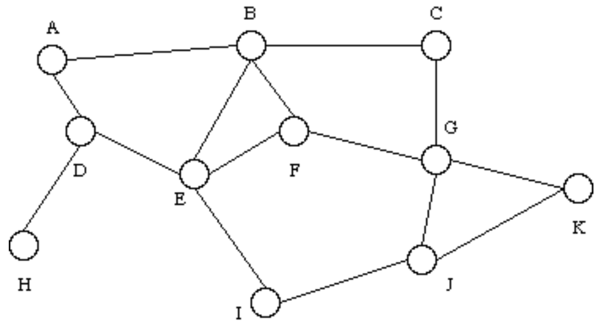

## Internet architecture – layered approach
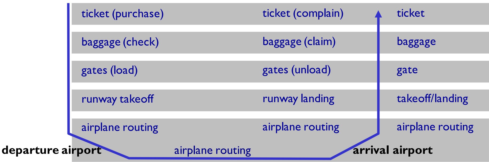

- layers: each layer implements a service
- via its own internal-layer actions
- A simplifying example using Air Travel

## Internet architecture – OSI/TCP-IP layer
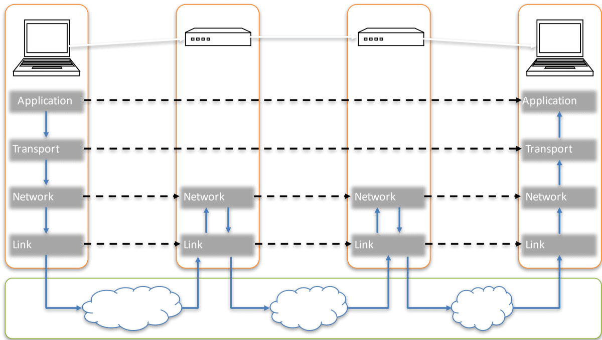

## Internet packet encapsulation
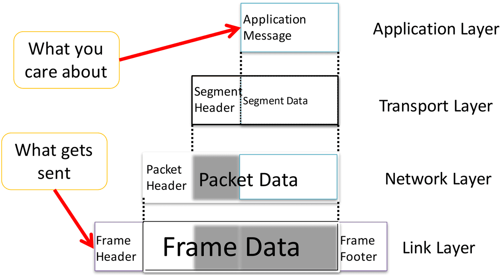
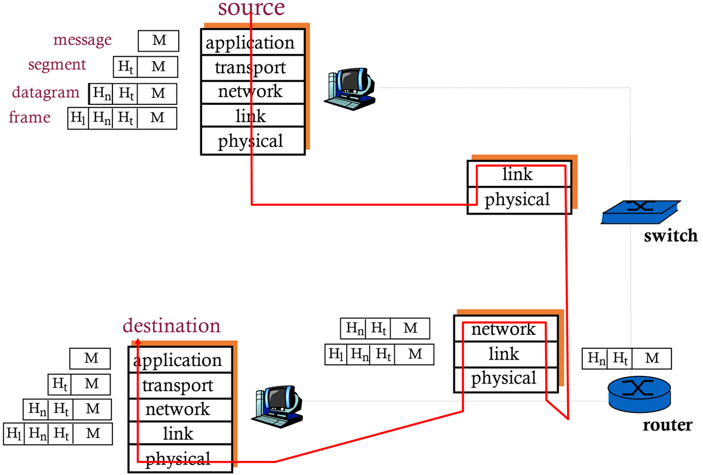

## Internet protocol stack
- **Application:**
  - supporting network applications - FTP, SMTP, HTTP
- **Transport:**
  - process-process data transfer - TCP, UDP
- **Network:**
  - routing datagrams - IP, routing protocols
- **Link:**
  - data transfer between neighbouring network elements - Ethernet
- **Physical:**
  - bits "on the wire"

## Types of Attack
- **Active attack**
  - enables an attacker to modify, misconfigure or disrupt a target.
  - e.g. modifying a process, system or data; disrupting a communication channel and so on
- **Passive attack**
  - allows an attacker to observe a target without modifying it.

## Types of Threat
- **Interception**
  - Unauthorised viewing of information (Confidentiality)
- **Modification**
  - Unauthorized changing of information (Integrity)
- **Fabrication**
  - Unauthorised creation of information (Integrity)
- **Interruption**
  - Preventing authorized access (Availability)

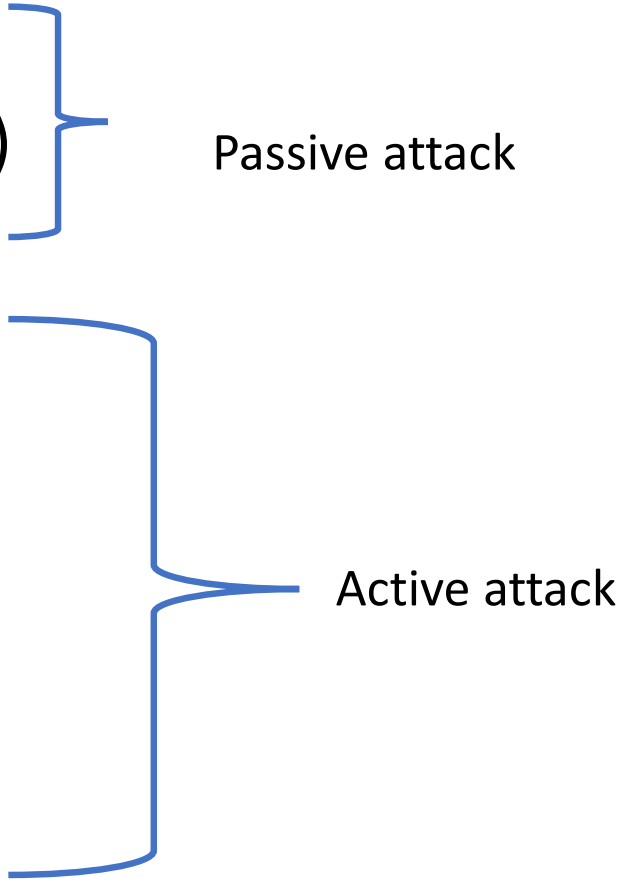

## Passive Attacks
- **Eavesdropping (Sniffing)**
  - Listen to packets from other parties
- **Footprinting (Network Mapping)**
  - Test to determine/acquire information (e.g. software installed) on the target system

## Man In The Middle (MITM) Attack
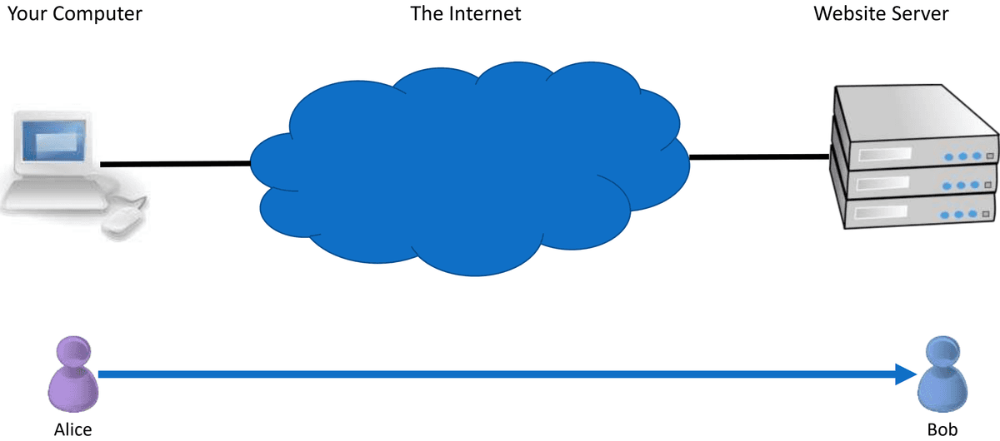
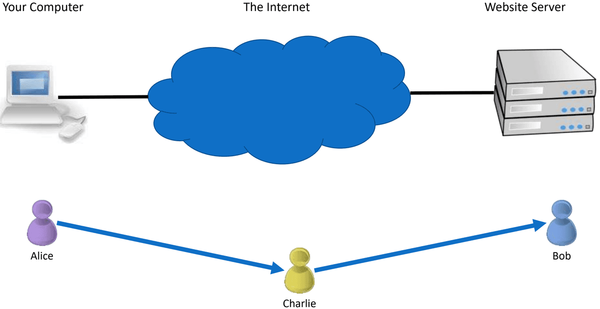

- Charlie is in the middle between Alice and Bob
- Charlie can:
  - View traffic
  - Change traffic
  - Add traffic
  - Delete traffic
- Charlie could be:
  - Internet service provider
  - Virtual Private Network (VPN) provider
  - WIFI provider such as a coffee shop
  - An attacker re-routing your connection

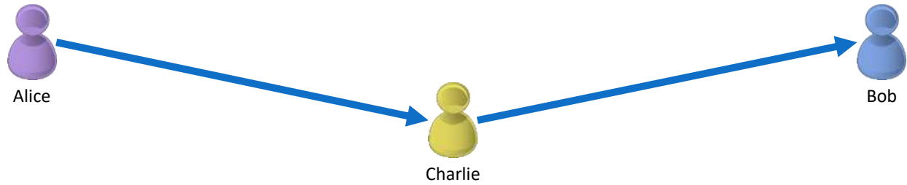

## Man In The Middle (MITM) Scenario
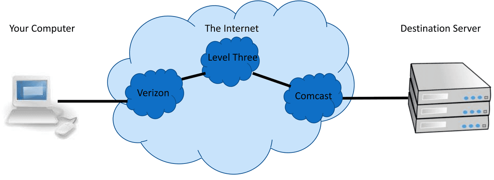
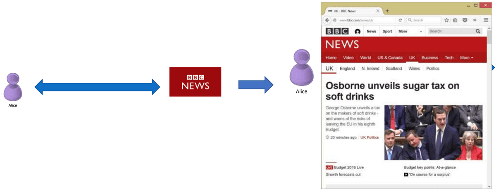

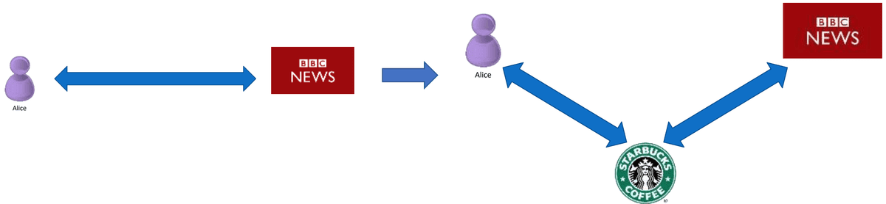

## Packet Sniffing
- Packet sniffing enables "reading" information traversing a network
- Packet sniffers intercept network packets, possibly using ARP cache poisoning
- Can be used as legitimate tools to analyse a network
  - Monitor network usage
  - Filter network traffic
  - Analyse network problems
- Can also be used maliciously
  - Steal information (i.e. passwords, conversations, etc.)
  - Analyse network information to prepare an attack
- Packet sniffers (tools used for packet sniffing) can be either software or hardware based
- Sniffers are dependent on network setup

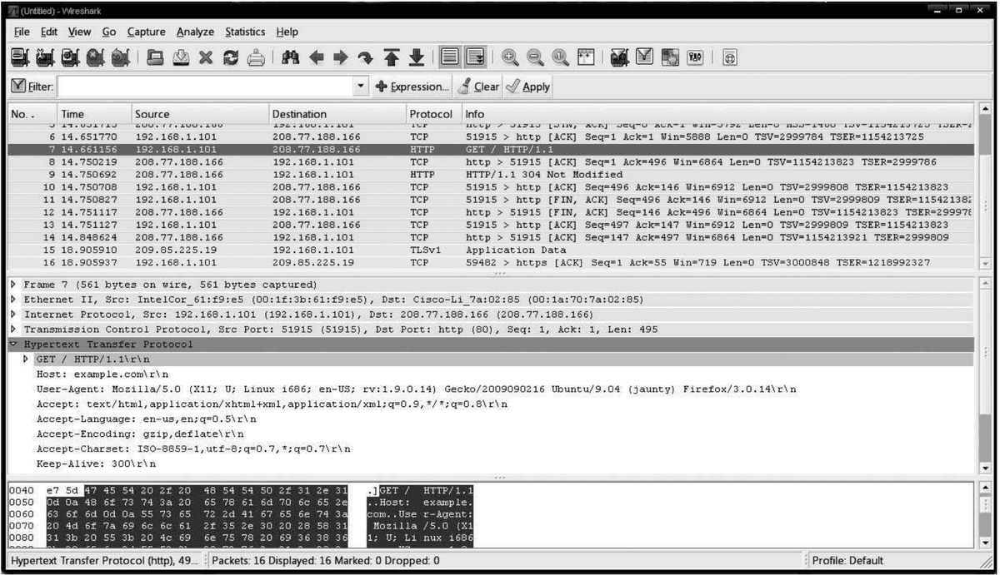

### Detecting Sniffers
- Sniffers are almost always passive
  - They simply collect data
  - This can make them extremely hard to detect
- A solution on switched hubs is ARP watch
  - An ARP watch monitors the ARP cache for duplicate entries of a machine.
  - If such duplicates appear, raise an alarm – Problem: false alarms
  - Specifically, DHCP networks can have multiple entries for a single machine

### Stopping Sniffers
- The best way is to encrypt packets securely
- Sniffers can capture the packets, but they are meaningless
- Capturing a packet is useless if it just reads as garbage
- SSH is also a much more secure method of connection.
- Private/Public key pairs makes sniffing virtually useless
- On switched networks, almost all attacks will be via ARP spoofing
  - Add machines to a permanent store in the cache
  - This store cannot be modified via a broadcast reply
  - Thus, a sniffer cannot redirect an address to itself

## Footprinting (Scanning)
- Footprinting sometime is the first phase of attacking in which the attacker gains information about a potential target
- Via scanning, an attacker can discover more about the target system.
  - such as what operating system is used
  - what services are running, and
  - whether or not there are any configuration lapses in the target system.
- Types of Scanning
  - Network scanning - IP addresses
  - Port scanning - Open ports and services
  - Vulnerability scanning - Presence of known weaknesses

### Objectives of Scanning
- Discovering live hosts and IP addresses of live hosts running on the network
- Discovering open ports:
  - Open ports are the best means to break into a system or network
  - Detecting the associated network service of each port
- Discovering operating systems and system architecture of the targeted system:
  - This is also referred to as fingerprinting
  - Here the attacker will try to launch the attack based on the operating system's vulnerabilities

## Network Scanning – Non-targeted Host
- ICMP Scanning via ping
  - to determine which hosts in a network are up by pinging them all
- Ping scan involves sending ICMP ECHO requests to a host
- If the host is live, it will return an ICMP ECHO reply
- This scan is useful for locating active devices or determining if ICMP is passing through a firewall


## Scanning Methods – Ping Sweep
- Ping Sweep is a basic network scanning technique to determine which range of IP addresses map to live hosts (computers)
- There are lots of tools available for scanning
- nmap is the most widely used tool available for this

## Network Scanning – Targeted Host
- Use DNS to determine the IP address of a known server
- Remember the `nslookup` command!

```bash
ms-mferdouslap:~ mferdous$ nslookup www.sust.edu
Server: 123.200.0.254
Address: 123.200.0.254#53
Non-authoritative answer:
www.sust.edu canonical name = web.sust.edu.
Name: web.sust.edu
Address: 103.84.159.5
```

## Port Scanning
- Once the IP address of the target is found, use the port scanning method to determine which ports are open in the host
- Remember, ports are like doors of a house
- Port scanning resembles knocking the doors to check which one is open
- Some are well known open ports: web server:80, FTP: 21, SMTP: 25
- However, some others ports also remain open for different applications
- There are tools for checking an opening port:
  - `nmap`

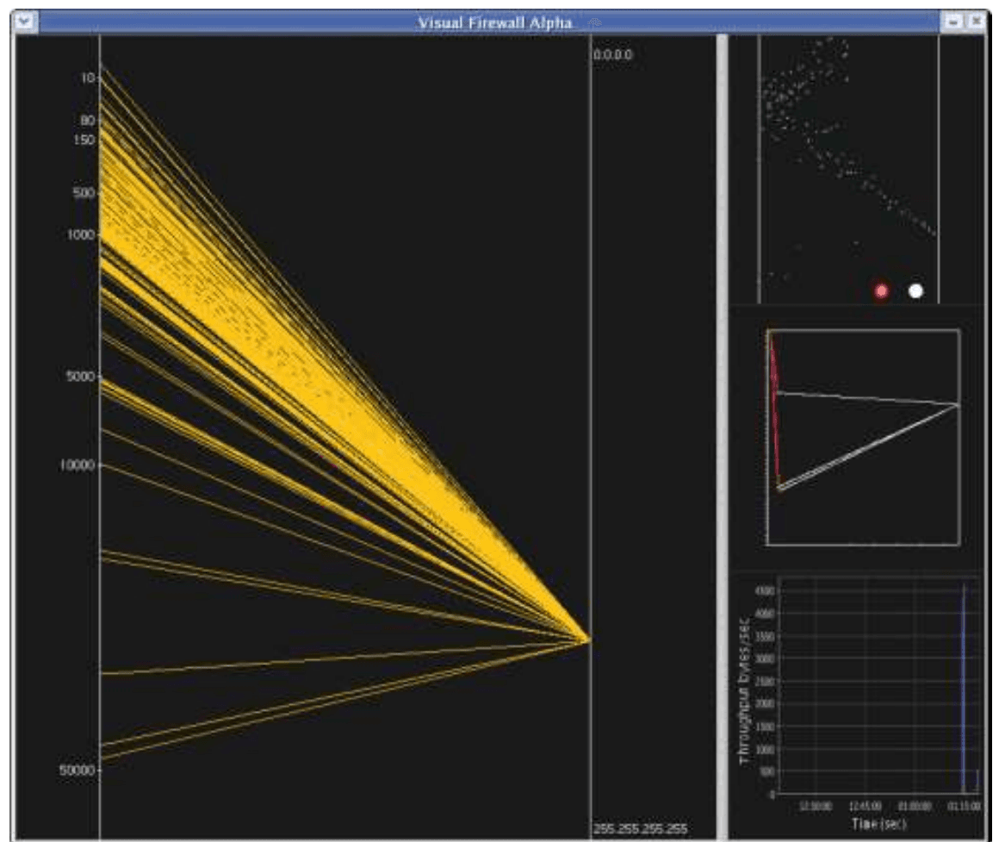

## Active Attacks
- Spoofing
  - ARP Spoofing
  - IP Spoofing
- TCP Session Hijacking
- DoS/DDoS
- DNS Cache Poisoning

## ARP
- A wants to send a datagram to B, having B's IP address
- B's MAC address not in A's ARP table
- A broadcasts ARP query packet, containing B's IP address
- Dest MAC address = FF-FF-FF-FF-FF-FF
- All nodes on LAN receive ARP query packet
- B receives ARP packet, replies to A with its (B's) MAC address.
- Frame sent to A's MAC address (unicast)

## ARP Spoofing
- The ARP protocol is simple and effective, but it lacks an authentication scheme
- Any computer on the network could claim to have the requested IP address
- In fact, any machine that receives an ARP reply, even if it was not preceded by a request, will automatically update its ARP cache with the new association
- Because of this shortcoming, it is possible for malicious parties on a LAN to perform the ARP spoofing attack

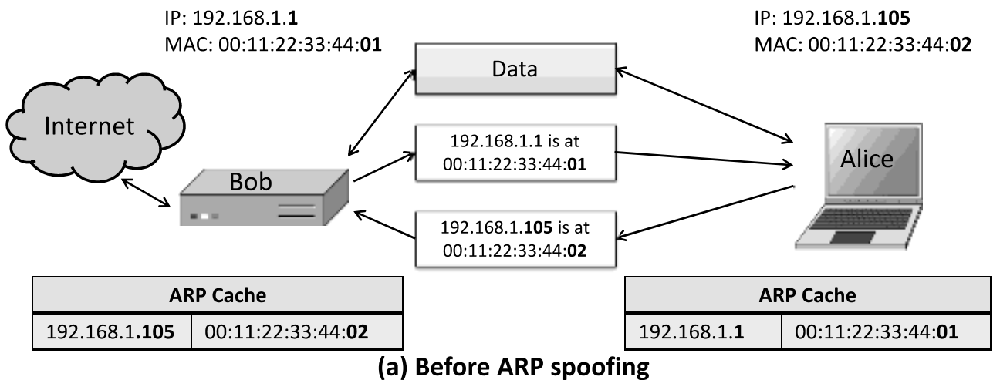
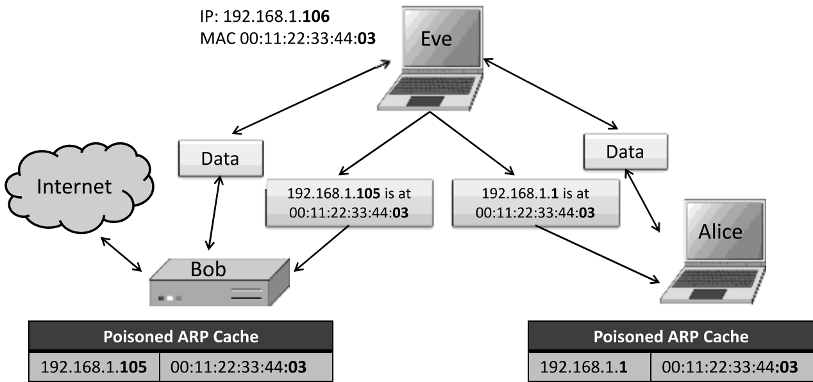

### ARP Spoofing – mitigation
- ARP spoofing can occur because of its lack of identity verification in the Internet's underlying mechanisms
- Fortunately, there are several means of preventing ARP spoofing, besides restricting LAN access to trusted users
- One simple technique involves checking for multiple occurrences of the same MAC address on the LAN
- Usually, one MAC address should belong to one equipment. Multiple occurrences of the same MAC address implies that the address might be spoofed
- Another solution:
  - Static ARP table configured by the admin in different routers/switches in the network
  - However, it is inconvenient

## IP Spoofing
- IP Spoofing is an attempt by an intruder to send packets from one IP address that appear to originate at another
- If the server thinks it is receiving messages from the real source after authenticating a session, it could inadvertently behave maliciously

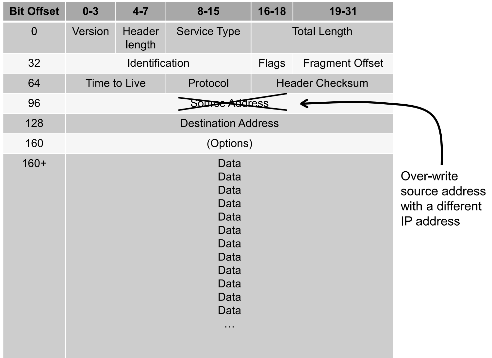

- The TCP/IP protocol requires that "acknowledgement" numbers be sent across sessions
- Makes sure that the client is getting the server's packets and vice versa
- Need to have the right sequence of acknowledgment numbers to spoof an IP identity

### Transmission Control Protocol (TCP) Header 20-60 bytes

:max_bytes(150000):strip_icc():format(webp)/tcp-header-56a1adc85f9b58b7d0c1a24f.png)

- IP Spoofing knowing the acknowledgment sequence pattern
  - Done on the same subnet
  - Use a packet sniffer to analyse the sequence pattern
  - Packet sniffers intercept network packets
  - Eventually decodes and analyses the packets sent across the network
  - Determine the acknowledgment sequence pattern from the packets
  - Send messages to server with actual client's IP address and with validly sequenced acknowledgment number

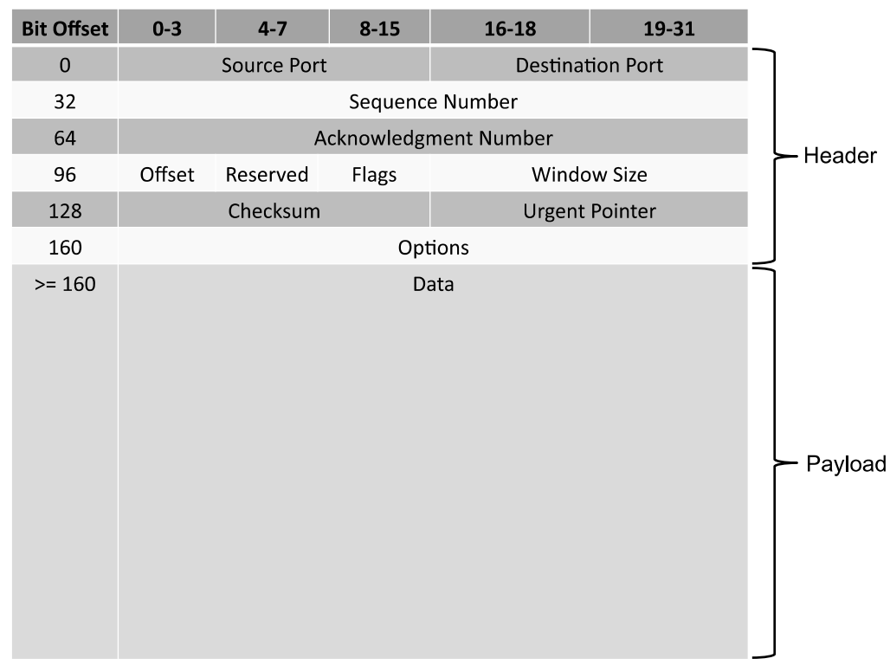

### Motivation of IP Spoofing
- If an attacker sends an IP packet with a spoofed source address,
  - He will not receive any response from the destination server
  - The response will return back to the machine having the spoofed address
- So, what is the motivation of an attacker for IP spoofing?
  - Use IP spoofing to carry out another attacks for which:
    - The attacker does not care about any responses for these packets or
    - He has some other way of receiving responses
- For example, in denial-of-service attacks,
  - The attacker doesn't want to receive any responses back
  - He just wants to overwhelm some other Internet host with data requests.
- Also, it can be used for other attacks such as for circumventing firewall policy or TCP session hijacking
  - In such cases, the attacker uses a different approach to receive the response back

### Mitigating IP Spoofing
- Unfortunately, IP spoofing cannot be prevented!
- But they can be handled in a different way!
- Borders routers connecting two sub-nets, can be configured to block any packet with the source address outside their domain
- IP spoofing can be combated by implementing IP traceback techniques
- IP traceback involves methods for tracing the path of a packet back to its actual source address
- Given this information, requests can then be made to the various autonomous systems along this path to block packets from this location
- The ISP controlling the actual source address can also be asked to block suspicious machines entirely until it is determined that they are clean of any malware or malicious users.
