# Networking Security - 2

## Outline
- Active Attacks
  - Spoofing
- TCP Session Hijacking
- DoS/DDoS
- ICMP Attacks
  - PING Flood
  - SMURF
  - SYN Flood
- DNS Cache Poisoning
- Network Address Translation
  - Firewall
- Intrusion Detection/Prevention System

## TCP Session Hijacking
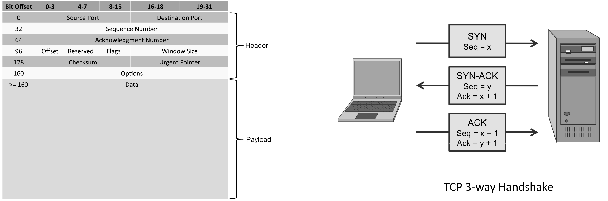

- A security attack over a protected network
- It is an attempt to take control of a network session
- Sessions are server keeping state of a client's connection
- Servers need to keep track of messages sent between client and the server and their respective actions
- Most networks follow the TCP/IP protocol
- It has several flavours depending on the location and knowledge of the attacker
- TCP Sequence Prediction/Complete Session Hijacking

### TCP Sequence Prediction
- A TCP sequence prediction attack attempts to guess an initial sequence number sent by the server at the start of a TCP session, so as to create a spoofed TCP session
- Early TCP stacks implemented sequence numbers by using a simple counter that was incremented by 1 with each transmission
- Without using any randomness, it was trivial to predict the next sequence number, which is the key to this attack
- Modern TCP stack implementations use pseudo-random number generators to determine sequence numbers, which makes a TCP sequence prediction attack more difficult, but not impossible
- The attacker launches a denial-of-service attack against the client victim to prevent that client from interfering with the attack
- The attacker sends a SYN packet to the target server, spoofing the source IP address to be that of the client victim
- After waiting a short period of time for the server to send a reply to the client (which is not visible to the attacker and is not acted on by the client due to the DoS attack), the attacker concludes the TCP handshake by sending an ACK packet with the sequence number set to a prediction of the next expected number (based on information gathered by other means), again spoofing the source IP to be that of the client victim
- The attacker can now send requests to the server as if he was the victim client

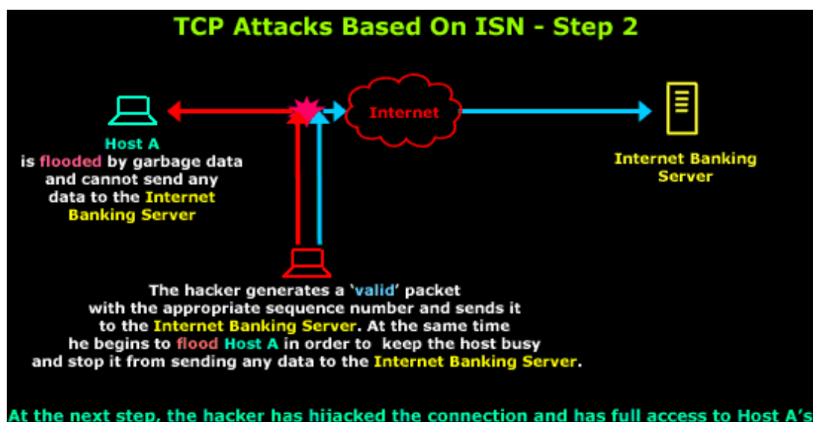
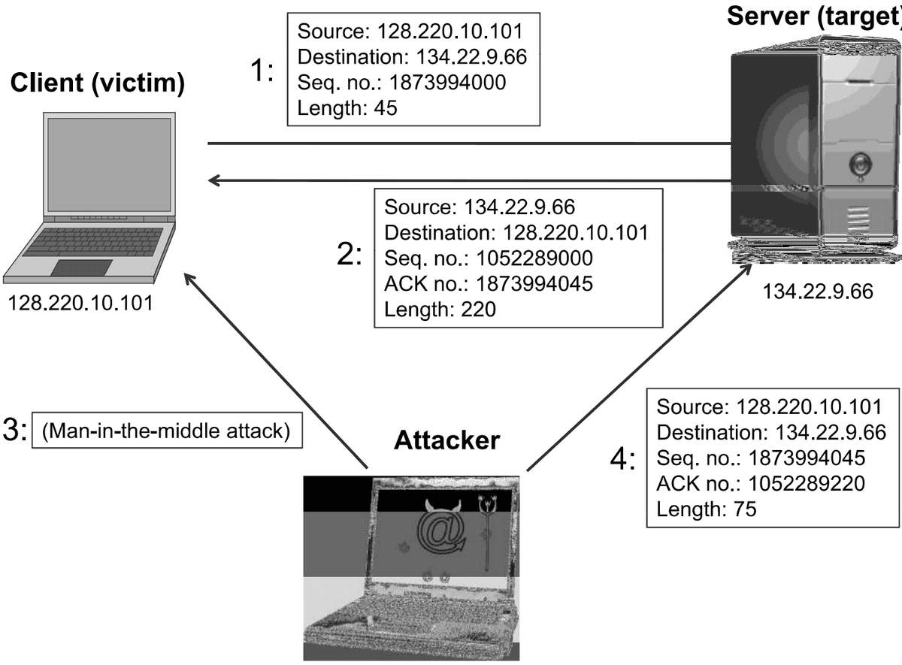

### Mitigating TCP Sequence Prediction
- Countermeasures to TCP session hijacking attacks involve the use of encryption and authentication
- either at the network layer, such as using IPsec, or at the application layer, such as using application-layer protocols that encrypt entire sessions
- In addition, web sites should avoid creating sessions that begin with secure authentication measures but subsequently switch over to unencrypted exchanges
- Such sessions trade off efficiency for security, because they create a risk with respect to a TCP session hijacking attack

## DoS
- Because bandwidth in a network is finite, the number of connections a web server can maintain to clients is limited
- Each connection to a server needs a minimum amount of network capacity to function
- When a server has used up its bandwidth or the ability of its processors to respond to requests, then additional attempted connections are dropped and some potential clients will be unable to access the resources provided by the server
- Any attack that is designed to cause a machine or piece of software to be unavailable and unable to perform its basic functionality is known as a denial-of-service (DoS) attack
- This includes any situation that causes a server to not function properly, but most often refers to deliberate attempts to exceed the maximum available bandwidth of a server
- Spoofing the source IP address is commonly used to obscure the identity of the attacker as well as make mitigation of the attack more difficult

### PING Flood
- In a ping flood attack, a powerful machine can perform a DoS attack on a weaker machine
- To carry out the attack, a powerful machine sends a massive amounts of PING echo requests to a single victim server with the following two conditions:
  - The attacker can create many more ping requests than the victim can process, and
  - The victim has enough network bandwidth to receive all these requests
- If these happen, the victim server will be overwhelmed with the traffic and start to drop legitimate connections

### SMURF (Directed Broadcast) Attack
- The smurfing attack also exploits the ICMP
- Some implementations respond to pings to broadcast addresses
- Idea: Ping a LAN to find hosts, which then all respond to the ping
- Attack:
  - Make a packet with a forged source address containing the victim's IP number.
  - Send it to a SMURF amplifier, who swamp the target with replies.
- The victim then receives a multitude of PING reply by which it can be overwhelmed if the previous two conditions are met

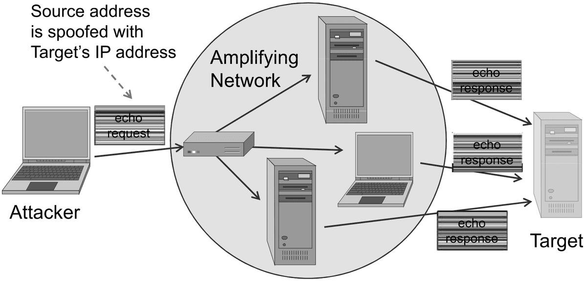

### Mitigating SMURF Attack
- To prevent SMURF attacks, administrators should configure hosts on their networks to ignore broadcast requests
- if a server is relatively weak, it would be wise for it to ignore ping requests altogether, to avoid ping floods
- In addition, routers should be configured to avoid forwarding packets directed to broadcast addresses, as this poses a security risk in that the network can be used as a ping flood amplifier

### SYN Flood
- In the SYN flood attack, an attacker sends a large number of SYN packets to the server, ignores the SYN/ACK replies, and never sends the expected ACK packets
- In fact, an attacker initiating this attack in practice will probably use random spoofed source addresses in the SYN packets he sends, so that the SYN/ACK replies are sent to random IP addresses
- If an attacker sends a large amount of SYN packets with no corresponding ACK packets, the server's memory will fill up with sequence numbers that it is remembering in order to match up TCP sessions with expected ACK packets
- These ACK packets will never arrive, so this wasted memory ultimately blocks out other, legitimate TCP session requests

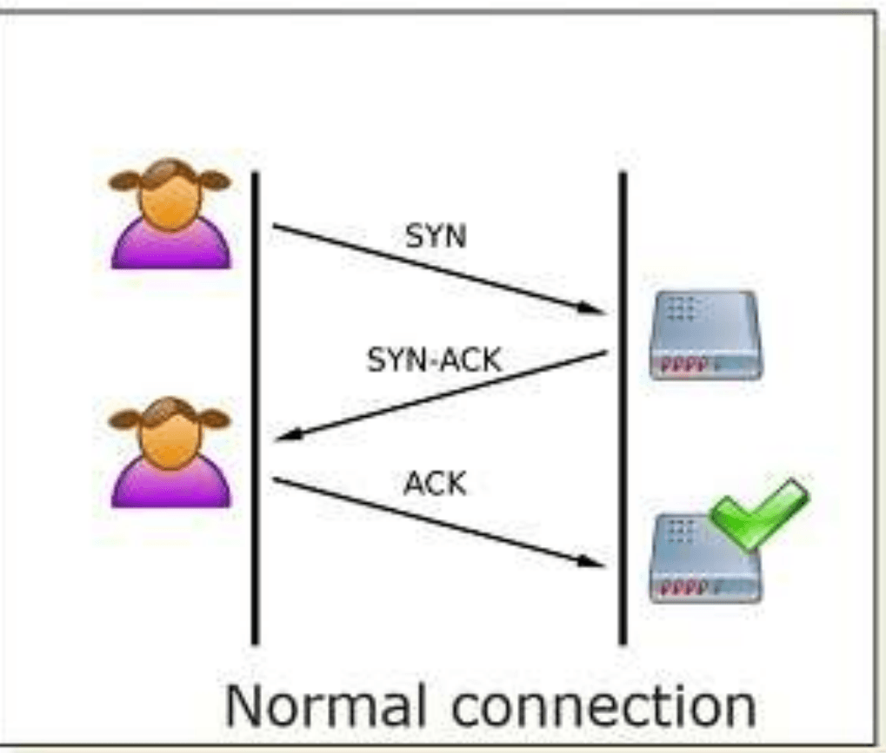
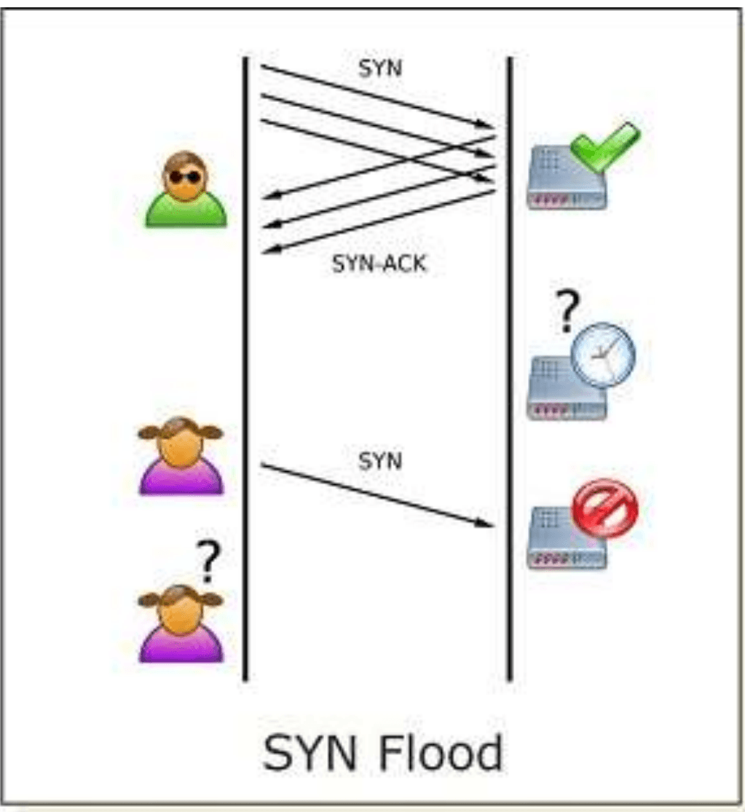

### Mitigating SYN Flood
- SYN cookie: server does not really keep the client's state until the handshake is done
- The server sends a specially crafted SYN/ACK packet without creating a corresponding memory entry
- Server embeds the state in the SYN/ACK number
- This number can be a function of source & destination MAC and IP addresses, counter, and a secret
- The function may be one-way hash function
- The secret is known only by the server
- This number must be hard to guess

### SYN Cookie Limitation
- Windows has not adopted SYN cookies, but they are implemented in several Linux distributions
- The lack of implementation is due to some restrictions imposed by SYN Cookie
- The main limitation is that SYN cookies do not ordinarily allow the use of the TCP options field
- Since this information is usually stored alongside SYN queue entries
- Recent Linux SYN cookie implementations attempt to address this second limitation by encoding TCP option information in the timestamp field of TCP packets

## Distributed DoS (DDoS)
- A denial-of-service condition can be created by using more than one attacking machine, in what is known as a distributed denial-of-service (DDOS) attack
- In this attack, malicious users leverage the power of many machines (sometimes hundreds or even thousands) to direct traffic against a single web site in an attempt to create denial-of-service conditions
- Major web sites, such as Yahoo!, Amazon, and Google, have been the targets of repeated DDOS attacks
- Often, attackers carry out DDOS attacks by using botnets—large networks of machines that have been compromised and are controllable remotely

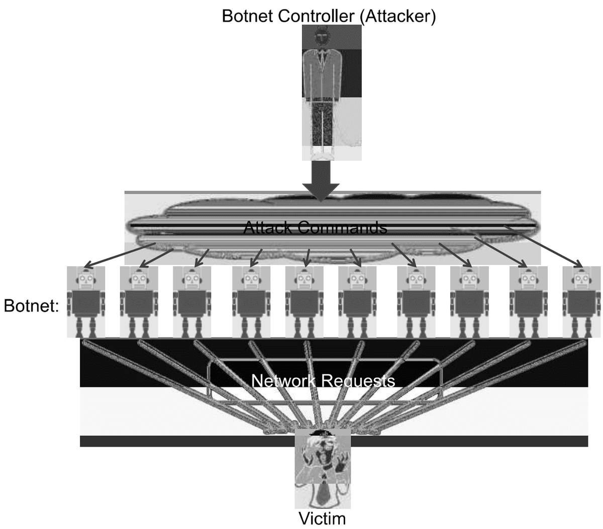

### Mitigating DDoS
- In theory, there is no way to completely eliminate the possibility of a DDoS attack, since the bandwidth a server is able to provide its users will always be limited
- Still, measures may be taken to mitigate the risks of DoS attacks.
- For example, many servers incorporate DoS protection mechanisms that analyse incoming traffic and drop packets from sources that are consuming too much bandwidth
- Unfortunately, IP spoofing may make DDoS prevention more difficult, by obscuring the identity of the attacker bots and providing inconsistent information on where network traffic is coming from

## DNS - Domain Name System
- DNS services
  - Hostname -> IP translation
  - Host alias
  - Mail server aliasing
  - Load distribution
  - replicated web servers
  - set of IP addresses for one canonical name. E.g., amazon.com
- Why not centralise DNS?
  - Single point of failure
  - Traffic volume

### DNS lookup
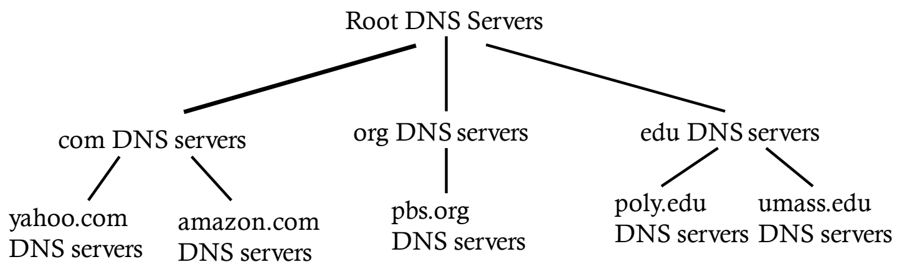

- Client wants IP for www.amazon.com; 1st approx:
  - client queries a root server to find com DNS server
  - client queries com DNS server to get amazon.com DNS
  - client queries amazon.com DNS server to get IP address for www.amazon.com

### DNS name resolution
- Host at me.cs.vt.edu
- Wants IP address for gaia.cs.umass.edu

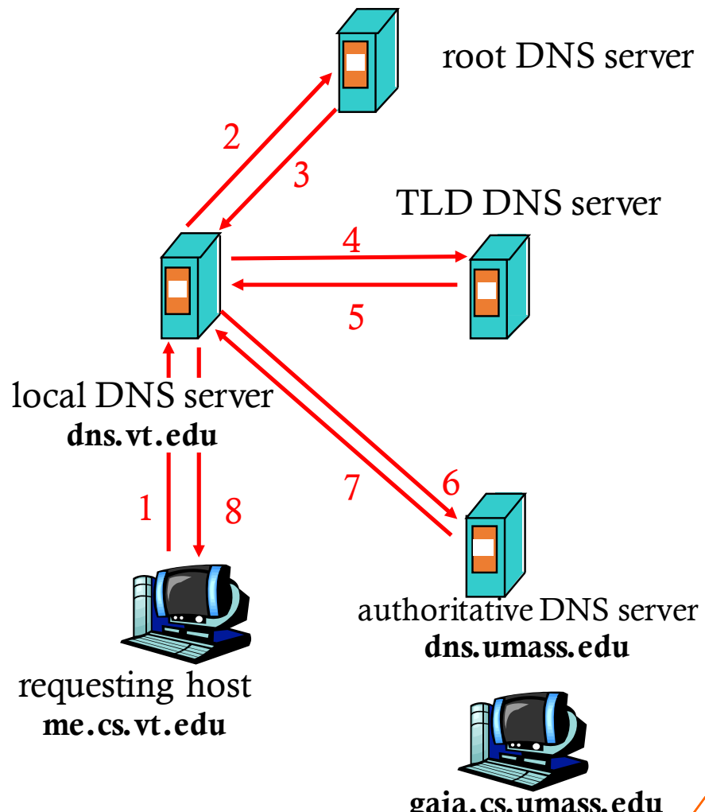

## DNS Cache Poisoning
- DNS cache poisoning corrupts a DNS server's cache with bogus data such as a rogue address, opening the door to data theft and other threats.
1. Attacker queries a recursive name server for a subdomain that doesn't exist (e.g. q0001.bankofamerica.com)
2. The recursive server does not have the IP address and queries a bankofamerica.com name server
3. Before bankofamerica.com name server can send NXDOMAIN response, attacker sends lots of spoofed responses that looks like they are coming from a legitimate bankofamerica.com server
   - Spoofed responses map www.bankofamerica.com to IP address of a server controlled by attacker
4. The recursive name server accepts a spoofed response, caches the record
5. User queries the recursive name server for IP address of www.bankofamerica.com
6. The recursive name server replies to user with cached rogue IP address
7. User connects to site controlled by attacker which may look exactly like the real bank of america website
- Impact: Logins, passwords, credit card numbers of the user can be captured

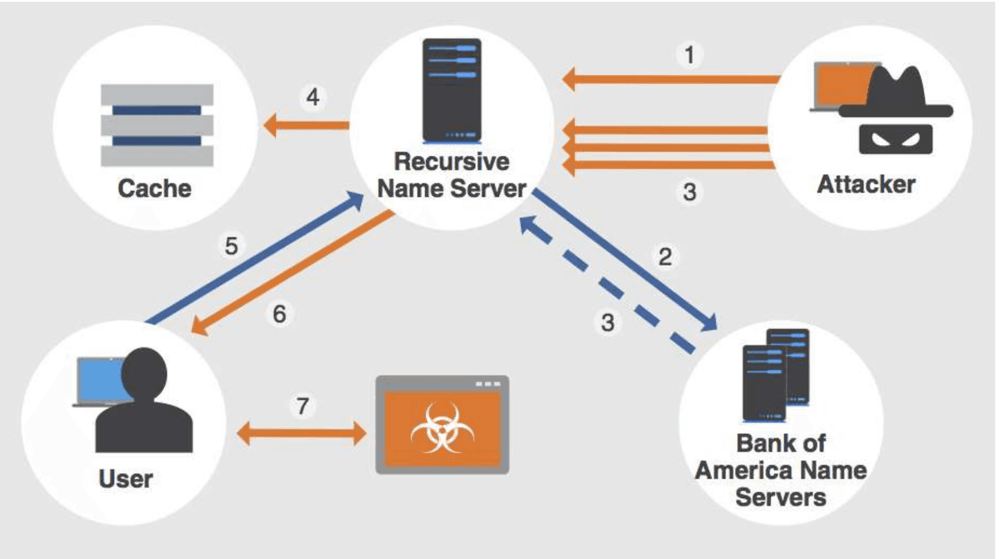

### Mitigating DNS Cache Poisoning
- First, most DNS cache poisoning attacks are targeted towards ISP DNS servers, known as local DNS (LDNS) servers, rather than authoritative name servers
- Prior to more recent cache poisoning attacks, the practice of leaving LDNS servers openly accessible to the outside world was common, but since 2008, most LDNS servers have been reconfigured to only accept requests from within their internal network
- This prevents all cache poisoning attempts originating from outside of an ISP's network
- However, the possibility of attacking from within the network remains.
- There are some other techniques not explored here, but the possibility of DNS Cache Poisoning still exists

## Firewall
- Firewalls divide the untrusted outside of a network from the more trusted interior of a network
- Often they run on dedicated devices
- Less possibilities for compromise – no compilers, linkers, loaders, debuggers, programming libraries, or other tools an attacker might use to escalate their attack
- Easier to maintain few accounts
- Physically divide the inside from outside of a network

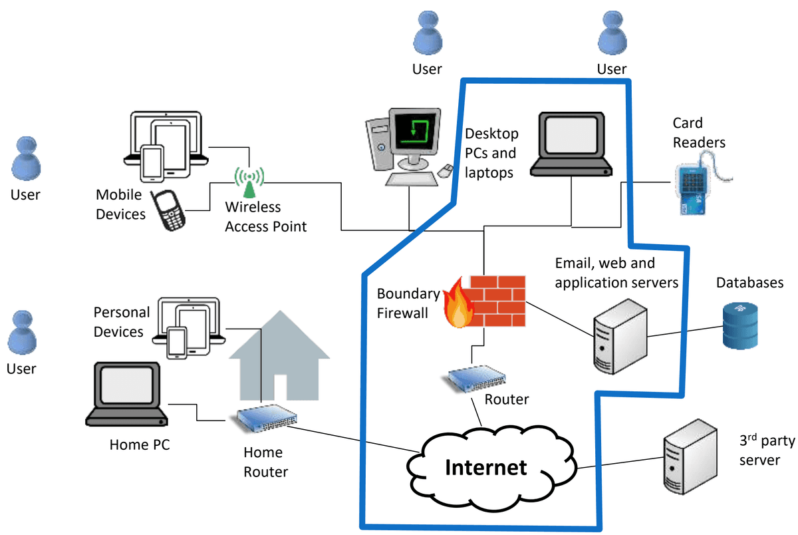

- Questionable things come from the internet AND from the local network
- Firewall applies a set of rules
- Based on rules, it allows or denies the traffic
- Firewalls can also act as a router deciding where to send traffic

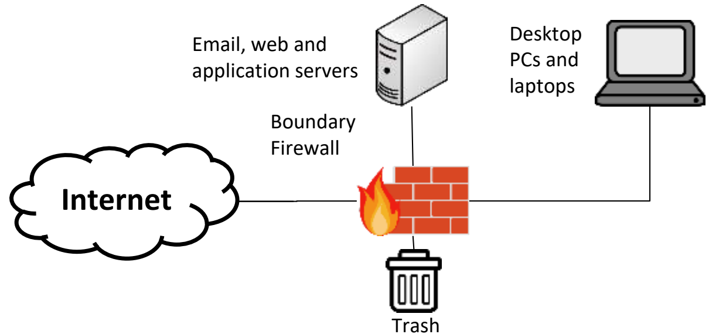

| Rule | Type | Source Address | Destination Address | Destination Port | Action |
| --- | --- | --- | --- | --- | --- |
| 1 | TCP | * | 192.168.1.* | 22 | Permit |
| 2 | UDP | * | 192.168.1.* | 69 | Permit |
| 3 | TCP | 192.168.1.* | * | 80 | Permit |
| 4 | TCP | * | 192.168.1.18 | 80 | Permit |
| 5 | UDP | * | 192.168.1.* | * | Deny |

### Firewall types
- Key differences include:
- How implemented
  - Software – slower, easier to deploy on personal computers
  - Hardware – faster, somewhat safer, harder to add in
- Number of OSI levels of processing required
  - Packet size (level 1)
  - MAC (level 2) filtering
  - IP & Port filtering (level 3)
  - Deep packet (level 4+)
- Based on these two differences:
  - Packet filtering gateway
  - Stateful inspection firewall
  - Application proxy
  - Personal firewall

### Packet filtering gateway
- Simplest – compares information found in the headers to the policy rules
- Operate at TCP/IP level 3
- Source addresses and ports can be forged, which a packet filter cannot detect
- Design is simple, but tons of rules are needed, so it is challenging to maintain

| Policy | Firewall Setting |
| --- | --- |
| No outside Web access. | Drop all outgoing packets to any IP address, port 80 |
| No incoming TCP connections, except those for institution's public Web server only. | Drop all incoming TCP SYN packets to any IP except 130.207.244.203, port 80 |
| Prevent streaming audio/video from eating up the available bandwidth. | Drop all incoming UDP packets - except DNS and router broadcasts. |
| Prevent your network from being used for a smurf DoS attack. | Drop all ICMP packets going to a "broadcast" address (eg 130.207.255.255). |
| Prevent your network from being tracerouted | Drop all outgoing ICMP TTL expired traffic |

### Stateful inspection firewall
- Maintains state from one packet to another
- Similar to a packet filtering gateway, but can remember recent events
- For example, if a outside host starts sending packets to many internal destination ports (aka a port scan) a stateful firewall would record the number of ports probed and once it is over the threshold specified in the policy it would block all further traffic

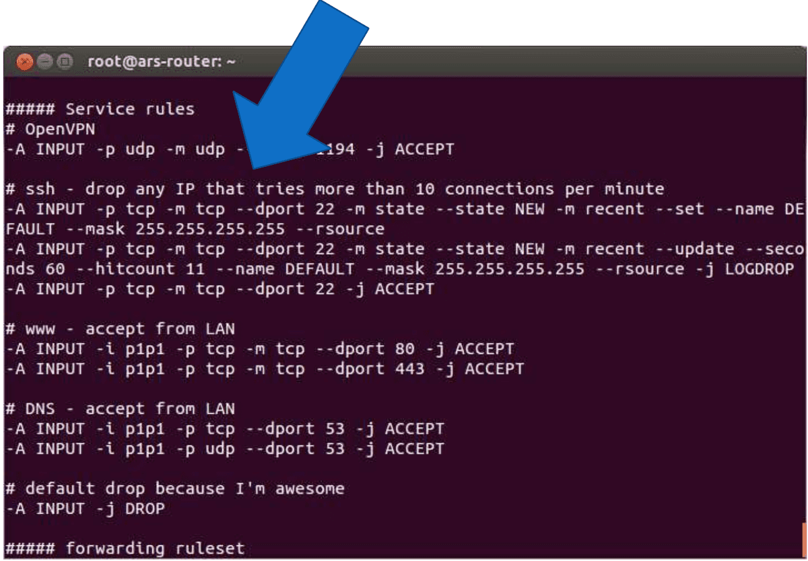

### Application proxy
- Simulates the (proper) effects of an application at TCP/IP level 5
- Effectively a protective Man In The Middle that screens information at an application layer
- Allows an administrator to block certain application requests.
- For example:
  - Block all web traffic containing certain words
  - Remove all macros from Microsoft Word files in email
  - Prevent anything that looks like a credit card number from leaving a database.

### Personal firewalls
- Runs on the workstation that it protects (software)
- Provides basic protection, especially for home or mobile devices.
- Malicious software can disable part or all of the firewall
- Any rootkit type software can disable the firewall

### Limitations of Firewalls
- IP spoofing:
  - router can't know if data "really" comes from the claimed source
- If multiple applications need special treatment, each has own app gateway
- Client software must know how to contact gateway
  - set IP address of proxy in Web browser
- Trade-off: degree of communication with outside world, level of security
- Many highly protected sites still suffer from attacks

## Intrusion Detection Systems (IDS)
- Firewalls are preventative, IDS detects a potential incident in progress
- At some point you have to let some traffic into and out of your network (otherwise users get upset)
- Most security incidents are caused by a user letting something into the network that is malicious, or by being an insider threat themselves
- These cannot be prevented or anticipated in advance.
- The next step is to identify that something bad is happening quickly so you can address it

### IDS types
- A Network Intrusion Detection System (NIDS) sits at the perimeter of a network and detects malicious behaviour based on traffic patterns and content
- A protocol-based intrusion detection system (PIDS) is specifically tailored towards detecting malicious behaviours in a specific protocol, and is usually deployed on a particular network host
- For example, a web server might run a PIDS to analyse incoming HTTP traffic and drop requests that may be potentially malicious or contain errors
- Finally, a host-based IDS (HIDS) resides on a single system and monitors activity on that machine, including system calls, inter-process communication, and patterns in resource usage

### IDS detection
- False positive: when an alarm is sounded on benign activity, which is not an intrusion
- False negative: when an alarm is not sounded on a malicious event, which is an intrusion
- True positive: when an alarm is sounded on a malicious event, which is an intrusion
- True negative: when an alarm is not sounded on benign activity, which is not an intrusion

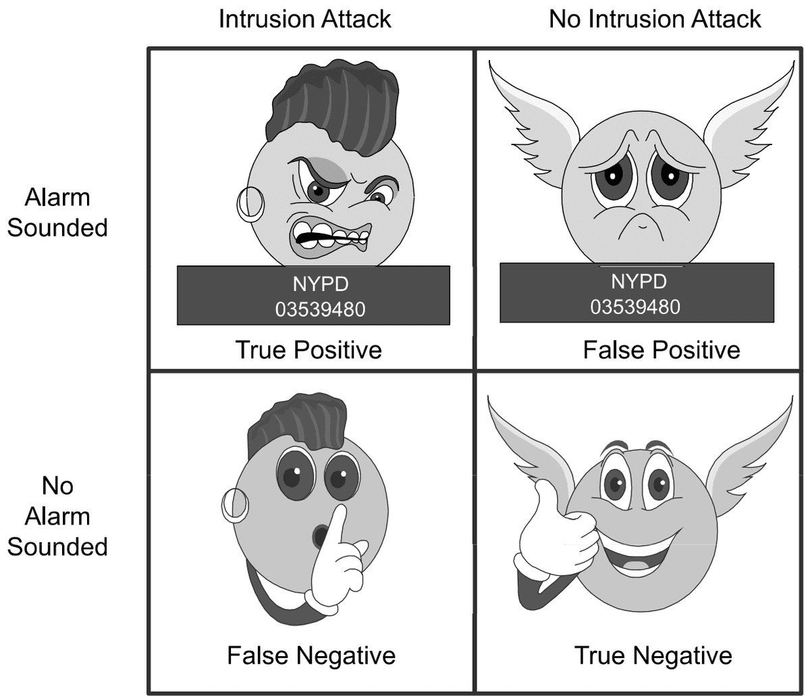

### IDS
- **Deep packet inspection:**
  - look at packet contents (e.g., check strings in packet against database of known virus)
  - Examine correlation among multiple packets
  - port scanning, network mapping, DoS attack
  - Generate alerts when it observes potentially malicious traffic
  - Passive monitoring
- **Two main approaches:**
  - Signature-based IDS
  - Anomaly-based/Heuristic-based IDS

### Signature-based IDS
- Signature based IDS maintains a database of attack signatures
- Each signature is a set of rules pertaining to an intrusion activity.
- A list of characteristics of a single or a series of packets
  - Packet size, source, destination port numbers, protocol type, payload
- Perform simple pattern matching and report situations that match the pattern
- Requires that admin know attack patterns in advance
- Attacker may test attack on common signatures
- High accuracy, low false positives
- **Limitations:**
  - Blind to new attacks (false negatives)
  - False alarms (false positives)
  - high Costs – ever packet is compared to a large collection of signatures

### Heuristic-based IDS
- Dynamically build a model of acceptable or “normal” behaviour and flag anything that does not match
- Observe normal traffic first, then,
  - Look for packet streams that are statistically unusual
  - Unusual percentage of ICMP packets
  - Sudden exponential growth in port scans and ping echo requests
- Advantage: can detect new attacks (in theory)
- Disadvantage:
  - Need to have a lot of training data to see what normal is
  - System needs time to warm up to new behaviour
  - Hard to distinguish normal from abnormal activities (e.g., stealthy malware).
  - Higher false positives, lower accuracy

## Intrusion Prevention Systems (IPS)
- Actively filters out suspicious traffic
- Active monitoring
- Terminate connections, blocking access of user accounts, IP addresses
- Respond to detected threats at real time
- Delete malicious content
- Apply patches
- Reconfigure a firewall or router
- Cisco global correlation IPS
  - Reputation scores for the sources
  - Reputation obtained from centralised databases
