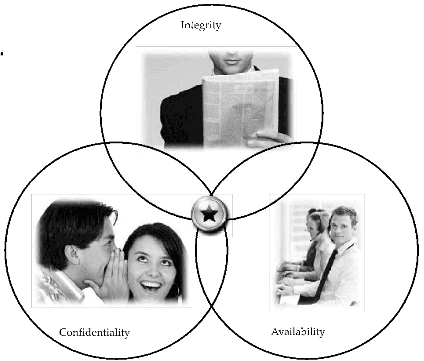
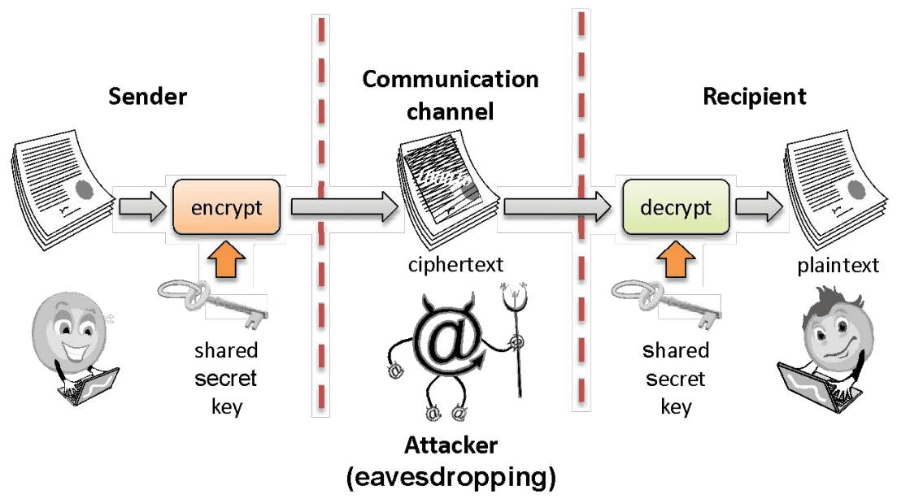
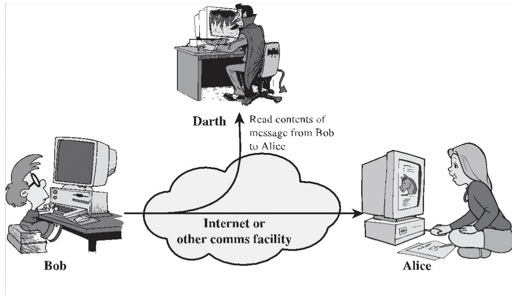
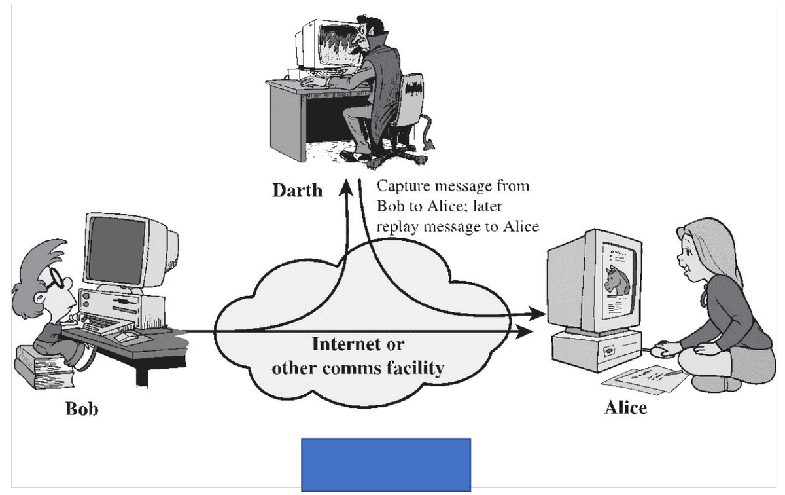
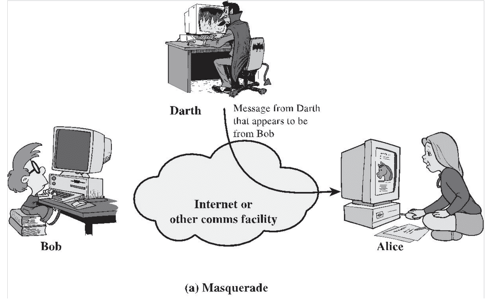
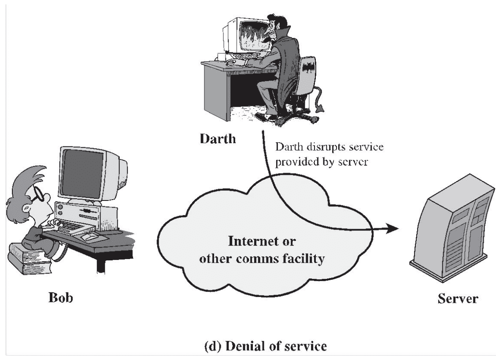

# Security Goals & Attacks

## Outline
- Security definition
- Security goals
- Security attacks

## Terminologies: Common Criteria (CC)
- CC is an international set of guidelines and specifications by ISO
  - for evaluating information security products
  - specifically to ensure they meet an agreed-upon security standard for government deployments
- Asset is something that is valuable to its owner
- Vulnerabilities are weaknesses in the asset
- Threats exploit vulnerabilities within an asset to violate its security in some environments
- Threats increase the risk of abuse of an asset
- Threat agents (attackers/adversaries) value assets and want to abuse them
- Owners adopt countermeasures to minimise risks

## Defining security
- The security of a system, application, or protocol is always relative to:
  - A set of desired properties
  - An adversary (attacker) with specific capabilities
- Academic study of security not about:
  - Breaking into a system
  - How to launch an attack
- Our focus will be explore:
  - Why a system is insecure
  - How to make them secure

## Security goals

- C.I.A.

| Properties | Brief description |
| --- | --- |
| Confidentiality | Keeping information secret from all but those who are authorised to see it |
| Integrity | Ensuring information has not been altered by unauthorized or unknown means |
| Availability | Data/information is available when required |

### Tools of Confidentiality
- **Encryption:**
  - the transformation of information using a secret, called an encryption key, so that the transformed information can only be read using another secret, called the decryption key (which may, in some cases, be the same as the encryption key)

### Integrity
- **Integrity:** the property that information/system has not be altered in an unauthorized way
- Two dimensions: data integrity and system integrity
- **Data integrity:**
  - Assures that information and programs are changed only in a specified and authorized manner
- **System integrity:**
  - Assures that a system performs its intended function in an unimpaired manner, free from deliberate or inadvertent unauthorized manipulation of the system

### Tools of Integrity
- **Backups:** the periodic archiving of data
- **Checksums:** the computation of a function that maps the contents of a file to a numerical value
  - A checksum function depends on the entire contents of a file and is designed in a way that even a small change to the input file (such as flipping a single bit) is highly likely to result in a different output value
- **Data correcting codes:** methods for storing data in such a way that small changes can be easily detected and automatically corrected

## Additional security properties

| Properties | Brief description |
| --- | --- |
| Authenticity | Data/information origin is identifiable accurately (source authenticity); corroboration of the identity of an entity (entity authentication) |
| Accountability/Non-repudiation | Actions involving data/information is traceable/preventing the denial of previous commitments or actions |
| Anonymity | Actions or data not relatable to a particular individual |

### Authenticity
- The property of an entity or the source of data (person/system/org) being genuine and being able to be verified and trusted
  - confidence in the validity of a transmission, a message, or message originator
- This means verifying:
  - that users are who they say they are and
  - that each input arriving at the system came from a trusted source.
  - Example: purporting someone else's identity for malicious purposes
- Data authentication deals with source authenticity
  - Mechanism: Digital signature
- Entity authentication deals with Identity authenticity. For a person:
  - something you have e.g., id cards
  - something you know e.g., a password or secret key
  - something you are e.g., a biometric (fingerprint, face or iris scanning)

### Accountability/Non-repudiation
- Ensures the actions of an entity to be traced uniquely to that entity
- True secure systems are not yet an achievable goal
  - we must be able to trace a security breach to a responsible party
- This supports:
  - non-repudiation (a party cannot deny a certain action)
  - fault isolation and
  - after-action recovery and legal action
- Mechanism: via a secure audit trail
  - creating an audit trail with machine logs is tricky: if a system is compromised, logs may also be tampered with
  - how about: send log messages to an append-only file?

## Security attacks

### Passive attacks
- **Eavesdropping:** the interception of information intended for someone else during its transmission over a communication channel

- Observe, analyse and then replay

### Active attacks
- **Masquerading:** the fabrication of information that seems to be from someone who is not actually the author/source

- **Denial-of-service:** the interruption or degradation of a data service or information access
  - Example: email spam, to the degree that it is meant to simply fill up a mail queue and slow down an email server

