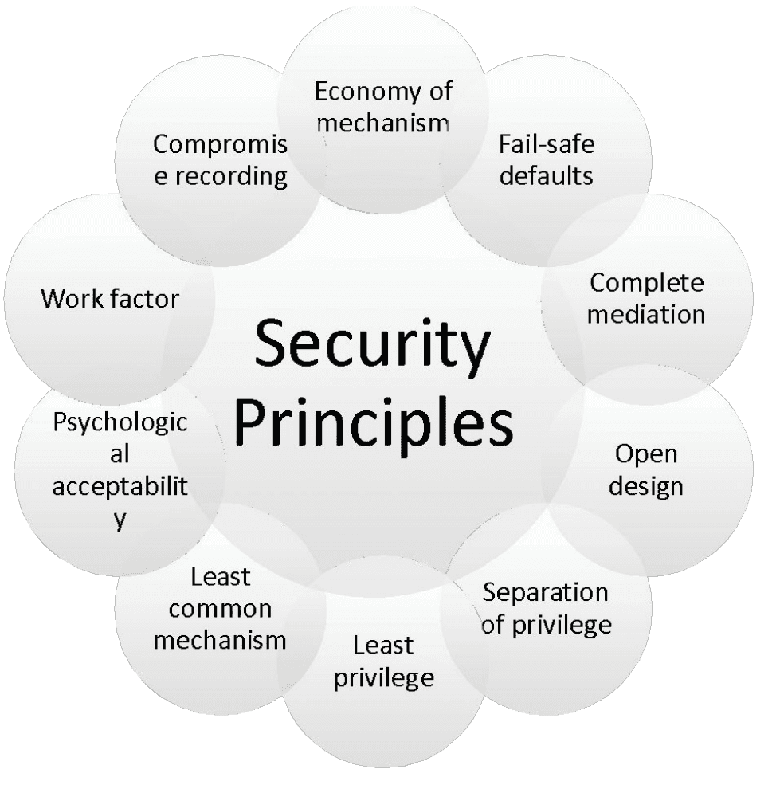
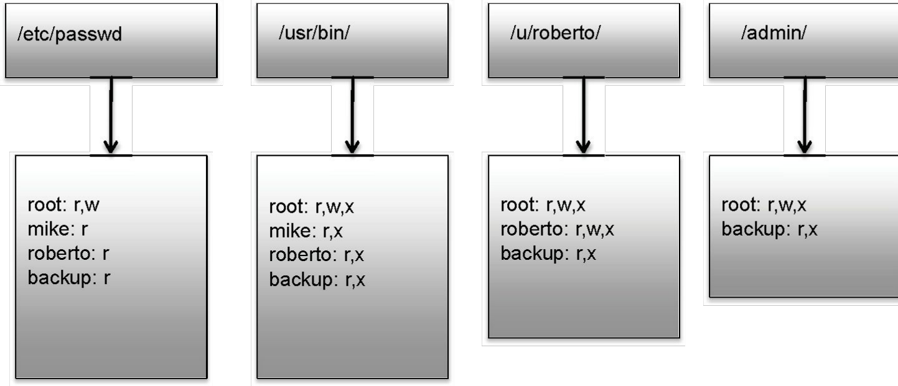
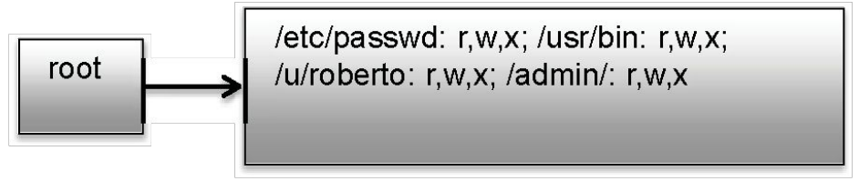
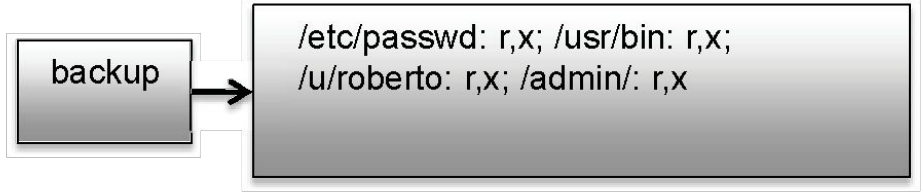
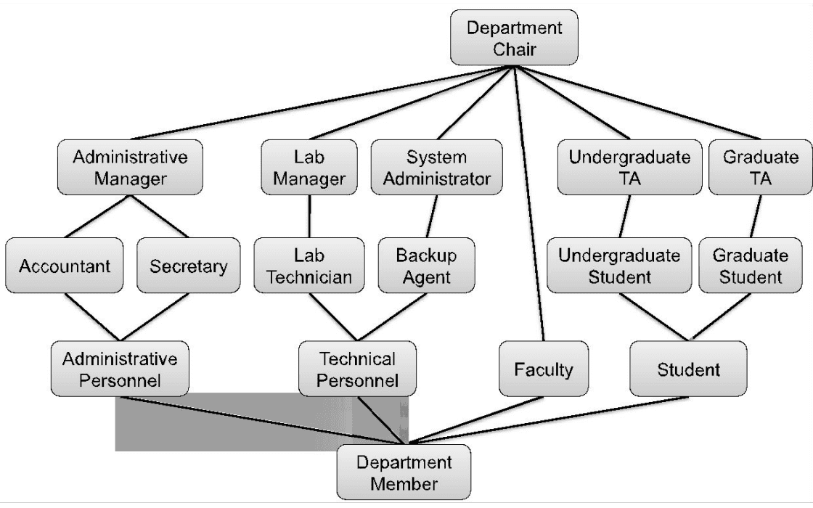

# Security Principles & Access Control

## Outline
- Security principles
- Access control

## Security principles
- The ten security principles by Saltzer and Schroeder in their 1975 paper
- “The protection of information in computer systems”
- These principles remain important guidelines for securing today’s computer systems and networks even after so many years

### Economy of mechanism
- This principle stresses simplicity in the design and implementation of security measures
- While applicable to most engineering endeavours, the notion of simplicity is especially important in the security domain, since a simple security framework facilitates its understanding by developers and users and enables the efficient development and verification of enforcement methods for it

### Fail-safe defaults
- This principle states that the default configuration of a system should have a conservative protection scheme
- For example, when adding a new user to an operating system, the default group of the user should have minimal access rights to files and services
- Unfortunately, operating systems and applications often have default options that favour usability over security
- This has been historically the case for a number of popular applications, such as web browsers that allow the execution of code downloaded from the web server

### Complete mediation
- The idea behind this principle is that every access to a resource must be checked for compliance with an authority
- As a consequence, one should be wary of performance improvement techniques that save the results of previous authorization checks, since permissions can change over time
- For example, an online banking web site should require users to sign on again after a certain amount of time, say, 15 minutes, has elapsed

### Open design
- According to this principle, the security architecture and design of a system should be made publicly available
- Security should rely only on keeping cryptographic keys secret
- Open design allows for a system to be scrutinized by multiple parties, which leads to the early discovery and correction of security vulnerabilities caused by design errors.
- The open design principle is the opposite of the approach known as security by obscurity, which tries to achieve security by keeping cryptographic algorithms secret and which has been historically used without success by several organizations
- **Kerckhoffs’s Principle:**
  - Stated by Netherlands born cryptographer Auguste Kerckhoffs in the 19th century
  - "A cryptosystem should be secure even if everything about the system, except the key, is public knowledge"

### Separation of privilege
- This principle dictates that multiple conditions should be required to achieve access to restricted resources or have a program perform some action
- A protection mechanism that requires two keys to unlock it is more robust and flexible than one that allows access to the presenter of only a single key

### Least privilege
- Every program and every user of the system should operate using the least set of privileges necessary to complete the job
- The military concept of need-to-know information is an example of this principle

### Least common mechanism
- In systems with multiple users, mechanisms allowing resources to be shared by more than one user should be minimised
- For example, if a file or application needs to be accessed by more than one user, then these users should have separate channels by which to access these resources, to prevent unforeseen consequences that could cause security problems

### Psychological acceptability
- This principle states that user interfaces should be well designed and intuitive, and all security-related settings should adhere to what an ordinary user might expect

### Work factor
- According to this principle, the cost of circumventing a security mechanism should be compared with the resources of an attacker when designing a security scheme
- A system developed to protect student grades in a university database, which may be attacked by snoopers or students trying to change their grades, probably needs less sophisticated security measures than a system built to protect military secrets, which may be attacked by government intelligence organizations

### Compromise recording
- This principle states that sometimes it is more desirable to record the details of an intrusion than to adopt more sophisticated measures to prevent it

## Access control
- Which users can read/write which files?
- Are my files really safe?
- What does it mean to be root?
- What do we really want to control?
- Four mechanisms:
  - Access control matrices
  - Access control lists
  - Capabilities
  - Role-based Access Control (RBAC)

### Access control matrices
- A table that defines permissions
- Each row of this table is associated with a subject, which is a user, group, or system that can perform actions
- Each column of the table is associated with an object, which is a file, directory, device, resource, or any other entity for which we want to define access rights
- Each cell of the table is then filled with the access rights for the associated combination of subject and object
- Access rights can include actions such as reading, writing, copying, executing, deleting, and annotating
- An empty cell means that no access rights are granted

|  | /etc/passwd | /usr/bin/ | /u/roberto/ | /admin/ |
| --- | --- | --- | --- | --- |
| root | read, write | read, write, exec | read, write, exec | read, write, exec |
| mike | read | read, exec |  |  |
| roberto | read | read, exec | read, write, exec |  |
| backup | read | read, exec | read, exec | read, exec |
| ... | ... | ... | ... | ... |

Table 1: An example access control matrix. This table lists read, write, and execution (exec) access rights for each of four fictional users with respect to one file, /etc/passwd, and three directories.

**Access control matrices: pros**
- The nice thing about an access control matrix is that it allows for fast and easy determination of the access control rights for any subject-object pair
  - just go to the cell in the table for this subject's row and this object's column
- locating a record of interest can be done with a single operation of looking up a cell in a matrix
- The access control matrix gives administrators a simple, visual way of seeing the entire set of access control relationships all at once

**Access control matrices: cons**
- There is a fairly big disadvantage to the access control matrix: it can get really big
- In particular, if we have $n$ subjects and $m$ objects, then the access control matrix has $n$ rows, $m$ columns, and $n \cdot m$ cells.
- For example, a reasonably sized computer server could easily have 1,000 subjects, who are its users, and 1,000,000 objects, which are its files and directories.
- But this would imply an access control matrix with 1 billion cells!
- It is hard to imagine there is a system administrator anywhere on the planet with enough time and patience to fill in all the cells for a table this large!
- Also, nobody would be able to view this table all at once!

### Access control lists
- It defines, for each object, o, a list, L, called o's access control list, which enumerates all the subjects that have access rights for o and, for each such subject, s, gives the access rights that s has for object o

**Access control lists: pros**
- The main advantage of ACLs over access control matrices is size
- The total size of all the access control lists in a system will be proportional to the number of nonempty cells in the access control matrix
  - which is expected to be much smaller than the total number of cells in the access control matrix
- Another advantage of ACLs, with respect to secure computer systems, is that the ACL for an object can be stored directly with that object as part of its metadata, which is particularly useful for file systems
- That is, the header blocks for files and directories can directly store the access control list of that file or directory
- Thus, if the operating system is trying to decide if a user or process requesting access to a certain directory or file in fact has that access right, the system need only consult the ACL of that object

**Access control lists: cons**
- The primary disadvantage of ACLs is enumerating all the access rights of a given subject is extremely inefficient
- In order to determine all the access rights for a given subject, s, a secure system based on ACLs would have to search the access control list of every object looking for records involving s
- That is, determining such information requires a complete search of all the ACLs in the system,
- For the Access Control Matrix, the similar computation involves examining the row for subject s!
- Sometime such computation is necessary:
  - E.g. removing a user from a system

### Capabilities
- Takes a subject-centred approach to access control
- It defines, for each subject s, the list of the objects for which s has nonempty access control rights, together with the specific rights for each such object

**Capabilities: pros**
- Similar advantages as access control lists
- A system administrator only needs to create and maintain access control relationships for subject-object pairs that have nonempty access control rights
- In addition, the capabilities model makes it easy for an administrator to quickly determine for any subject all the access rights that that subject has
- For example, each time a subject s requests a particular access right for an object o, the system needs only to examine the complete capabilities list for s looking for o. If s has that right for o, then it is granted it
- Thus, if the size of the capabilities list for a subject is not too big, this is a reasonably fast computation

**Capabilities: cons**
- The main disadvantage of capabilities is that they are not associated directly with objects
- Thus, the only way to determine all the access rights for an object o is to search all the capabilities lists for all the subjects

### Role Based Access Control (RBAC)
- Define roles and then specify access control rights for these roles, rather than for subjects directly
- For example, a file system for a university computer science department could have roles for “faculty,” “student,” “administrative personnel,” “administrative manager,” “backup agent,” “lab manager,” “system administrator,” etc.
- Each role is granted the access rights that are appropriate for the class of users associated with that role
- Then assign a user to the corresponding role
- Such role can take advantage of the concept of inheritance:
  - if a role R1 is above role R2 in the hierarchy, then R1 inherits the access rights of R2

**RBAC: pros & cons**
- The total set of roles should be much smaller than the set of subjects
- Hence, storing access rights just for roles is more efficient
- And the overhead for determining if a subject s has a particular right is small
  - for all the system needs to do is to determine if one of the roles for s has that access right
- The main disadvantage of the role-based access control model is that it is not implemented in current operating systems