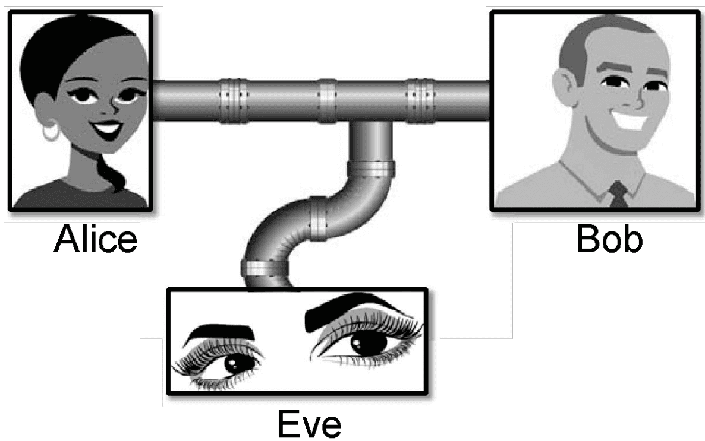
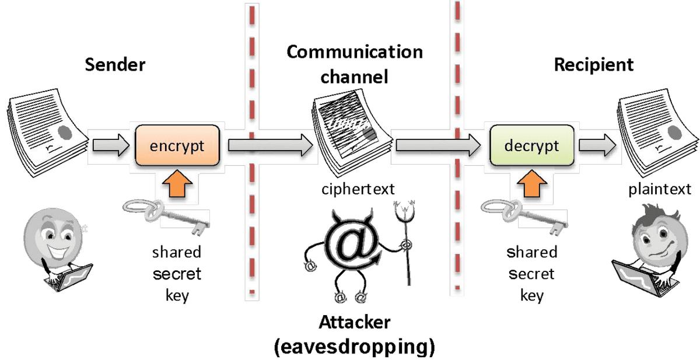
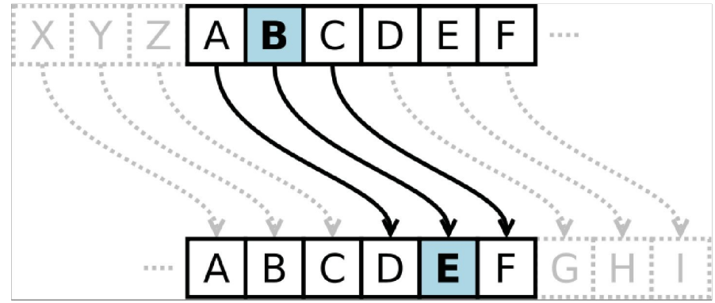
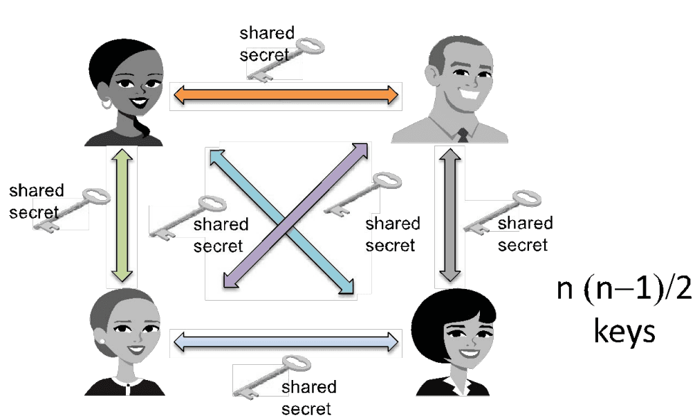
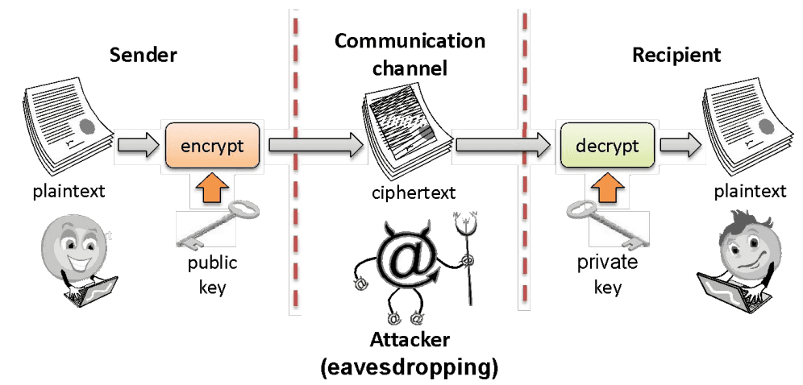
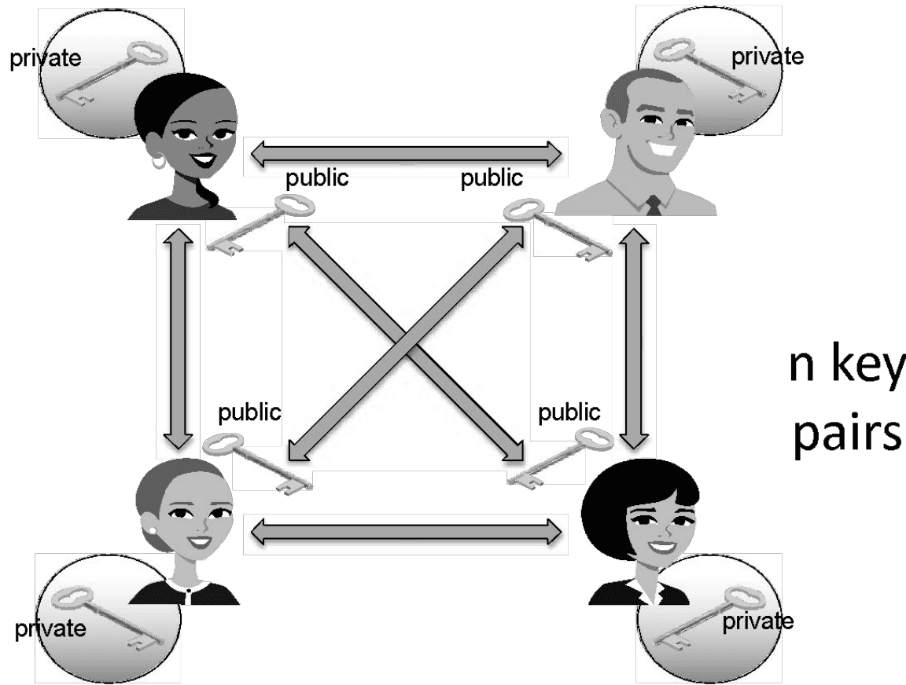
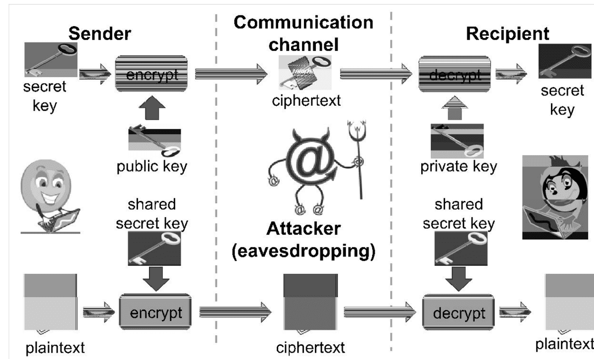
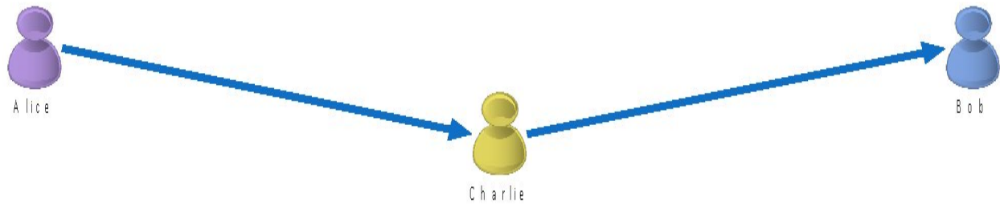
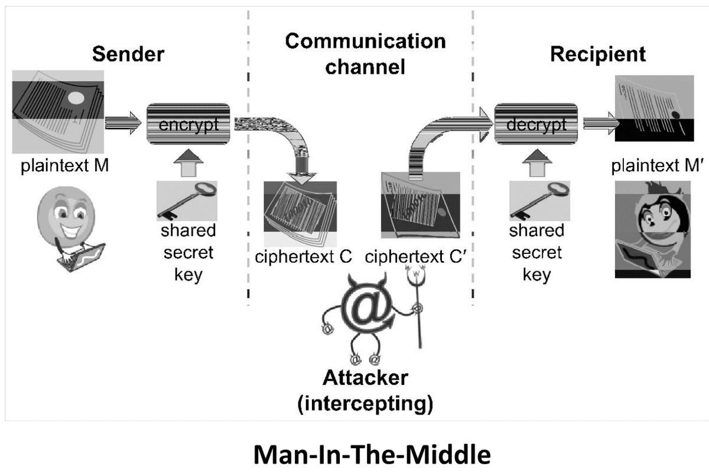

# Cryptosystem Basics & Encryption

## Outline
- Basic crypto concepts

## Encryption
- A means to allow two parties, customarily called Alice and Bob, to establish confidential communication over an insecure channel that is subject to eavesdropping

- The message M is called the plaintext
- Alice will convert plaintext M to an encrypted form using an encryption algorithm E that outputs a ciphertext C for M

- As equations:
  $$ \bullet C = E(M), M = D(C) $$
- The encryption and decryption algorithms are chosen so that it is infeasible for someone other than Alice and Bob to determine plaintext M from ciphertext C
- Thus, ciphertext $C$ can be transmitted over an insecure channel that can be eavesdropped by an adversary
- The decryption algorithm must use some secret information known to Bob, and possibly also to Alice, but no other party
  - using an auxiliary input a secret number or string called decryption key.
  - the decryption algorithm itself can be implemented by standard, publicly available software and only the decryption key needs to remain secret
- Similarly, the encryption algorithm uses as auxiliary input an encryption key, which is associated with the decryption key
- If it is feasible to derive the decryption key from the encryption key, the encryption key should be kept secret as well

## Cryptosystem
- A cryptosystem consists of seven components:
  - The set of possible plaintexts
  - The set of possible ciphertexts
  - The set of encryption keys
  - The set of decryption keys
  - The correspondence between encryption keys and decryption keys
  - The encryption algorithm to use
  - The decryption algorithm to use

### Caesar cipher
- Replace each letter with the one "three over" in the alphabet
- An example of a shift cipher
- Can be denoted using the following formula:
  - s(c, k), here c represents one of 23 letters in Latin Alphabet and k represents the key
- If $k > 0$, forward shift (encryption) and if $k < 0$, backward shift (decryption)
- Example: s(A,3) = D, s(D,-3) = A
- For Caesar cipher, $\{k=3\}$ is the set of encryption key and $\{k=-3\}$ is the set of decryption key
- Uses modulo operation in a sort of circular shift fashion when shift goes beyond the limit

## Symmetric key distribution
- Symmetric crypto-systems are quite fast and efficient
- However their main problem is key distribution
- It requires each pair of communicating parties to share a (separate) secret key
- If there are n parties, it means it requires a total of $n(n-1)/2$ keys

## Public key cryptography

- Bob has two keys: a private key, $S_B$ , which Bob keeps secret, and a public key, $P_B$ , which Bob broadcasts widely
- In order for Alice to send an encrypted message to Bob, she needs only obtain Bob's public key, $P_B$, and use that to encrypt her message, M, and send the result, $C = E_{P_B}(M)$, to Bob.
- Bob then uses his secret key to decrypt the message as $M = D_{S_B}(C)$
- That is, separate keys are used for encryption and decryption

### Public key distribution
- How many keys do we need to distribute for n users??
- Only one key is needed for each recipient!

## Combining symmetric and public key systems
- The main disadvantage of public-key cryptosystems is that they are much slower than existing symmetric encryption schemes
- Hence, public-key cryptography is unsuitable for interactive sessions that use a lot of back-and-forth communication
- Also, public-key cryptosystems have larger key lengths than that for symmetric cryptosystems
- For example, RSA is commonly used with 2,048-bit keys while AES is typically used with 256-bit keys
- To work around these disadvantages,
  - public-key cryptosystems are often used in practice just to allow Alice and Bob to exchange a shared secret key
  - Once exchanged, the shared secret key then can be used for communication encrypted with a symmetric encryption scheme

## Digital signature
- Public key crypto systems allow the reversing the order in which encryption and decryption is carried out
  $$ \bullet E_{P_B}\left(D_{S_B}(M)\right) = M $$
- This concept is leveraged to create digital signatures
- To sign a message, M, Alice just decrypts it with her private key, $S_A$, creating $C = D_{S_A}(M)$
- Anyone can encrypt this message using Alice's public key, as $M' = E_{PA}(C)$ and then compare if $M = M'$
- If they match, the signature is valid
- Indeed, no one but Alice, who has private key $S_A$, could have produced such an object $C$, so that $M' = E_{P_A}(C)$
- Only disadvantage, the signature is as long as the message!
- Compare it with real life signatures!

## Man In The Middle (MITM) Attack
- Charlie is in the middle between Alice and Bob
- Charlie can:
  - View traffic
  - Change traffic
  - Add traffic
  - Delete traffic
- Charlie could be:
  - Internet service provider
  - Virtual Private Network (VPN) provider
  - WIFI provider such as a coffee shop
  - An attacker re-routing your connection
  - An incompetent admin (it happens)

### Simple attacks on crypto systems: MITM
- The straightforward use of a cryptosystem presented, which consists of simply transmitting the ciphertext, assures confidentiality
- However, it does not guarantee the authenticity and integrity of the message if the adversary can intercept and modify the ciphertext
- How the recipient can be assured that the message s(he) receives is the intended one?

- **Bob (M, S):** (C,S) -> Eve (C',S') -> Alice (C',S'): (M',S')??
- Note that $M'$ will be different from the original message $M$
- When Alice verifies the digital signature $S'$, she obtains message $M'$ by encrypting $S'$
- Thus, Alice is led to believe that Bob has signed M' instead of M
- Note that in the above attacks the adversary can arbitrarily alter the transmitted ciphertext or signature
- However, the adversary cannot choose, or even figure out, what would be the resulting plaintext since she does not have the ability to decrypt
- Thus, the above attacks are effective only if any arbitrary sequence of bits is a possible message
- This scenario occurs, for example, when a randomly generated symmetric key is transmitted encrypted with a public-key cryptosystem

### Simple attacks on crypto systems: brute-force
- How about brute forcing a crypto system?
- Trying different probable keys over a cipher text to decrypt it to a meaningful text
- Mind you, encryption and decryption functions are open, just the key is secret!
- If the plaintext is an arbitrary binary string, this attack cannot succeed, as there is no way for the attacker to distinguish a valid message
- However, if the plaintext is known to be text in a natural language, then the adversary hopes that only a small subset of the decryption results (ideally just a single plaintext) will be a meaningful text for the language

## Brute force attack details
- Some knowledge about the possible message being sent will then help the attacker pinpoint the correct plaintext
- Key should be a sufficiently long random value to make exhaustive search attacks unfeasible
- Problem is it is usually easy to recognize that a message is a valid plaintext
- For example, given a certain ciphertext, if an attacker could decrypt it with a given key and get message NGGNPXNGQNJABAVEIVARORNPU, which she can immediately dismiss
- But if she gets message ATTACKATDAWNONIRVINEBEACH, then she can be confident she has found the decryption key
- This ability is related to the unicity distance for a cryptosystem
- English text is typically represented with 8-bit ASCII encoding
- A message with t characters has n bits, with n = 8t
- The total number of possible $n$-bit (or t-byte) arrays is $2^{8t} = 2^n$
- It is estimated that each character of English text carries about 1.25 bits of information, known as the entropy of English
- The number of t-byte arrays that correspond to English text:
  $$ \bullet\ 2^{1.25t}=2^{1.25n/8}\approx 2^{0.16n} $$
- In general, for some constant $0 < \alpha < 1$, there are $2^{\alpha n}$ valid text messages among the $2^n$ possible plaintexts
  - as not all combinations are valid messages
- The probability that a randomly selected plaintext corresponds to meaningful text is represented with: $\frac{2^{\alpha n}}{2^n} = \frac{1}{2^{(1-\alpha)n}}$
- The fraction of valid messages tends rapidly to zero as $n$ grows
- Let $k$ be the length (number of bits) of the decryption key.
- For a given ciphertext, there are $2^k$ possible plaintexts, each corresponding to a key
- From the previous discussion, each such plaintext is a valid text message with probability $\frac{1}{2(1-\alpha)n}$
- Hence, the expected number of plaintexts corresponding to valid text messages is $\frac{2^k}{2(1-\alpha)n}$
- As the key length $k$ is fixed, the above number tends rapidly to zero as the ciphertext length $n$ grows
- We expect that there is a unique valid plaintext for the given ciphertext when $n = \frac{k}{1-\alpha}$
- The above threshold value for $n$ is called the unicity distance for the given language and key length
- **The unicity distance for a cryptosystem:** the minimum number of characters of ciphertext that are needed so that there is a single intelligible plaintext associated with it
- Consider a cipher text: FJKFPO that is encrypted with a substitution cipher (discussed later) and brute force might result in the following: thatis of your season onyour thatwe thetop thetwo oxford thatin thatof
- Which is the correct one? It is impossible to know!
- For the English language and the 256-bit AES cryptosystem, the unicity distance is about 304 bits or 38 ASCII-encoded characters
- This is only half a line of text
- We can conclude that brute-force decryption is likely to succeed for messages in natural language that are not too short
- Namely, when a key yields a plaintext that is a meaningful text, the attacker has probably recovered the original message

