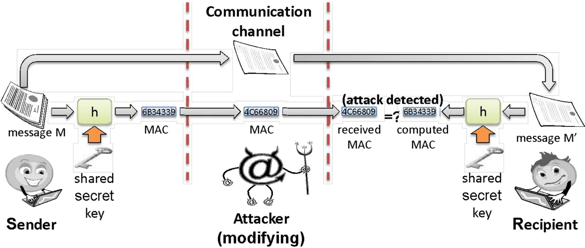
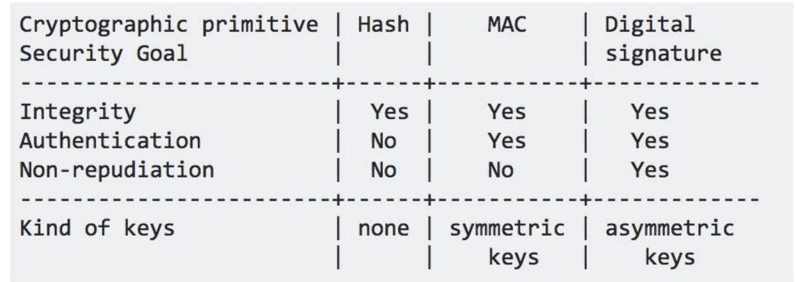
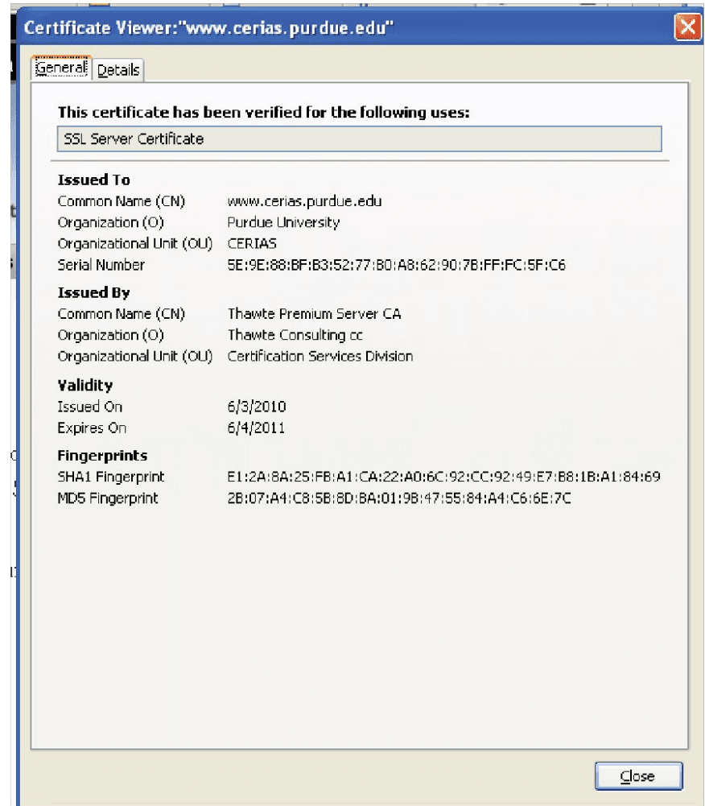
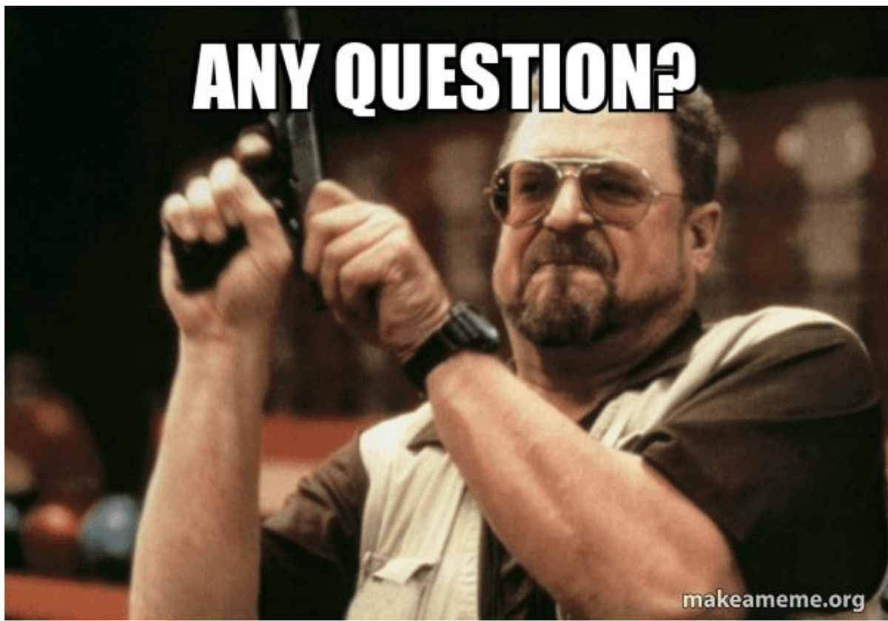

# Cryptographic Hashes & Passwords

## Outline
- Basic crypto concepts
- Other aspects

## Cryptographic hash functions
- To reduce the size of the message that Bob has to sign, we often use cryptographic hash functions, which are checksums on messages that have some additional useful properties:
- **One-way:** it should be easy to compute Y=H(M), but hard to find M given only Y
- **Collision-resistant:** it should be hard to find two messages, M and N, such that $H(M)=H(N)$
- Examples: SHA-1, SHA-256

### Cryptographic hash functions: applications
- Given a cryptographic hash function, we can reduce the time and space needed for Bob to perform a digital signature by
  - first creating a hash of M: $h(M)$ and
  - then have him sign this value: $S = E_{S_B}(h(M))$ which is sometimes called the digest of $M$
- Send S and M to Alice
- Upon receiving, Alice computes $h' = h(m)$
- Then compute: $h'(m) = D_{P_B}(S)$ and them compare $h' = h'(m)$
- Signing a cryptographic digest of the message is more efficient
- Signing a cryptographic digest of the message also defends against the MITM attack described previously
  - both guarding integrity and authenticity of the message
- Because it is no longer possible for the attacker to forge a message-signature pair without knowledge of the private key
- Hence, if the attacker crafts a forged signature its validation will fail!
- This guarantees authenticity of the message
- Also, because of the collision-resistant property of the hash-function, the attacker cannot find another message $M'$ which will have the same digest as the $M$
- This guarantees the integrity of the message
- Another application of cryptographic hash functions is to protect the integrity of critical files in an operating system in the following way:
  - store the cryptographic hash value of each such file in protected memory.
  - compute the cryptographic hash of a corresponding file in run-time
  - and compare the computed value with the stored in secure memory.
  - if they match, the file has not been altered with, because of the collision-resistant property of the hash function

## Message Authentication Code (MAC)
- A cryptographic hash function $h$ can be used in conjunction with a secret key shared by two parties to provide integrity protection to messages exchanged over an insecure channel, much like a digital signature
- Suppose Alice and Bob share a secret key $K$
- When Alice wants to send a message M to Bob, she computes the hash value of the key K concatenated with message M: A = h(K | M)
- A is called the MAC
- Alice sends the pair $(M,A)$ to Bob
- Let's assume what Bob receives (M', A)
- Alice computes $A' = h(k||M')$, if $A = A'$, Bob is assured that
  - the message is sent by Alice, thus guaranteeing authenticity
  - and the message has not been altered during transmission and hence guaranteeing integrity

### Digital Signature vs MAC
- They are similar, but the shared key K needs to be exchanged in a secure fashion
- Like any symmetric encryption

## Digital certificates
- Public-key cryptography solves the problem of how to get Alice and Bob to share a common secret key
- But this solution has a flaw:
  - How does Alice know that the public key, $P_B$, that she used is really the public key for Bob?
  - And if there are lots of Bobs, how can she be sure she used the public key for the right one?
- **Solution:** Utilise a trusted authority who will verify a user's identity and then digitally sign a statement that combines each person's identity with their public key
- The statement can be something like this:
  - “The Bob who lives on 11 Main Street in Gotham City was born on August 4, 1981, and has email address bob@gotham.com, has the public key $P_B$, and I stand by this certification until December 31, 2011.”
- Such a statement is called digital certificates
- Such a trusted authority is called a Certificate Authority (CA)
- Since the digital certificate is a strong evidence of the authenticity of Bob's public key, Alice can trust it even if it comes from an unsigned email message or is posted on a third-party web site
- However, Alice also needs to trust the public key of Cas
- This creates a circular problem
- Solution, embed the public keys of the CAs in the OS/Browser
- We will study the protocol for validating digital certificates when we study web security
- Name of the certification authority (e.g., Thawte).
- Date of issuance of the certificate (e.g., 1/1/2009).
- Expiration date of the certificate (e.g., 12/31/2011).
- Address of the website (e.g., mail.google.com).
- Name of the organization operating the web site (e.g., "Google, Inc.").
- Public key used of the web server (e.g., an RSA 1,024-bit key).
- Name of the cryptographic hash function used (e.g., SHA-256).
- Digital signature.

## Other aspects: passwords
- A short sequence of characters used as a means to authenticate someone via a secret that they know (something you know paradigm)
- Ideally, passwords should be easy to remember and hard to guess.
- Unfortunately, these two goals are in conflict with each other
  - Easy to remember passwords are easy to guess!
  - Hard random passwords are difficult to memorise!

### Strong passwords
- What is a strong password
  - UPPER/lower case characters
  - Special characters
  - Numbers
- When is a password strong?
  - Seattle1
  - M1ke03
  - P@$$wOrd
  - TD2k5secV
- An Example:
  - “Mark took Lisa to Disneyland on March 15,
  - MtLtDoM15,
  - MtL+DoM15, (a more secure password)

### Password complexity
- A fixed 6 symbols password:
  - Numbers: $10^6 = 1,000,000$
  - UPPER or lower case characters $26^6 = 308,915,776$
  - UPPER and lower case characters $52^6 = 19,770,609,664$
  - 32 special characters (&, %, $, £, ", |, ^, §, etc.) $32^6 = 1,073,741,824$
  - 94 practical symbols available 94$^{6}$ = 689,869,781,056
- ASCII standard 7 bit $2^7 = 128$ symbols
- $128^{6}$ = 4,398,046,511,104 (4 trillion)
- Odd characters make password safer!

### Password length
- **94 characters:**
  - 26 UPPER/lower case characters=52characters
  - 10 numbers
  - 32 special characters
  - 52 + 10 + 32 = 94 characters available
- 5 characters: $94^{5}$ = 7,339,040,224
- 6 characters: $94^{6}$ = 689,869,781,056
- 7 characters: $94^{7}$ = 64,847,759,419,264
- 8 characters: $94^{8}$ = 6,095,689,385,410,816
- 9 characters: $94^{9}$ = 572,994,802,228,616,704
- Longer passwords are better

### Secure passwords
- A strong password includes characters from at least three of the following groups:

| Group | Example |
| --- | --- |
| Lowercase letters | a, b, c, ... |
| Uppercase letters | A, B, C, ... |
| Numerals | 0, 1, 2, 3, 4, 5, 6, 7, 8, 9 |
| Non-alphanumeric (symbols) | ( )`~!@ # $ % ^ & * - + = \| \ { } [ ] : ; " ' < > , . ? / |
| Unicode characters | €, Γ, f, and λ |

- Use pass phrases eg. "I re@lly want to buy 11 Dogs!"

## Dictionary attack
- For the English language, there are less than 50,000 common words, 1,000 common human first names, 1,000 typical pet names, and 10,000 common last names
- 36,525 birthdays and anniversaries for almost all living humans
- So an attacker can compile a dictionary of all these common passwords and have a file that has fewer than 100,000 entries
- Armed with this dictionary of common passwords, one can perform an attack that is called, for obvious reasons, a dictionary attack
- If a computer can test one password every millisecond, then it can complete the dictionary attack in 100 seconds, which is less than 2 minutes
- **Solution:**
  - a certain number of password try within a certain duration
  - a certain number of tries before the account is locked.

## Other attacks
- Social engineering refers to techniques involving the use of human insiders to circumvent computer security solutions
- "Humans are the weakest link in the information security chain"
- **Pretexting:** creating a story that convinces an administrator or operator into revealing secret information
  - I forgot my password and I have a meeting in 10 minutes. Could you please reset my password according to my choice?!
- **Baiting:** offering a kind of "gift" to get a user or agent to perform an insecure action
  - Leaving a USB drive with text “top secret”!
- **Quid pro quo:** (“something for something.”): offering an action or service and then expecting something in return:
  - I am a helpdesk agent and your computer is in severe danger, let me help you!

## Security usability
- A secure system must be usable:
  - Remember security is often the secondary goal of a user
- **Security Usability:**
  - A growing field combining the expertise of Security researchers, psychologists and computer engineering
- Domain was created with the following seminal paper by Whitten et al.:
- Why Johnny Can’t Encrypt at Usenix’99 – Study the paper
- If you are more interested about passwords:
- Passwords and the Evolution of Imperfect Authentication – Bonneau et al.
- Homework: to read these two papers

