# Crypto Primitives & Block Ciphers

## Outline
- Crypto primitives
- Classis crypto systems
- Block cipher

## Crypto primitives
- Alice wants to send a message (plaintext P) to Bob
- The communication channel is insecure and can be eavesdropped by an attacker Eve
- The goal is to allow secure exchanges of messages between Alice and Bob in an insecure channel
- Crypto to the rescue!

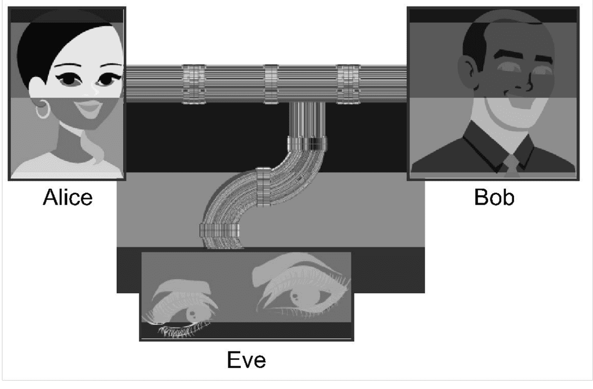

### Notation
- Secret key K
- Encryption function $E: C = E_K(P)$, here $C$ is the cipher text and $P$ is the plain text
- Decryption function $D: P = D_K(C)$
- Plaintext length typically the same as ciphertext length

### Efficiency
- functions $E_K$ and $D_K$ should have efficient algorithms

### Consistency
- Decrypting the ciphertext yields the plaintext
  $$ \bullet D_K(E_K(P))=P $$

## Cryptosystem attacks
- The science of attacking cryptosystems is known as cryptanalysis and its practitioners are called cryptanalysts
- In performing cryptanalysis, we assume that the cryptanalyst knows the algorithms for encryption and decryption
  - only the keys used are secret
- This assumption follows the open design principle
- The concept of achieving security by obscurity (e.g. a cryptanalyst does not know anything about algorithms) is likely to fail
- This because such information might leak in different ways:
  - internal company documents could be published or stolen,
  - a programmer who coded an encryption algorithm could be bribed or could voluntarily disclose the algorithm, or
  - the software or hardware that implements an encryption algorithm could be reverse engineered

### Ciphertext-only attack
- In this attack, the cryptanalyst has access to the ciphertext of one or more messages, all of which were encrypted using the same key, $K$
- His or her goal is to determine the plaintext for one or more of these ciphertexts or, better yet, to discover K

### Known-plaintext attack
- In this attack, the cryptanalyst has access to one or more plaintext-ciphertext pairs, such that each plaintext was encrypted using the same key, $K$
- His or her goal in this case is to determine the key, $K$

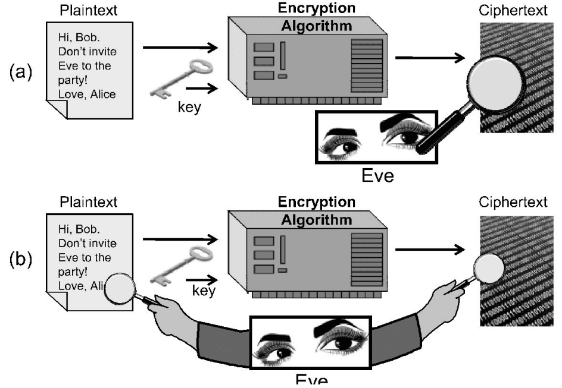

### Chosen-plaintext attack
- In this attack, the cryptanalyst can chose one or more plaintext messages and get the ciphertext that is associated with each one, based on the use of same key, $K$
- In the offline chosen-plaintext attack, the cryptanalyst must choose all the plaintexts in advance
- In the adaptive chosen-plaintext attack, the cryptanalyst can choose plaintexts in an iterative fashion, where each plaintext choice can be based on information he gained from previous plaintext encryptions

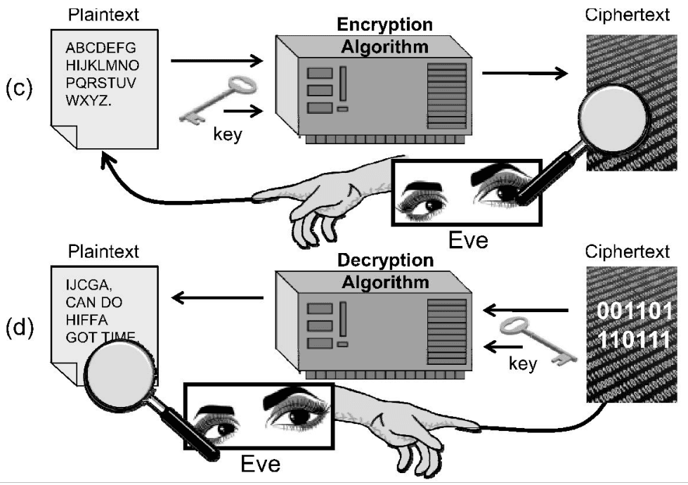

### Chosen-ciphertext attack
- In this attack, the cryptanalyst can choose one or more ciphertext messages and get the plaintext that is associated with each one, based on the use of same key, $K$
- As with the chosen-plaintext attack, this attack also has both offline and adaptive versions

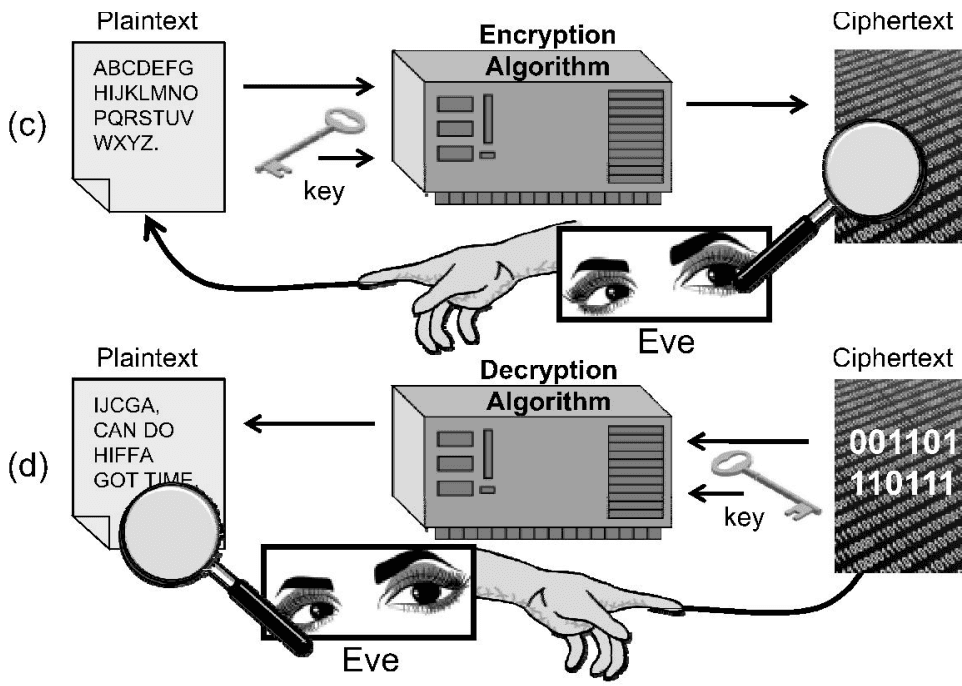

## Classic cipher: Substitution cipher
- Each letter is uniquely replaced by another
- Caesar cipher is an example of a substitution cipher utilised by Julius Caesar:
  - Here, each letter in the plaintext is shifted three letters on right
  - When it reaches the end, it is wrapped back at the beginning
  - The decryption would require a three left shift
- An example of a Caesar shift is given below:

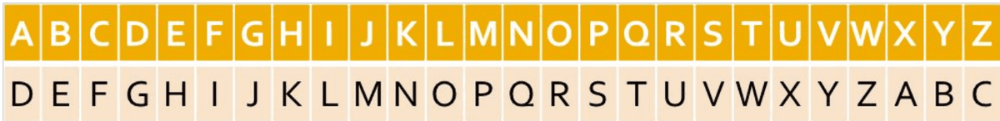

- A substitution cipher can be generalised in the following way:
  $$ \bullet E_k(x)=(x+k)\, mod\ 26 $$
  $$ \bullet D_k(x) = (x-k) \mod 26 $$
- For Caesar cipher, $k = 3$
- $k$ can be any value, however it is very easy to attack the system by brute forcing different values of $k$ until a meaningful message is found
- We can generalise this cipher so that each letter can have an arbitrary substitution, so long as all the substitutions are unique
- This approach greatly increases the key space; hence, increasing the security of the cryptosystem
- For example, with English plaintexts, there are 26! possible substitution ciphers
- 26! $\approx 4.03 \times 10^{26}$ such ciphers!

### Substitution cipher attack
- Even with this huge key space, a substitution cipher can be easily broken
- This is because letters in a natural language, like English, are not uniformly distributed
- Knowledge of letter frequencies, including pairs and triples can be used in cryptologic attacks against substitution ciphers
- For example, in English text, the letter “E” occurring just over 12% of the time, and “T” occurring less than 10% of the time
- The most frequently occurring character in a ciphertext created from English substitution cipher probably corresponds to the letter E and so on

| a: | 8.05% | b: | 1.67% | c: | 2.23% | d: | 5.10% |
| --- | --- | --- | --- | --- | --- | --- | --- |
| e: | 12.22% | f: | 2.14% | g: | 2.30% | h: | 6.62% |
| i: | 6.28% | j: | 0.19% | k: | 0.95% | l: | 4.08% |
| m: | 2.33% | n: | 6.95% | o: | 7.63% | p: | 1.66% |
| q: | 0.06% | r: | 5.29% | s: | 6.02% | t: | 9.67% |
| u: | 2.92% | v: | 0.82% | w: | 2.60% | x: | 0.11% |
| y: | 2.04% | z: | 0.06% |  |  |  |  |

Table 1: Letter frequencies in the book The Adventures of Tom Sawyer, by Mark Twain.

## Polygraphic substitution cipher
- A plaintext could be partitioned into strings of two letters each, that is, divided into digrams, and each digram substituted with a different and unique other digram to create the ciphertext
- Since there are $26^2 = 676$ possible English digrams, there are 676! possible key space
- This is a huge key space improvement!
- The problem with such keys, however, is that they are long
  - specifying an arbitrary digram substitution key requires that we write down the substitutions for all 676 digrams
- One easy way to express a digram substitution is using a two-dimensional table
- In such a table, the first letter in a pair would specify a row, the second letter in a pair would specify a column, and each entry would be the unique two-letter substitution to use for this pair.
- Such a specification is called a substitution box or S-box
- This approach can be extended for binary values.

|  | 00 | 01 | 10 | 11 |
| --- | --- | --- | --- | --- |
| 00 | 0011 | 0100 | 1111 | 0001 |
| 01 | 1010 | 0110 | 0101 | 1011 |
| 10 | 1110 | 1101 | 0100 | 0010 |
| 11 | 0111 | 0000 | 1001 | 1100 |

|  | 0 | 1 | 2 | 3 |
| --- | --- | --- | --- | --- |
| 0 | 3 | 8 | 15 | 1 |
| 1 | 10 | 6 | 5 | 11 |
| 2 | 14 | 13 | 4 | 2 |
| 3 | 7 | 0 | 9 | 12 |

Figure 3: A 4-bit S-box (a) An S-box in binary. (b) The same S-box in decimal. This particular S-box is used in the Serpent cryptosystem, which was a finalist to become AES, but was not chosen.

## Classic cipher: Vigenère cipher
- It applies to blocks of length $m$
- A key in this cryptosystem is a sequence of m shift amounts, $(k_1, k_2, \dots, k_m)$ using the modulo of the alphabet size (26 for English)
- Given a block of $m$ characters of plaintext, we encrypt the block by cyclically shifting the first character by $k_1$, the second by $k_2$, the third by $k_3$, and so on
- Thus, there are potentially m different substitutions for any given letter in the plaintext (depending on where in the plaintext the letter appears)
- Decryption is done by performing the reverse shifts on each block of $m$ characters in the ciphertext

|  | A | B | C | D | E | F | G | H | I | J | K | L | M | N | O | P | Q | R | S | T | U | V | W | X | Y | Z |
| --- | --- | --- | --- | --- | --- | --- | --- | --- | --- | --- | --- | --- | --- | --- | --- | --- | --- | --- | --- | --- | --- | --- | --- | --- | --- | --- |
| A | A | B | C | D | E | F | G | H | I | J | K | L | M | N | O | P | Q | R | S | T | U | V | W | X | Y | Z |
| B | B | C | D | E | F | G | H | I | J | K | L | M | N | O | P | Q | R | S | T | U | V | W | X | Y | Z | A |
| C | C | D | E | F | G | H | I | J | K | L | M | N | O | P | Q | R | S | T | U | V | W | X | Y | Z | A | B |
| D | D | E | F | G | H | I | J | K | L | M | N | O | P | Q | R | S | T | U | V | W | X | Y | Z | A | B | C |
| E | E | F | G | H | I | J | K | L | M | N | O | P | Q | R | S | T | U | V | W | X | Y | Z | A | B | C | D |
| F | F | G | H | I | J | K | L | M | N | O | P | Q | R | S | T | U | V | W | X | Y | Z | A | B | C | D | E |
| G | G | H | I | J | K | L | M | N | O | P | Q | R | S | T | U | V | W | X | Y | Z | A | B | C | D | E | F |
| H | H | I | J | K | L | M | N | O | P | Q | R | S | T | U | V | W | X | Y | Z | A | B | C | D | E | F | G |
| I | I | J | K | L | M | N | O | P | Q | R | S | T | U | V | W | X | Y | Z | A | B | C | D | E | F | G | H |
| J | J | K | L | M | N | O | P | Q | R | S | T | U | V | W | X | Y | Z | A | B | C | D | E | F | G | H | I |
| K | K | L | M | N | O | P | Q | R | S | T | U | V | W | X | Y | Z | A | B | C | D | E | F | G | H | I | J |
| L | L | M | N | O | P | Q | R | S | T | U | V | W | X | Y | Z | A | B | C | D | E | F | G | H | I | J | K |
| M | M | N | O | P | Q | R | S | T | U | V | W | X | Y | Z | A | B | C | D | E | F | G | H | I | J | K | L |
| N | N | O | P | Q | R | S | T | U | V | W | X | Y | Z | A | B | C | D | E | F | G | H | I | J | K | L | M |
| O | O | P | Q | R | S | T | U | V | W | X | Y | Z | A | B | C | D | E | F | G | H | I | J | K | L | M | N |
| P | P | Q | R | S | T | U | V | W | X | Y | Z | A | B | C | D | E | F | G | H | I | J | K | L | M | N | O |
| Q | Q | R | S | T | U | V | W | X | Y | Z | A | B | C | D | E | F | G | H | I | J | K | L | M | N | O | P |
| R | R | S | T | U | V | W | X | Y | Z | A | B | C | D | E | F | G | H | I | J | K | L | M | N | O | P | Q |
| S | S | T | U | V | W | X | Y | Z | A | B | C | D | E | F | G | H | I | J | K | L | M | N | O | P | Q | R |
| T | T | U | V | W | X | Y | Z | A | B | C | D | E | F | G | H | I | J | K | L | M | N | O | P | Q | R | S |
| U | U | V | W | X | Y | Z | A | B | C | D | E | F | G | H | I | J | K | L | M | N | O | P | Q | R | S | T |
| V | V | W | X | Y | Z | A | B | C | D | E | F | G | H | I | J | K | L | M | N | O | P | Q | R | S | T | U |
| W | W | X | Y | Z | A | B | C | D | E | F | G | H | I | J | K | L | M | N | O | P | Q | R | S | T | U | V |
| X | X | Y | Z | A | B | C | D | E | F | G | H | I | J | K | L | M | N | O | P | Q | R | S | T | U | V | W |
| Y | Y | Z | A | B | C | D | E | F | G | H | I | J | K | L | M | N | O | P | Q | R | S | T | U | V | W | X |
| Z | Z | A | B | C | D | E | F | G | H | I | J | K | L | M | N | O | P | Q | R | S | T | U | V | W | X | Y |

- Unfortunately, it can be easily broken using statistical techniques

## One-Time Pads
- There is one type of substitution cipher that is absolutely unbreakable
- The one-time pad was invented in 1917 by Joseph Mauborgne and Gilbert Vernam
- We use a block of shift keys, $(k_1, k_2, \dots, k_n)$ to encrypt a plaintext, M, of length n, with each shift key being chosen uniformly at random
- Since each shift is random, every ciphertext is equally likely for any plaintext
- In spite of their perfect security, one-time pads have some weaknesses
  - The key has to be as long as the plaintext
  - Keys can never be reused
- Repeated use of one-time pads allowed the U.S. to break some of the communications of Soviet spies during the Cold War

## Classic cipher – Hill cipher
- Hill cipher takes a block of m letters, each interpreted as a number from 0 to 25, and interprets this block as a vector of length m
- Thus, if $m = 3$ and a block is the string "CAT," then we would represent this
- block as the vector: $\vec{x} = \begin{bmatrix} 2 \\ 0 \\ 19 \end{bmatrix}$
- The cipher uses an $m \times m$ random matrix, $K$, as the key, provided that $K$ is invertible when we perform all arithmetic modulo 26
- The ciphertext vector, $\vec{c}$, for $\vec{x}$, is determined by the matrix equation
- $\vec{c} = K.\vec{x},$ denotes matric multiplication with all arithmetic is done modulo 26.
- The decryption is done this way: $\vec{x} = K^{-1}$. $\vec{c}$
- This holds, because: $K^{-1}.\vec{c} = K^{-1}(K.\vec{x}) = (K^{-1}.K).\vec{x} = \vec{1}.\vec{x} = \vec{x}$

## Block cipher
- In a block cipher:
  - Plaintext and ciphertext have fixed length b (e.g., 128 bits)
  - A plaintext of length $n$ is partitioned into a sequence of $m$ blocks, $P[0], \dots, P[m-1]$, where $n \le bm < n + b$
  - Each message is divided into a sequence of blocks and encrypted or decrypted in terms of its blocks

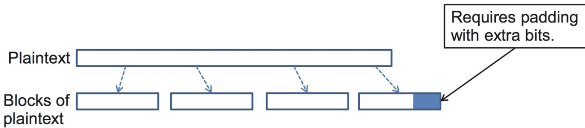

### Padding
- Block ciphers require the length n of the plaintext to be a multiple of the block size b
- Padding the last block needs to be unambiguous (cannot just add zeroes)
- When the block size and plaintext length are a multiple of 8, a common padding method (PKCS5) is a sequence of identical bytes, each indicating the length (in bytes) of the padding
- Example for b = 128 (16 bytes)
  - Plaintext: “Roberto” (7 bytes)
  - Padded plaintext: "Roberto999999999" (16 bytes), where 9 denotes the number and not the character
- We need to always pad the last block, which may consist only of padding
  - To remove any ambiguity if the message has a padding or not!

## Modes of operation
- There are several ways to use a block cipher, such as AES, that operate on fixed-length blocks
- The different ways such an encryption algorithm can be used are known as its modes of operation
- Four modes of operation:
  - Electronic Codebook (ECB) Mode
  - Cipher-Block Chaining (CBC) Mode
  - Cipher Feedback (CFB) Mode
  - Output Feedback (OFB) Mode

### Electronic Codebook (ECB) Mode
- This is the simplest mode
- In this mode, the encrypting of the block, $B_i$ is carried out according to the following formula: $C_i = E_K(B_i)$
- Likewise, the decryption is done using the following formula: $B_i = D_K(C_i)$

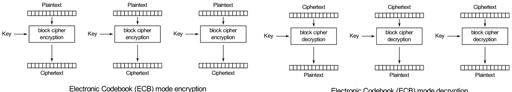
Source: https://en.wikipedia.org/wiki/Block_cipher_mode_of_operation

**Electronic Codebook (ECB) Mode: pros & cons**
- ECB mode works well with random strings (e.g., keys and initialization vectors) and strings that fit in one block
- Documents and images are not suitable for ECB encryption since patterns in the plaintext are repeated in the ciphertext
- Example of image encrypted in ECB :

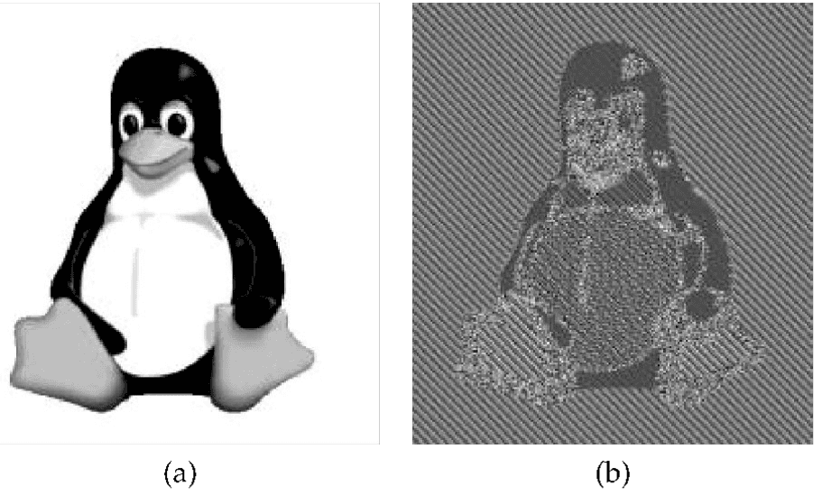
Figure 6: How ECB mode can leave identifiable patterns in a sequence of blocks: (a) An image of Tux the penguin, the Linux mascot. (b) An encryption of the Tux image using ECB mode.

### Cipher-block Chaining (CBC) Mode
- CBC mode avoids the revelation of patterns in a sequence of blocks
- In this mode, the first plaintext block, $B_1$, is XORed with an initialization vector, $C_0$, prior to being encrypted
- Each subsequent plaintext block is XORed with the previous ciphertext block prior to being encrypted
- That is, setting $C_0$ to the initialization vector, then $C_i = E_K(B_i$   $C_{i-1})$
- Decryption is done in the reverse manner: $B_i = D_K(C_i) \oplus C_{i-1}$

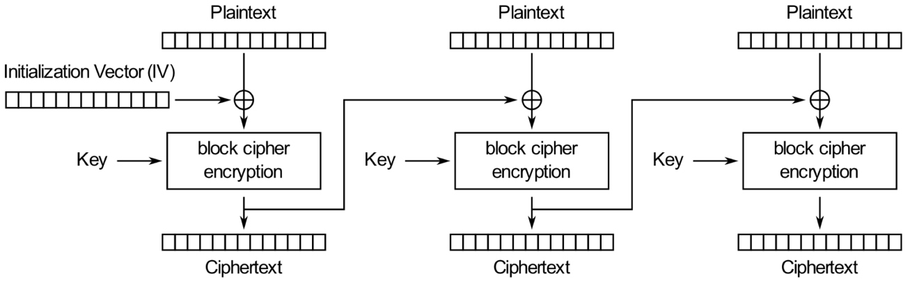
Cipher Block Chaining (CBC) mode encryption

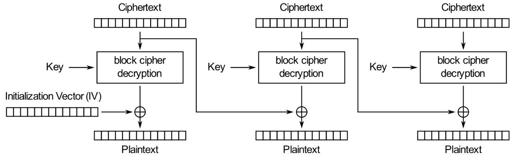
Cipher Block Chaining (CBC) mode decryption

**CBC Mode: pros & cons**
- **Strengths:**
  - Doesn't show patterns in the plaintext
  - Is the most common mode
  - Is fast and relatively simple
- **Weaknesses:**
  - CBC requires the reliable transmission of all the blocks sequentially
  - CBC is not suitable for applications that allow packet losses (e.g., music and video streaming)

### Cipher Feedback (CFB) Mode
- CFB is similar to that of the CBC mode
- Like the CBC, the encryption for block $B_i$ involves the encryption, $C_{i-1}$, of the previous block
- The encryption begins with an initialization vector, $C_0$
- It computes the encryption of the $i^{\text{th}}$ block as $C_i = E_K(C_{i-1}) \oplus B_i$
- Decryption: $B_i = E_K(C_{i-1})\oplus C_i$

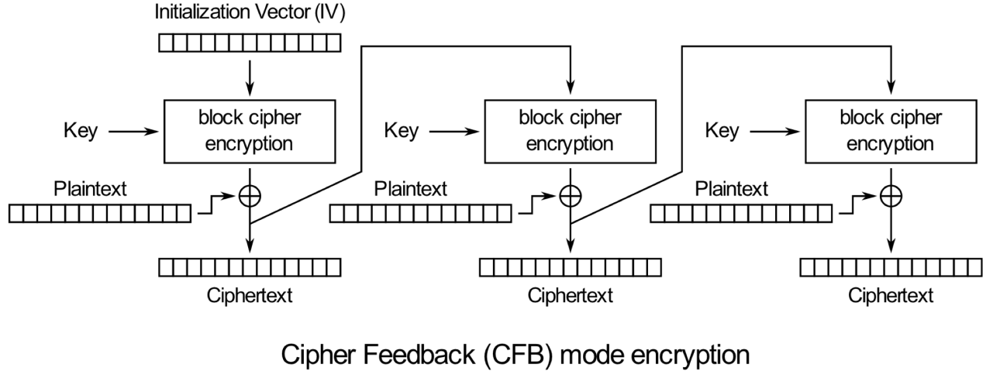
Cipher Feedback (CFB) mode encryption

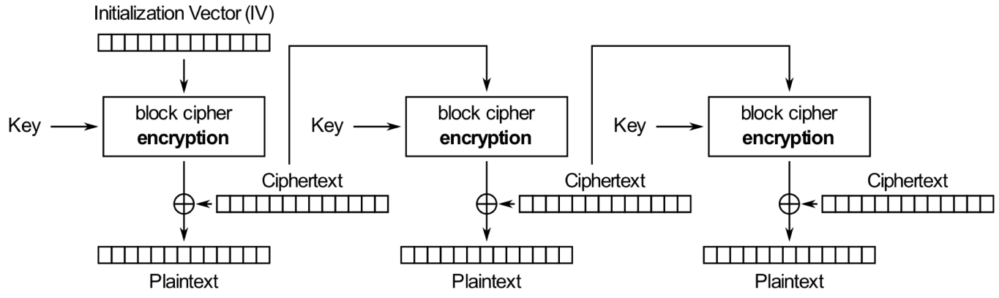
Cipher Feedback (CFB) mode decryption

### Output Feedback (OFB) Mode
- In OFB, a sequence of blocks is encrypted much as in the one-time pad, but with a sequence of blocks that are generated with the block cipher
- The encryption algorithm begins with an initialization vector, $V_0$. It then generates a sequence of vectors, $V_i = E_K(V_{i-1})$
- Given this sequence of pad vectors, we perform block encryptions as follows: $C_i = V_i \oplus B_i$.
- Likewise, we perform block decryptions as follows: $B_i = V_i \oplus C_i$
- This mode of operation can tolerate block losses, and it can be performed in parallel, both for encryption and decryption, provided the sequence of pad vectors has already been computed

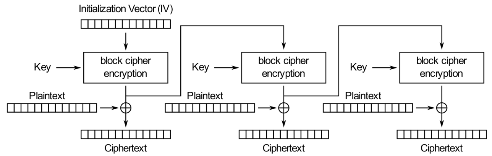
Output Feedback (OFB) mode encryption

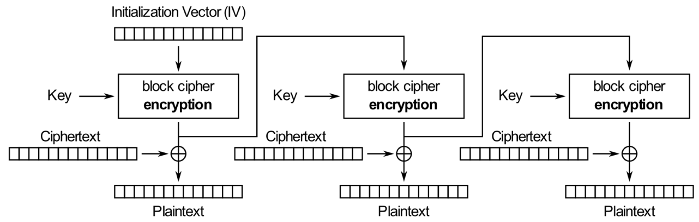
Output Feedback (OFB) mode decryption

