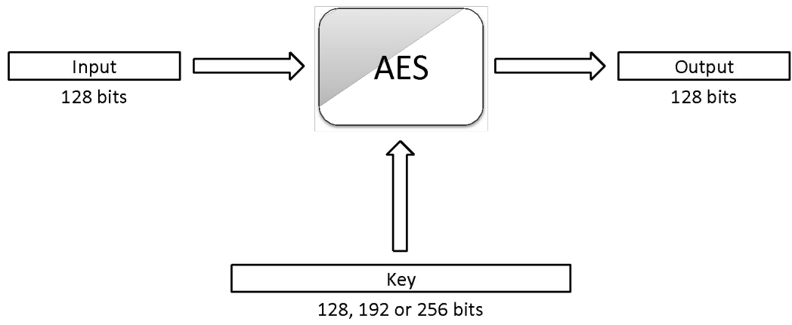
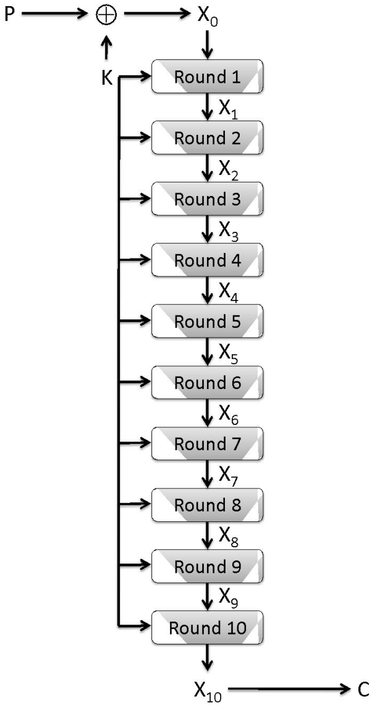
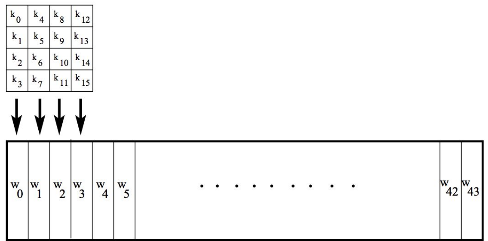
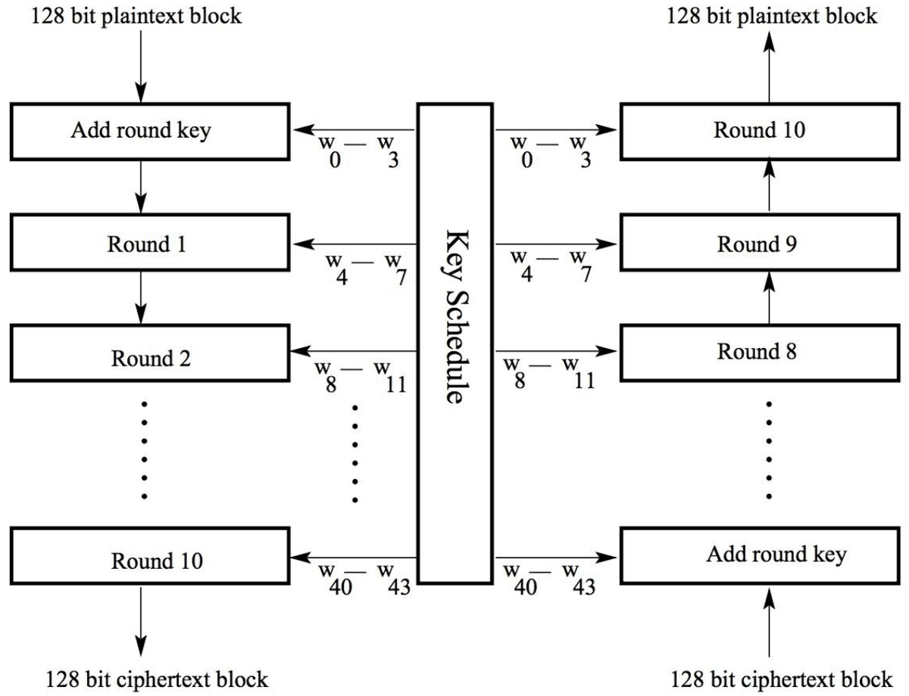
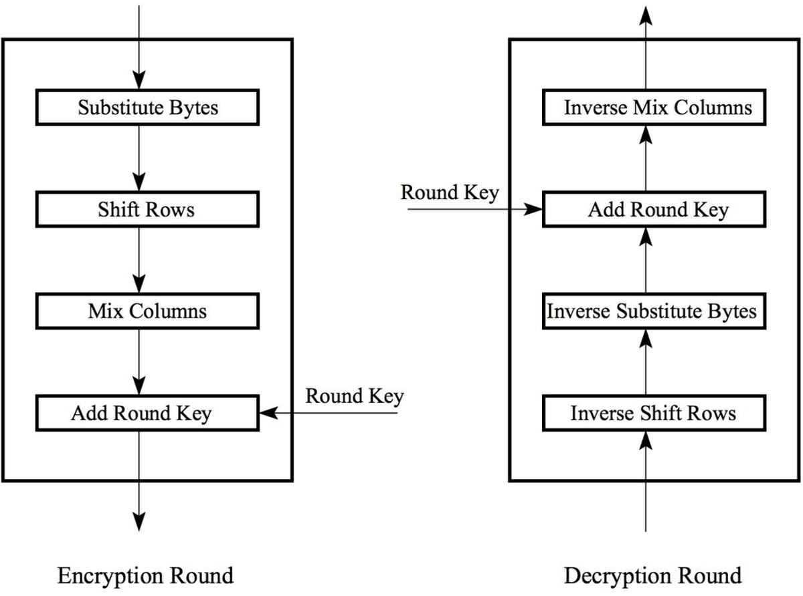
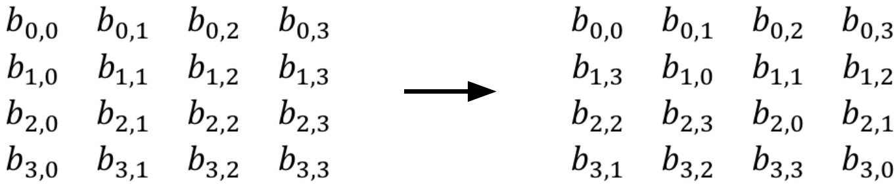
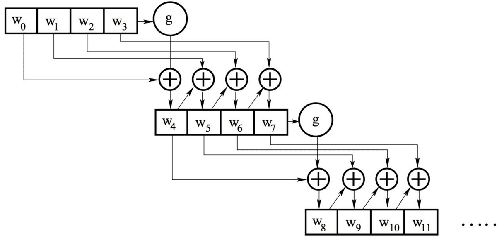
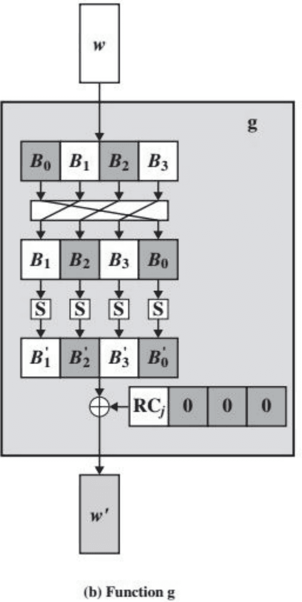
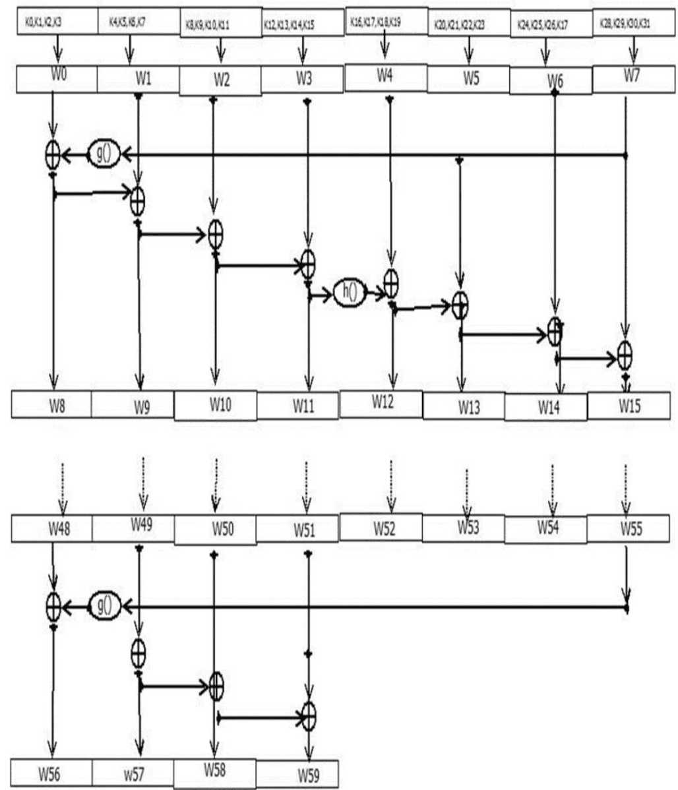

# Advanced Encryption Standard (AES)

## Outline
- AES

## Block cipher in practice

### Data Encryption Standard (DES)
- Developed by IBM and adopted by NIST in 1977
- 64-bit blocks and 56-bit keys
- Small key space makes exhaustive search attack feasible since late 90s

### Triple DES (3DES)
- Nested application of DES with three different keys $K_A$, $K_B$ and $K_C$
- Effective key length is 168 bits, making exhaustive search attacks unfeasible
  $$ C = E_{K_C} \left( D_{K_B} \left( E_{K_A}(P) \right) \right), \quad P = D_{K_A} \left( E_{K_B} \left( D_{K_C}(C) \right) \right) $$
- Equivalent to DES when $K_A = K_B = K_C$ (backward compatible)

### Advanced Encryption Standard (AES)
- Selected by NIST in 2001 through open international competition and public discussion
- 128-bit blocks and several possible key lengths: 128, 192 and 256 bits
- Exhaustive search attack not currently possible
- AES-256 is the symmetric encryption algorithm of choice

## AES
- NIST put out a public call for a replacement of the symmetric encryption algorithm DES in 1997
- Five finalists: Rijndael (“Rhine doll”), designed by Joan Daemen and Vincent Rijmen, MARS from IBM, RC6 from RSA Security, Serpent by Ross Anderson, Eli Biham, and Lars Knudsen and Twofish by a team led by Bruce Schneider
- Rijndael was ultimately chosen as the new standard the Advanced Encryption Standard (AES)
- AES is a block cipher that operates on 128-bit blocks
- designed to be used with keys that are 128, 192, or 256 bits long, yielding ciphers known as AES-128, AES-192, and AES-256

### The State Array
- The 128-bit version of the AES encryption algorithm proceeds in ten rounds
- Each round performs an invertible transformation on a 128-bit array, called state
- The initial state $X_0$ is the XOR of the plaintext P with the key K:
  $$ X_0=P \oplus K $$
- This is the initial add round key step
- Round i (i = 1, ..., 10) receives state $X_{i-1}$ as input and produces state $X_i$
- The ciphertext C is the output of the final round: $C = X_{10}$

- To provide some structure to the 128-bit blocks it operates on, the AES algorithm views each such block, starting with the 128-bit block of plaintext, as 16 bytes of 8 bits each
  $$ (a_{0,0},a_{1,0},a_{2,0},a_{3,0},a_{0,1},a_{1,1},a_{2,1},a_{3,1},a_{0,2},a_{1,2},a_{2,2},a_{3,2},a_{0,3},a_{1,3},a_{2,3},a_{3,3}) $$
- This is arranged in column-major order into a $4 \times 4$ matrix as follows:
  $$ \begin{bmatrix} a_{0,0}& a_{0,1}& a_{0,2}& a_{0,3}\\ a_{1,0}& a_{1,1}& a_{1,2}& a_{1,3}\\ a_{2,0}& a_{2,1}& a_{2,2}& a_{2,3}\\ a_{3,0}& a_{3,1}& a_{3,2}& a_{3,3}\end{bmatrix} = \begin{bmatrix} byte_0 & byte_4 & byte_8 & byte_{12} \\ byte_1 & byte_5 & byte_9 & byte_{13} \\ byte_2 & byte_6 & byte_{10} & byte_{14} \\ byte_3 & byte_7 & byte_{11} & byte_{15} \end{bmatrix} $$
- AES also has the notion of a word consisting of four bytes, that is 32 bits.
- Therefore, each column of the state array is a word, as is each row
- Each round of processing works on the input state array and produces an output state array

## AES – Key Expansion
- Assuming a 128-bit key, the key is also arranged in the form of an array of $4 \times 4$ bytes
- As with the input block, the first word from the key fills the first column of the array, and so on
- The four column words of the key array are expanded into a schedule of 44 words
- Each round consumes four words from the key schedule
- The figure depicts the arrangement of the encryption key in the form of 4-byte words and the expansion of the key into a key schedule consisting of 44 4-byte words
- Of these, the first four words are used for adding to the input state array before any round-based processing can begin, and the remaining 40 words used for the ten rounds of processing that are required for the case a 128-bit encryption key.

## AES - Overall Encryption and Decryption

AES Encryption and Decryption

- Each round is built from four basic steps:
  1. **SubBytes step:** an S-box substitution step
  2. **ShiftRows step:** a permutation step
  3. **MixColumns step:** a matrix multiplication step
  4. **AddRoundKey step:** an XOR step with a round key derived from the 128-bit encryption key
- For encryption and decryption, the sequence of these steps change according to the side figure

## AES – SubBytes Step
- In the SubBytes step, each byte in the matrix is substituted with a replacement byte according to the substitution box known as S-box shown
- This results in the following transformation:
  $$ \begin{bmatrix} a_{0,0}&a_{0,1}&a_{0,2}&a_{0,3}\\ a_{1,0}&a_{1,1}&a_{1,2}&a_{1,3}\\ a_{2,0}&a_{2,1}&a_{2,2}&a_{2,3}\\ a_{3,0}&a_{3,1}&a_{3,2}&a_{3,3}\end{bmatrix} \rightarrow \begin{bmatrix} b_{0,0}&b_{0,1}&b_{0,2}&b_{0,3}\\ b_{1,0}&b_{1,1}&b_{1,2}&b_{1,3}\\ b_{2,0}&b_{2,1}&b_{2,2}&b_{2,3}\\ b_{3,0}&b_{3,1}&b_{3,2}&b_{3,3}\end{bmatrix} $$
- This S-box is actually a lookup table for a mathematical equation on 8-bit binary words that operates in an esoteric (abstract) number system known as $GF(2^8)$,
- GF stands for Galois Field, pronounced as Geloa

|  | 0 | 1 | 2 | 3 | 4 | 5 | 6 | 7 | 8 | 9 | a | b | c | d | e | f |
| --- | --- | --- | --- | --- | --- | --- | --- | --- | --- | --- | --- | --- | --- | --- | --- | --- |
| 0 | 63 | 7c | 77 | 7b | f2 | 6b | 6f | c5 | 30 | 01 | 67 | 2b | fe | d7 | ab | 76 |
| 1 | ca | 82 | c9 | 7d | fa | 59 | 47 | f0 | ad | d4 | a2 | af | 9c | a4 | 72 | c0 |
| 2 | b7 | fd | 93 | 26 | 36 | 3f | f7 | cc | 34 | a5 | e5 | f1 | 71 | d8 | 31 | 15 |
| 3 | 04 | c7 | 23 | c3 | 18 | 96 | 05 | 9a | 07 | 12 | 80 | e2 | eb | 27 | b2 | 75 |
| 4 | 09 | 83 | 2c | 1a | 1b | 6e | 5a | a0 | 52 | 3b | d6 | b3 | 29 | e3 | 2f | 84 |
| 5 | 53 | d1 | 00 | ed | 20 | fc | b1 | 5b | 6a | cb | be | 39 | 4a | 4c | 58 | cf |
| 6 | d0 | ef | aa | fb | 43 | 4d | 33 | 85 | 45 | f9 | 02 | 7f | 50 | 3c | 9f | a8 |
| 7 | 51 | a3 | 40 | 8f | 92 | 9d | 38 | f5 | bc | b6 | da | 21 | 10 | ff | f3 | d2 |
| 8 | cd | 0c | 13 | ec | 5f | 97 | 44 | 17 | c4 | a7 | 7e | 3d | 64 | 5d | 19 | 73 |
| 9 | 60 | 81 | 4f | dc | 22 | 2a | 90 | 88 | 46 | ee | b8 | 14 | de | 5e | 0b | db |
| a | e0 | 32 | 3a | 0a | 49 | 06 | 24 | 5c | c2 | d3 | ac | 62 | 91 | 95 | e4 | 79 |
| b | e7 | c8 | 37 | 6d | 8d | d5 | 4e | a9 | 6c | 56 | f4 | ea | 65 | 7a | ae | 08 |
| c | ba | 78 | 25 | 2e | 1c | a6 | b4 | c6 | e8 | dd | 74 | 1f | 4b | bd | 8b | 8a |
| d | 70 | 3e | b5 | 66 | 48 | 03 | f6 | 0e | 61 | 35 | 57 | b9 | 86 | c1 | 1d | 9e |
| e | e1 | f8 | 98 | 11 | 69 | d9 | 8e | 94 | 9b | 1e | 87 | e9 | ce | 55 | 28 | df |
| f | 8c | a1 | 89 | 0d | bf | e6 | 42 | 68 | 41 | 99 | 2d | 0f | b0 | 54 | bb | 16 |

## AES – ShiftRows Step
- The ShiftRows step is a simple permutation, which has the effect of mixing up the bytes in each row of the $4 \times 4$ matrix output from the SubBytes step
- The permutation amounts to a cyclical shift of each row of the $4 \times 4$ matrix so that the first row is shifted left by 0, the second is shifted left by 1, the third is shifted left by 2, and the fourth is shifted left by 3, as follows:
  $$ \begin{bmatrix} b_{0,0} & b_{0,1} & b_{0,2} & b_{0,3} \\ b_{1,0} & b_{1,1} & b_{1,2} & b_{1,3} \\ b_{2,0} & b_{2,1} & b_{2,2} & b_{2,3} \\ b_{3,0} & b_{3,1} & b_{3,2} & b_{3,3} \end{bmatrix} \quad \rightarrow \quad \begin{bmatrix} b_{0,0} & b_{0,1} & b_{0,2} & b_{0,3} \\ b_{1,1} & b_{1,2} & b_{1,3} & b_{1,0} \\ b_{2,2} & b_{2,3} & b_{2,0} & b_{2,1} \\ b_{3,3} & b_{3,0} & b_{3,1} & b_{3,2} \end{bmatrix} = \begin{bmatrix} c_{0,0} & c_{0,1} & c_{0,2} & c_{0,3} \\ c_{1,0} & c_{1,1} & c_{1,2} & c_{1,3} \\ c_{2,0} & c_{2,1} & c_{2,2} & c_{2,3} \\ c_{3,0} & c_{3,1} & c_{3,2} & c_{3,3} \end{bmatrix} $$
- For decryption, the corresponding step shifts the rows in exactly the opposite fashion
- The first row is left unchanged, the second row is shifted to the right by one byte, the third row to the right by two bytes, and the last row to the right by three bytes, all shifts being circular

## AES – MixColumns Step
- The MixColumns Step mixes up the information in each column of the $4 \times 4$ matrix output from the ShiftRows step
- It does this mixing by applying what amounts to a Hill-cipher matrix-multiplication transformation applied to each column, using the $GF(2^8)$ number system
- In other words, this step replaces each byte of a column by a function of all the bytes in the same column
- More precisely, each byte in a column is replaced by two times that byte, plus three times the next byte, plus the byte that comes next, plus the byte that follows
- For the bytes in the first row of the state array, this operation can be stated as
  $$ b^{\prime}_{0,j}=(0x02\wedge s_{0,j})\oplus(0x03\wedge s_{1,j})\oplus s_{2,j} \oplus s_{3,j} $$
- Here, `0x02` implies `00000010` and `0x03` implies `00000011`
- For the bytes in the second row of the state array, this operation can be stated as
  $$ b^{\prime}_{1,j}=s_{0,j}\oplus(0x02\wedge s_{1,j})\oplus(0x03\wedge s_{2,j})\oplus s_{3,j} $$
- For the third row:
  $$ b^{\prime}_{2,j}=s_{0,j}\oplus s_{1,j}\oplus(0x02\wedge s_{2,j})\oplus(0x03\wedge s_{3,j}) $$
- For the fourth row:
  $$ b^{\prime}_{3,j}=(0x03\wedge s_{0,j})\oplus s_{1,j}\oplus s_{2,j}\oplus(0x02\wedge s_{3,j}) $$

$$ \begin{bmatrix} 00000010 & 00000011 & 00000001 & 00000001 \\ 00000001 & 00000010 & 00000011 & 00000001 \\ 00000001 & 00000001 & 00000010 & 00000011 \\ 00000011 & 00000001 & 00000001 & 00000010 \end{bmatrix} \cdot \begin{bmatrix} c_{0,0} & c_{0,1} & c_{0,2} & c_{0,3} \\ c_{1,0} & c_{1,1} & c_{1,2} & c_{1,3} \\ c_{2,0} & c_{2,1} & c_{2,2} & c_{2,3} \\ c_{3,0} & c_{3,1} & c_{3,2} & c_{3,3} \end{bmatrix} $$

- For decryption, the following matrix is multiplied with the $4 \times 4$ matrix
  $$ \begin{bmatrix} 0E & 0B & 0D & 09 \\ 09 & 0E & 0B & 0D \\ 0D & 09 & 0E & 0B \\ 0B & 0D & 09 & 0E \end{bmatrix} $$

## AES – AddRoundKey Step
- In the AddRoundKey step, we exclusive-or the result from previous steps with a set of keys derived from the 128-bit secret key
- The operation of the AddRoundKey step, therefore, can be expressed as follows:
  $$ \begin{bmatrix} d_{0,0} & d_{0,1} & d_{0,2} & d_{0,3} \\ d_{1,0} & d_{1,1} & d_{1,2} & d_{1,3} \\ d_{2,0} & d_{2,1} & d_{2,2} & d_{2,3} \\ d_{3,0} & d_{3,1} & d_{3,2} & d_{3,3} \end{bmatrix} \oplus \begin{bmatrix} k_{0,0} & k_{0,1} & k_{0,2} & k_{0,3} \\ k_{1,0} & k_{1,1} & k_{1,2} & k_{1,3} \\ k_{2,0} & k_{2,1} & k_{2,2} & k_{2,3} \\ k_{3,0} & k_{3,1} & k_{3,2} & k_{3,3} \end{bmatrix} = \begin{bmatrix} e_{0,0} & e_{0,1} & e_{0,2} & e_{0,3} \\ e_{1,0} & e_{1,1} & e_{1,2} & e_{1,3} \\ e_{2,0} & e_{2,1} & e_{2,2} & e_{2,3} \\ e_{3,0} & e_{3,1} & e_{3,2} & e_{3,3} \end{bmatrix} $$
- The critical part of performing this step is determining how the matrix of keys, $k_{i,j}$, for this round, are derived from the single 128-bit secret key, $K$

## AES – Key Expansion Details
- Each round has its own round key that is derived from the original 128-bit encryption key
- One of the four steps of each round, for both encryption and decryption, involves XORing of the round key with the state array
- The AES Key Expansion algorithm is used to derive the 128-bit round key for each round from the original 128-bit encryption key
- The logic of the key expansion algorithm is designed to ensure that if you change one bit of the encryption key, it should affect the round keys for several rounds
- At first, the algorithm first arranges the 16 bytes of the encryption key in the form of a $4 \times 4$ array of bytes, similar to the plain text
- The first four bytes of the encryption key constitute the word $w_0$, the next four bytes the word $w_1$, and so on
- The algorithm subsequently expands the words $[w_0, w_1, w_2, w_3]$ into a 44-word key schedule that can be labelled $w_0, w_1, w_2, w_3, \dots, w_{43}$
- Of these, the words $[w_0, w_1, w_2, w_3]$ are bitwise XOR'ed with the input block before the round-based processing begins
- The remaining 40 words of the key schedule are used four words at a time in each of the 10 rounds
- The above two statements are also true for decryption in reverse order
  $$ \begin{bmatrix} k_0 & k_4 & k_8 & k_{12} \\ k_1 & k_5 & k_9 & k_{13} \\ k_2 & k_6 & k_{10} & k_{14} \\ k_3 & k_7 & k_{11} & k_{15} \end{bmatrix} \rightarrow \begin{matrix} \downarrow \\ [w_0 \quad w_1 \quad w_2 \quad w_3] \end{matrix} $$
- The key expansion takes place on a four-word to four-word basis, in the sense that each grouping of four words decides what the next grouping of four words will be

- Let's say that we have the four words of the round key for the $i^{th}$ round: $w_i \quad w_{i+1} \quad w_{i+2} \quad w_{i+3}$
- For these to serve as the round key for the $i^{th}$ round, i must be a multiple of 4
- These will obviously serve as the round key for the $(i/4)^{th}$ round
- For example, $w_4, w_5, w_6, w_7$ is the round key for round 1, the sequence of words $w_8, w_9, w_{10}, w_{11}$ the round key for round 2, and so on
- Now we need to determine the words $w_{i+4} \quad w_{i+5} \quad w_{i+6} \quad w_{i+7}$ from the words $w_i \quad w_{i+1} \quad w_{i+2} \quad w_{i+3}$
- Except for the first word in a new 4-word grouping, each word is an XOR of the previous word and the corresponding word in the previous 4-word grouping.
  $$ w_{i+5} = w_{i+4} \oplus w_{i+1} $$
  $$ w_{i+6} = w_{i+5} \oplus w_{i+2} $$
  $$ w_{i+7} = w_{i+6} \oplus w_{i+3} $$
- So now we only need to figure out $w_{i+4}$
- This is the beginning word of each 4-word grouping in the key expansion
- The beginning word of each round key is obtained by:
  $$ w_{i+4} = w_i \oplus g(w_{i+3}) $$
- Here, $\oplus$ signifies an XOR operation
- That is, the first word of the new 4-word grouping is to be obtained by XOR'ing the first word of the last grouping with what is returned by applying a function `g()` to the last word of the previous 4-word grouping
- The function `g()` consists of the following functionalities
  - Perform a one-byte left circular rotation on the argument 4-byte word
  - Perform a byte substitution for each byte of the word returned by the previous step by using the same $16 \times 16$ lookup table as used in the SubBytes step
  - XOR the bytes obtained from the previous step with what is known as a round constant
- The round constant is a word whose three rightmost bytes are always zero
- Therefore, XOR'ing with the round constant amounts to XOR'ing with just its leftmost byte

- The round constant for the $i^{th}$ round is denoted `Rcon[i]`
- Since, by specification, the three rightmost bytes of the round constant are zero, we can write it as shown below
  `Rcon[i] = (RC[i], 0x00, 0x00, 0x00)`
- The only non-zero byte in the round constants, `RC[i]`, obeys the following recursion:
  $$ RC[1] = 0\text{x}01 $$
  $$ RC[j] = 0\text{x}02 \times RC[j-1] $$
- The addition of the round constants is for the purpose of destroying any symmetries that may have been introduced by the other steps in the key expansion algorithm
- A key length of 192 bits entails 12 rounds and a key length of 256 bits entails 14 rounds
- However, the length of the input block remains unchanged at 128 bits.
- The key expansion algorithm must obviously generate a longer schedule
  - For the 192 bit key it requires 12 rounds
  - For the 256 bit keys it requires 14 rounds
- Keeping in mind how we used the key schedule for the case of a 128 bit key
  - we are going to need 52 words in the key schedule for the case of 192-bit keys and
  - 60 words for the case of 256-bit keys

### AES – Key Expansion: 256 bits

Figure 4: 256 bit key Genration

## Attacks on AES
- AES is considered a highly secure symmetric cryptosystem
- Indeed, the only known practical attacks on AES are side channel attacks
  - A side-channel attack is any attack based on information gained from the implementation of a computer system, rather than weaknesses in the implemented algorithm itself
- A side channel attack on AES is timing attack
- Variations of such an attack were independently discovered in 2005 by Bernstein and by Osvik, Shamir, and Tromer
- Recall that to speed up the running time of AES, the algorithm is implemented using lookup tables
- The timing attack is based on the fact that the cache of the processor where the AES algorithm is executed will store portions of the lookup tables used in the implementation of AES
- Thus, the time it takes to execute the algorithm provides information about how the lookup tables are accessed
- By timing multiple executions of the algorithm using the same key on a series of known plaintexts of known ciphertexts, the attacker can eventually learn the key
- If the attacker is on the same system where AES is executed, the key can be recovered in less than a second
- If the attacker and the AES computation are on different machines, recovering the key takes several hours
- To defend against timing attacks, AES should be implemented in a way that the execution time remains constant, irrespective of the cache architecture

