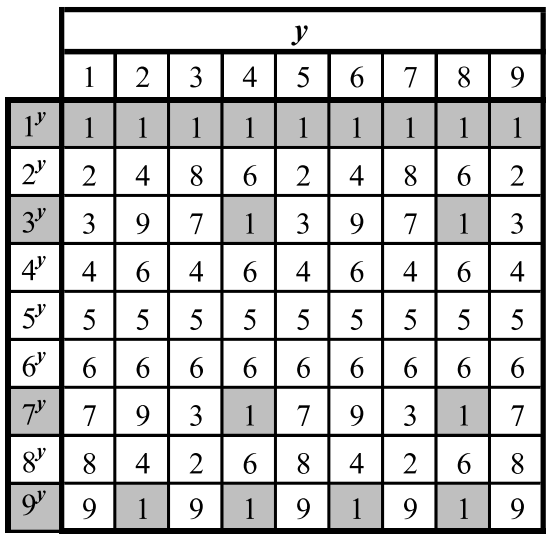
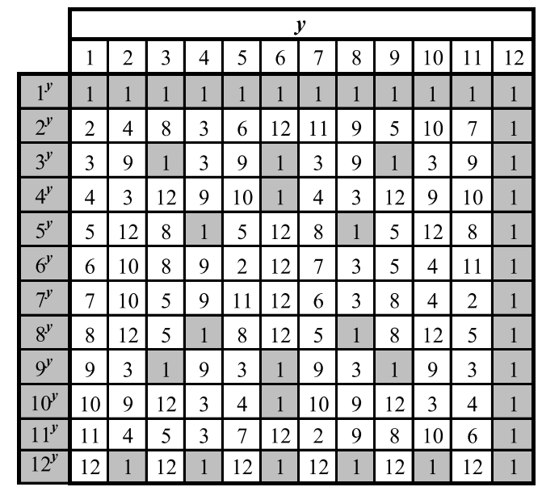
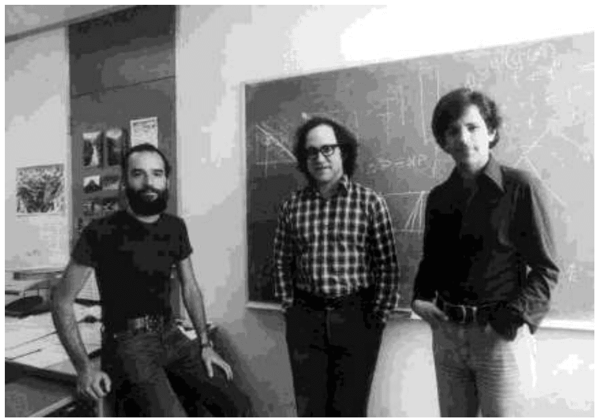
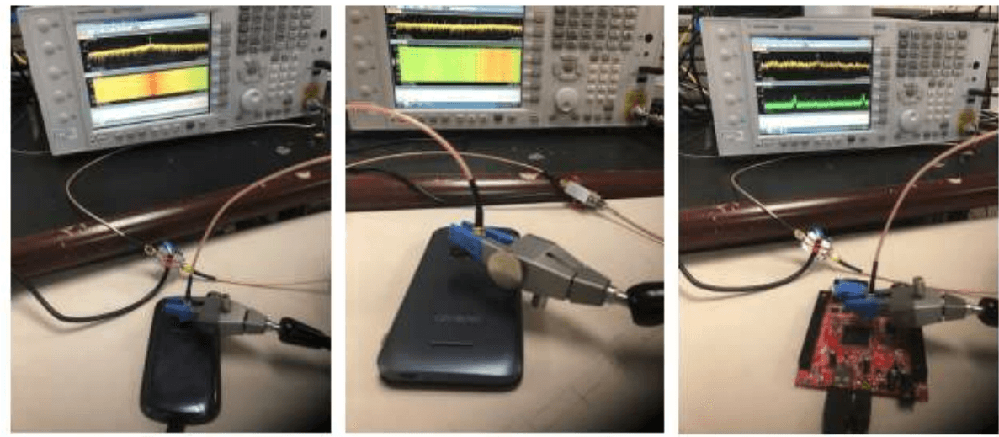

# RSA Cryptosystem & Number Theory

## Outline
- Number theory review
- RSA Cryptosystem
- RSA Implementation

## Prime numbers
- **Prime number $p$:**
  - $p$ is an integer (Integers are like whole numbers, but they also include negative numbers, but no fractions allowed)
  - $p \ge 2$
  - The only divisors of $p$ are 1 and $p$
- **Examples:**
  - 2, 7, 19 are primes
  - -3, 0, 1, 6 are not primes
- **Prime decomposition (aka factorization)** of a positive integer $n$:
  $$ n=p_1^{e_1} \times p_2^{e_2} \times \dots \times p_k^{e_k} $$
- **Example:**
  $$ 200 = 2^3 \times 5^2 $$
- **Fundamental Theorem of Arithmetic:**
  - The prime decomposition of a positive integer is unique

## Greatest Common Divisor (GCD)
- The greatest common divisor (GCD) of two integers a and b, denoted $\text{gcd}(a, b)$, is the largest positive integer that divides both a and b
- **Examples:**
  - $\text{gcd}(18, 30) = 6$
  - $\text{gcd}(0, 20) = 20$
  - $\text{gcd}(-21, 49) = 7$
- Two integers a and b are said to be relatively prime if $\text{gcd}(a, b) = 1$.
- **Example:**
  - 15 and 28 are relatively prime, as $\text{gcd}(15,28) = 1$

## Modular arithmetic
- **Modulo operator** for a positive integer $n$:
  $$ r = a \bmod n $$
  here, $r$ and $a$ are integers and $r$ is the reminder
- It is equivalent to: $a = r + kn$
- Here, $k$ is the quotient, also denoted with $q$
- **Example:**
  $$ \begin{aligned} 29 \bmod 13 &= 3 \\ 13 \bmod 13 &= 0 \\ -1 \bmod 13 &= 12 \end{aligned} $$
  $$ \begin{aligned} 29 &= 3 + 2 \times 13 \\ 13 &= 0 + 1 \times 13 \\ -1 &= 12 + (-1) \times 13 \end{aligned} $$
- **Modulo and GCD:**
  - $\text{gcd}(a, b) = \text{gcd}(b, a \bmod b)$
- **Example:**
  $$ \begin{aligned} \text{gcd}(21, 12) &= 3 \\ \text{gcd}(12, 21 \bmod 12) &= \text{gcd}(12, 9) = 3 \end{aligned} $$

### Euclid's GCD algorithm
- Euclid’s algorithm for computing the GCD repeatedly applies the formula:
  $$ \text{gcd}(a, b) = \text{gcd}(b, a \bmod b) $$
- **Example:** $\text{gcd}(412, 260) = 4$

**Algorithm EuclidGCD(a,b)**
Input integers $a$ and $b$
Output $\text{gcd}(a,b)$
```text
if b == 0
  return a
else
  return EuclidGCD(b, a mod b)
```

| a | 412 | 260 | 152 | 108 | 44 | 20 | 4 |
| --- | --- | --- | --- | --- | --- | --- | --- |
| b | 260 | 152 | 108 | 44 | 20 | 4 | 0 |

## Multiplicative Inverse
- The residues modulo a positive integer $n$ are the set
  $$ Z_n=\{ 0,1,2,\dots,(n-1)\} $$
- Let $x$ and $y$ be two elements of $Z_n$ such that: $xy \bmod n = 1$.
- Then we say that $y$ is the multiplicative inverse of $x$ in $Z_n$
- and we write $y = x^{-1} \bmod n$
- **Example:**
  - Multiplicative inverses of the residues modulo 11

| x | 0 | 1 | 2 | 3 | 4 | 5 | 6 | 7 | 8 | 9 | 10 |
| --- | --- | --- | --- | --- | --- | --- | --- | --- | --- | --- | --- |
| $x^{-1}$ |  | 1 | 6 | 4 | 3 | 9 | 2 | 8 | 7 | 5 | 10 |

### Multiplicative Inverse Theorem
- **Theorem:**
  - An element $x$ of $Z_n$ has a multiplicative inverse if and only if $x$ and $n$ are relatively prime
- **Example:**
  - The elements of $Z_{10}$ with a multiplicative inverse are 1, 3, 7, 9

| x | 0 | 1 | 2 | 3 | 4 | 5 | 6 | 7 | 8 | 9 |
| --- | --- | --- | --- | --- | --- | --- | --- | --- | --- | --- |
| $x^{-1}$ |  | 1 |  | 7 |  |  |  | 3 |  | 9 |

- **Corollary:**
  - If $p$ is prime, every nonzero residue in $Z_p$ has a multiplicative inverse

| x | 0 | 1 | 2 | 3 | 4 | 5 | 6 | 7 | 8 | 9 | 10 |
| --- | --- | --- | --- | --- | --- | --- | --- | --- | --- | --- | --- |
| $x^{-1}$ |  | 1 | 6 | 4 | 3 | 9 | 2 | 8 | 7 | 5 | 10 |

## Modular exponentiation
- The form $x^y \bmod n$ is called the modular exponentiation
- It has several properties
- If $n$ is not prime, e.g. $n = 10$, there are modular powers equal to 1 only for the elements of $Z_n$ that are relatively prime with $n$
  - That is, those elements whose gcd with $n$ is 1
  - For $n = 10$, these elements are 1, 3, 7, 9
- If $n$ is prime, e.g. $n = 13$, every nonzero element of $Z_n$ has a power equal to 1





### Fermat’s Little Theorem
- **Theorem:**
  - Let $p$ be a prime. For each nonzero residue $x$ of $Z_p$, we have
    $$ x^{p-1} \bmod p = 1 $$
- **Example (p = 5):**
  $$ \begin{aligned} 1^4 \bmod 5 &= 1 \\ 2^4 \bmod 5 &= 16 \bmod 5 = 1 \\ 3^4 \bmod 5 &= 81 \bmod 5 = 1 \\ 4^4 \bmod 5 &= 256 \bmod 5 = 1 \end{aligned} $$
- **Corollary:**
  - Let $p$ be a prime. For each nonzero residue $x$ of $Z_p$, the multiplicative inverse of $x$ is $x^{p-2} \bmod p$
- **Proof:**
  $$ x(x^{p-2}) \bmod p = x^{p-1} \bmod p = 1 $$

### Euler’s Theorem
- The multiplicative group of $Z_n$, denoted with $Z_n^*$, is the subset of elements of $Z_n$ relatively prime with $n$
- The totient function of $n$, denoted with $\Phi(n)$ is the size of $Z_n^*$, $\Phi(n) = |Z_n^*|$
- **Example:**
  $$ Z_{10}^* = \{1,3,7,9\} \qquad \Phi(10) = 4 $$
- If $p$ is prime, we have:
  $$ \begin{aligned} Z_p^* &= \{1,2,3, \dots, (p-1)\} \\ \Phi(p) &= p-1 \end{aligned} $$
- **Theorem:**
  - For each element $x$ of $Z_n^*$ we have: $x^{\Phi(n)} \bmod n = 1$
- **Example (n = 10):**
  $$ \begin{aligned} 3^{\Phi(10)} \bmod 10 &= 3^4 \bmod 10 = 81 \bmod 10 = 1 \\ 7^{\Phi(10)} \bmod 10 &= 7^4 \bmod 10 = 2401 \bmod 10 = 1 \\ 9^{\Phi(10)} \bmod 10 &= 9^4 \bmod 10 = 6561 \bmod 10 = 1 \end{aligned} $$

## RSA Cryptosystem
- RSA is named after its inventors, Ronald Rivest, Adi Shamir, and Leonard Adleman
- First published in 1977
- It is based on the practical difficulty of the factorization of the product of two large prime numbers
- One of the most widely used cryptosystems
- Because of its implications, the inventors have received Turing prize in 2002, the so-called Noble prize of CS



Figure 10: The inventors of the RSA cryptosystem, from left to right, Adi Shamir, Ron Rivest, and Len Adleman, who received the Turing Award in 2002 for this achievement.

### RSA Setup
- $n = pq$, here $p$ and $q$ should be large prime numbers (e.g. 1024 digits)
- $e$ is chosen such that it is relatively prime to $\Phi(n)$
- That is $\gcd(e, \Phi(n)) = 1$
  $$ \Phi(n) = \Phi(p)\Phi(q) = (p-1)(q-1) $$
- $d$ is inverse of $e$ in $Z_{\Phi(n)}$
- That is $de \bmod \Phi(n) = 1$

### Keys
- **Public key:** $K_e = (n, e)$
- **Private key:** $K_d = d$

### Encryption
- Plaintext, $M$
- Ciphertext, $C = M^e \bmod n$

### Decryption
- $M = C^d \bmod n$

### Setup Example 1
- $p = 7, q = 17$
- $n = 7 \times 17 = 119$
- $\Phi(n)=(p-1)(q-1)=6 \times 16=96$
- $e=5$
- $d = 77$

- **Keys:**
  - Public key: (119,5)
  - Private key: 77

- **Encryption:**
  - $M = 19$
  - $C = 19^5 \bmod 119 = 66$

- **Decryption:**
  - $M=66^{77} \bmod 119=19$

### Setup Example 2
- $p = 5, q = 11$
- $n = 5 \times 11 = 55$
- $\Phi(n) = 4 \times 10 = 40$
- $e = 3$
- $d = 27$ (Since $3 \times 27 = 81 = 2 \times 40 + 1$)

- **Encryption:**
  $$ C = M^3 \bmod 55 $$

- **Decryption:**
  $$ M = C^{27} \bmod 55 $$

| M | 1 | 2 | 3 | 4 | 5 | 6 | 7 | 8 | 9 | 10 | 11 | 12 | 13 | 14 | 15 | 16 | 17 | 18 |
| --- | --- | --- | --- | --- | --- | --- | --- | --- | --- | --- | --- | --- | --- | --- | --- | --- | --- | --- |
| C | 1 | 8 | 27 | 9 | 15 | 51 | 13 | 17 | 14 | 10 | 11 | 23 | 52 | 49 | 20 | 26 | 18 | 2 |
| M | 19 | 20 | 21 | 22 | 23 | 24 | 25 | 26 | 27 | 28 | 29 | 30 | 31 | 32 | 33 | 34 | 35 | 36 |
| C | 39 | 25 | 21 | 33 | 12 | 19 | 5 | 31 | 48 | 7 | 24 | 50 | 36 | 43 | 22 | 34 | 30 | 16 |
| M | 37 | 38 | 39 | 40 | 41 | 42 | 43 | 44 | 45 | 46 | 47 | 48 | 49 | 50 | 51 | 52 | 53 | 54 |
| C | 53 | 37 | 29 | 35 | 6 | 3 | 32 | 44 | 45 | 41 | 38 | 42 | 4 | 40 | 46 | 28 | 47 | 54 |

## RSA Correctness
- Ciphertext, $C = M^e \bmod n$ with the assumption that $\gcd(M,n) = 1$.
- We need to show that $C^d \bmod n = M$
- Since $ed \bmod \Phi(n) = 1$, there is an integer $k$ such that:
  $$ ed = k\Phi(n) + 1 $$
- Since $M$ is relatively prime with $n$, we get the following from Euler's theorem:
  $$ M^{\Phi(n)} \bmod n = 1 $$
- Now,
  $$ C^d \bmod n = M^{ed} \bmod n = M^{k\Phi(n)+1} \bmod n $$
  $$ = M \cdot M^{k\Phi(n)} \bmod n = M(M^{\Phi(n)})^k \bmod n = M \cdot 1^k = M $$

## RSA Security
- The security of the RSA cryptosystem is based on the difficulty of finding $d$, given $e$ and $n$
- If we knew $\varphi(n) = (p-1)(q-1)$, it would be easy to compute $d$ from $e$.
- Thus, Bob needs to keep $p$ and $q$ secret (or even destroy all knowledge of them), since anyone who knows the values of $p$ and $q$ immediately knows the value of $\varphi(n)$
- Anyone who knows the value of $\varphi(n)$ can compute $d = e^{-1} \bmod \varphi(n)$, using the extended Euclidean algorithm
- Thus, the security of the RSA cryptosystem is closely tied to factoring $n$, which would reveal the values of $p$ and $q$
- Fortunately, since this problem has shown itself to be hard to solve, we can continue to rely on the security of the RSA cryptosystem, provided we use a large enough modulus

### Security Milestones
- In 1999, 512-bit challenge factored in 4 months using 35.7 CPU-years
  - 160 175-400 MHz SGI and Sun
  - 8 250 MHz SGI Origin
  - 120 300-450 MHz Pentium II
  - 4 500 MHz Digital/Compaq
- In 2005, a team of researchers factored the RSA-640 challenge number using 30 2.2GHz CPU years
- In 2004, the prize for factoring RSA-2048 was $200,000
- Current practice is 2,048-bit keys
- Estimated resources needed to factor a number within one year:

| Length (bits) | PCs | Memory |
| --- | --- | --- |
| 430 | 1 | 128MB |
| 760 | 215,000 | 4GB |
| 1020 | $342 \times 10^{6}$ | 170GB |
| 1620 | $1.6 \times 10^{15}$ | 120TB |

- Side channel attacks have also been demonstrated on RSA, based on measuring the time taken by decryption and/or the power consumption of the CPU performing the operation
- A very recent (30 August, 2018) research presented at USENIX'18, authors were able to retrieve the encryption keys from mobile device within seconds and without physical access to the devices
- The attack recovers the exponent's bits during modular exponentiation from analog signals that are unintentionally produced by the processor
- https://www.usenix.org/system/files/conference/usenixsecurity18/sec18-alam.pdf



## RSA Determinism
- We must take some care in how we use the RSA cryptosystem, however, because of its deterministic nature
- For example, suppose we use the RSA algorithm to encrypt two plaintext messages, $M_1$ and $M_2$, into the respective ciphertexts, $C_1$ and $C_2$, using the same public key
- Because RSA is deterministic, we know that, in this case, if $C_1 = C_2$, then $M_1 = M_2$
- Unfortunately, this fact could allow a cryptanalyst to infer information from ciphertexts encrypted from supposedly different plaintexts
- There is an alternative cryptosystem which can handle this issue

## RSA Implementation
- The implementation of the RSA cryptosystem requires various algorithms
- **Overall:**
  - Representation of integers of arbitrarily large size and arithmetic operations on them
- **Encryption:**
  - Modular power
- **Decryption:**
  - Modular power
- **Setup:**
  - Generation of random numbers with a given number of bits (to generate candidates p and q)
  - Primality testing (to check that candidates p and q are prime)
  - Computation of the GCD (to verify that e and $\Phi(n)$ are relatively prime)
  - Computation of the multiplicative inverse (to compute d from e)

### Repeated squaring
- RSA requires modular exponentiation in the form of $x^y \bmod n$ for its encryption and decryption functions
- One simple approach to calculate $x^y$ then perform the modular operation
- This is fully impractical in case y is large, as in the case of RSA
- Let's assume that we would like to compute $2^{1234} \bmod 789$
- If we compute $2^{1234}$ at first and then reduce it to 789, we will need to deal with very large numbers even though the final will contain only 3 digits
- Another approach could be
  - Perform each multiplication and then calculate the remainder
- But it would require to perform the multiplication 1234 times which will be too slow to be practical
- In such cases, another method is utilised called repeated squaring

$$ \begin{aligned} 2^2 \bmod 789 &= 4 \\ 2^4 \bmod 789 &= 4^2 = 16 \\ 2^8 \bmod 789 &= 16^2 = 256 \\ 2^{16} \bmod 789 &= 256^2 = 49 \\ 2^{32} \bmod 789 &= 49^2 = 34 \\ 2^{64} \bmod 789 &= 34^2 = 367 \\ 2^{128} \bmod 789 &= 367^2 = 559 \\ 2^{256} \bmod 789 &= 559^2 = 37 \\ 2^{512} \bmod 789 &= 37^2 = 580 \\ 2^{1024} \bmod 789 &= 580^2 = 286 \end{aligned} $$

$$ \begin{aligned} 1234 &= 1024 + 128 + 64 + 16 + 2 \\ 2^{1234} &= 2^{1024+128+64+16+2} \\ &= 2^{1024} \cdot 2^{128} \cdot 2^{64} \cdot 2^{16} \cdot 2^2 \\ &= 286 \cdot 559 \cdot 367 \cdot 49 \cdot 4 \bmod 789 \\ &= 481 \end{aligned} $$

- If we want compute $a^b \bmod n$
  - We can do it with at most $2 \log_2(b)$ multiplications mod n
  - We never have to deal with numbers larger than $n^2$

## Multiplicative inverse calculation
- Given integers $a$ and $b$, there are integers $i$ and $j$ such that
  $$ ia + jb = \gcd(a, b) = d $$
- **Example:** $a=21, b=15, d=3, i=3, j=-4$
  $$ 3=3 \times 21 + (-4)15 = 63 - 60 = 3 $$
- Given positive integers a and b, the extended Euclid's algorithm computes a triplet $(d,i,j)$ such that
  - $d = \text{gcd}(a,b)$
  - $d = ia + jb$
- To test the existence of and compute the inverse of $x \in Z_n$,
  - we execute the extended Euclid's algorithm on the input pair $(x,n)$
- Let $(d,i,j)$ be the triplet returned where $d = ix + jn$
- If $d = 1$, i is the multiplicative inverse of x in $Z_n$
- If $d > 1$, x has no inverse in $Z_n$

## Primality testing
- Yet another important computation that is often used in modern cryptography is primality testing
- In this instance, we are given a positive integer, $n$, and we want to determine if $n$ is prime or not
- Fortunately, there are efficient methods for performing such tests.
- None of these methods actually factor $n$
- They just indicate whether $n$ is prime or not.

### Fermat Primality Test:
- Let $p > 1$ be an integer. Choose a random integer $a$ with $1 < a < p - 1$.
- If $a^{p-1} \bmod p \neq 1$, then $p$ is composite
- If $a^{p-1} \bmod p = 1$, then $p$ is probably prime.
- Given an efficient way of performing primality testing, actually generating a random prime number is relatively easy
- This simplicity is due to an important fact about numbers
  - the number of prime numbers between 1 and any number $n$ is at least $n/\ln n$, for $n \ge 4$
- Selecting a random number between the range, check for its primality.
- if we repeat this process a logarithmic number of times, testing each number generated for primality, then one of our generated numbers is expected to be prime

## Typical RSA use-case
- Even with an efficient implementation, the RSA cryptosystem is orders-of-magnitude slower than the AES symmetric cryptosystem
- Thus, a standard approach to encryption is as follows:
  - Encrypt a secret key, K, with the RSA cryptosystem for the AES symmetric cryptosystem
  - Encrypt with AES using key $K$
  - Transmit the RSA-encrypted key together with the AES-encrypted document.
- The above method illustrates a common use of public-key cryptography in conjunction with a symmetric cryptosystem


