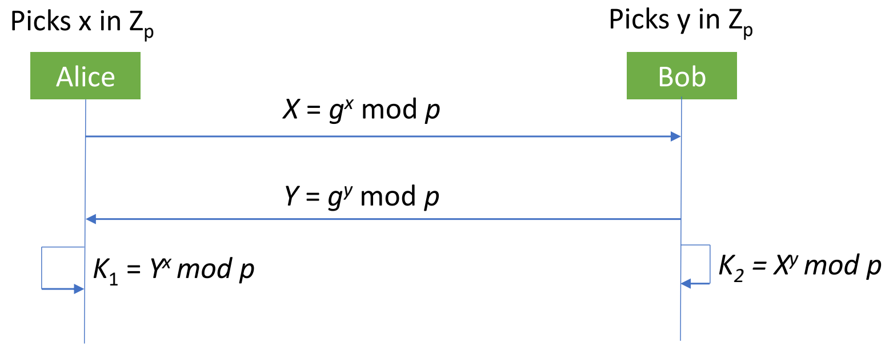
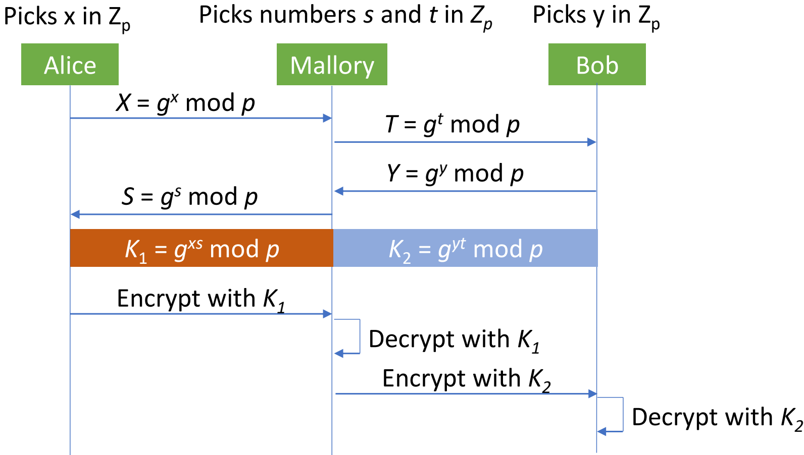
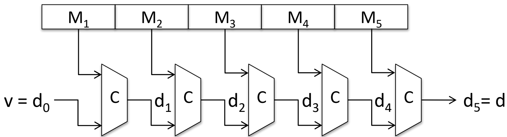
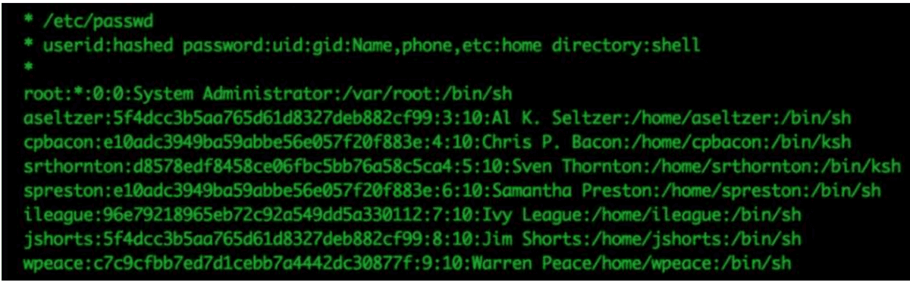
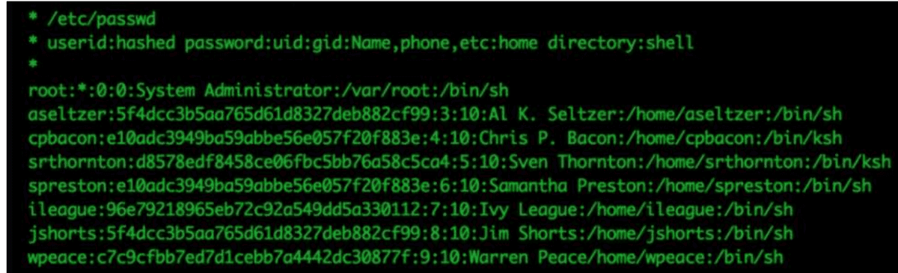
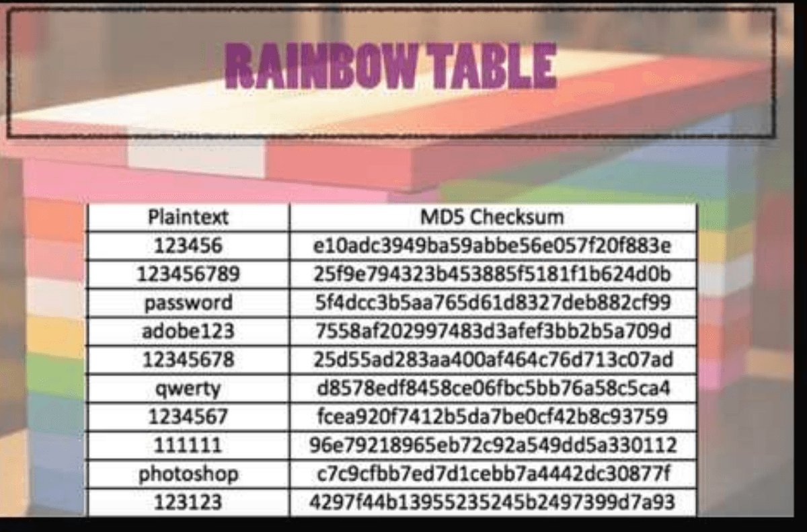

# Elgamal, DH Key Exchange & Hash Functions

## Outline
- Elgamal Crypto System
- Key Exchange
- Hash Function

## Elgamal cryptosystem
- The Elgamal cryptosystem, named after its inventor, Taher Elgamal, is a public-key cryptosystem that uses randomisation
- Enabling independent encryptions of the same plaintext to produce different ciphertexts.
- In the number system $Z_p$, all arithmetic is done modulo a prime number, $p$
- A number, g in $Z_p$, is said to be a generator or primitive root modulo p if, for each positive integer k in $Z_p$, k is in range [0, p-2], there is a unique integer i such that $i = g^k \bmod p$
- **For example,**
  - 3 is a primitive root modulo 7
    $$ \begin{aligned} 3^0 \bmod 7 &= 1 \\ 3^1 \bmod 7 &= 3 \\ 3^2 \bmod 7 &= 2 \\ 3^3 \bmod 7 &= 6 \\ 3^4 \bmod 7 &= 4 \\ 3^5 \bmod 7 &= 5 \end{aligned} $$
  - Here, you get all the possible results: 1,3,2,6,4,5
  - 3 is not a primitive root modulo 11
    $$ \begin{aligned} 3^0 \bmod 11 &= 1 \\ 3^1 \bmod 11 &= 3 \\ 3^2 \bmod 11 &= 9 \\ 3^3 \bmod 11 &= 5 \\ 3^4 \bmod 11 &= 4 \\ 3^5 \bmod 11 &= 1 \end{aligned} $$
  - You get 1, 3, 9, 5, 4 and this sequence repeats after $3^5$

- It turns out that there are $\varphi(\varphi(p)) = \varphi(p-1)$ generators for $Z_p$.
- So we can test different numbers until we find one that is a generator
- Once we have a generator $g$, we can efficiently compute $x = g^k \bmod p$, for any value $k$
- Conversely, given x, g, and p, the problem of determining k such that $x = g^k \bmod p$ is known as the **discrete logarithm problem**
- Like factoring, the discrete logarithm problem is widely believed to be computationally hard
- The security of the Elgamal cryptosystem depends on the difficulty of the discrete logarithm problem

### Setup
- Bob chooses a random large prime number, $p$, and finds a generator, $g$, for $Z_p$
- He then picks a random number, x, between 1 and p - 2, and computes $y = g^x \bmod p$.
- The number, x, is Bob's secret key
- His public key is the triple $(p, g, y)$
- When Alice wants to encrypt a plaintext message, M, for Bob, she begins by getting his public key, (p, g, y)
- She then generates a random number, k, between 1 and p - 2
- She then uses modular multiplication and exponentiation to compute two numbers:
  $$ \begin{aligned} a &= g^k \pmod p \\ b &= My^k \bmod p \end{aligned} $$
- The encryption of M is the pair $(a,b)$

### Decryption
- The decryption can be carried out by Bob in the following manner:
  $$ M = b(a^x)^{-1} \bmod p $$
- **Correctness:**
  $$ \begin{aligned} b(a^x)^{-1} \bmod p &= My^k (g^{kx})^{-1} \bmod p \\ &= M(g^x)^k g^{-kx} \bmod p \\ &= Mg^{kx} g^{-kx} \bmod p \\ &= M \bmod p = M \end{aligned} $$

### Security and Key Exchange properties
- Note that Bob doesn't need to know the random value, k, to decrypt a message that was encrypted using this value
- And Alice didn't need to know Bob's secret key to encrypt the message for him in the first place
- Instead, Alice got $g^x$, as $y$, from Bob's public key, and Bob got $g^k$, as $a$, from Alice's ciphertext
- Alice raised y to the power k and Bob raised a to the power x, and in so doing they implicitly computed a type of one-time shared key, $g^{xk}$
- which Alice used for encryption and Bob used for decryption
- The security of this scheme is based on the fact that, without knowing x, it would be very difficult for an eavesdropper to decrypt the ciphertext, (a, b)
- Since everyone knows $y = g^x \bmod p$, from Bob's public key, the security of this scheme is therefore related to the difficulty of solving the discrete logarithm problem
- That is, Elgamal could be broken by an eavesdropper finding the secret key, x
- This can be only done by solving the discrete logarithm problem which is believed to computationally hard
- Note that an Elgamal encryption is dependent on the choice of the random number, $k$
- Different k should be chosen for different message encryption
- If k is reused she would be leaking information much like the one-time pad would leak information if we were to reuse a pad

## Key exchange
- The use of a symmetric cryptosystem requires that Alice and Bob agree on a secret key before they can send encrypted messages to each other
- Accomplish it by the one-time use of a private communication channel, such as an in-person meeting in a private room, or mailing in tamper-proof containers
- A key exchange protocol, which is also called key agreement protocol, is a cryptographic approach
- to establish a shared secret key by communicating solely over an insecure channel, without any previous private communication
- Intuitively, the existence of a key exchange protocol appears unlikely.
- as the adversary can arbitrarily disrupt the communication between Alice and Bob
- Indeed, it can be shown that no key exchange protocol exists if the adversary can actively modify messages sent over the insecure channel
- Nevertheless, key exchange can be successfully accomplished if the adversary is limited to only passive eavesdropping on messages

## Diffie-Hellman key exchange protocol (DH protocol)
- The classic Diffie-Hellman key exchange protocol (DH protocol), which is named after its inventors, Whitfield Diffie and Martin Hellman
- based on modular exponentiation
- Assumed two public parameters have been established and are known to all participants (including the attacker):
- a prime number, $p$, and a generator $g$, for $Z_p$
- Alice picks a random number $x \in Z_p$
- Bob picks a random number $y \in Z_p$

- The secret key essentially is $K = g^{xy} \bmod p$
- **Proof:**
  $$ K_1 = Y^x \bmod p = (g^y)^x \bmod p = (g^x)^y \bmod p = X^y \bmod p = K_2 $$
- The security of the DH protocol is based on the assumption
- It is difficult for the attacker to determine the key K from the public parameters and the eavesdropped values X and Y

### DH Protocol Example
- Alice and Bob agree on $p = 23$ and $g = 5$
- Alice chooses $x = 6$ and sends $5^6 \bmod 23 = 8$ as $X$
- Bob chooses y = 15 and sends $5^{15} \bmod 23 = 19$ as Y
- Alice computes $K_1 = 19^6 \bmod 23 = 2$
- Bob computes $8^{15} \bmod 23 = 2$
- 2 is their shared secret!
- Clearly, much larger values of x, y, and p are required

### Attack on DH protocol
- Even though it is secure against a passive attacker, the DH protocol is vulnerable to a man-in-the-middle attack if the attacker can intercept and modify the messages exchanged by Alice and Bob

## Cryptographic Hash Functions
- A cryptographic hash function produces a compressed digest of a message with three properties: deterministic, one-way, and collision-resistant
- Deterministic property will ensure that a fixed input will produce a same output
- The hash value should be significantly smaller than a typical message.
- For example, the commonly used standard hash function SHA-256 produces hash values with 256 bits
- The digest will be such that changing one bit of input should potentially impact every bit of output, known as diffusion
- A hash function utilises several of the techniques employed in symmetric encryption, including substitution, permutation, exclusive-or, and iteration, in a way that provides the required diffusion

### Hash Function: one way
- That is, given a message, $M$, it should be easy to compute a hash value, $H(M)$, from that message
- However, given only a value, x, it should be difficult to find a message, M, such that x = H(M)

### Hash Function: collision resistance
- A hash function, $H$, is a mapping of input strings to (smaller) output strings
- We say that $H$ has **weak collision resistance** if, given any message, $M$, it is computationally difficult to find another message, $M' \neq M$, such that
  $$ H(M') = H(M) $$
- Hash function $H$ has **strong collision resistance** if it is computationally difficult to compute two distinct messages, $M_1$ and $M_2$, such that
  $$ H(M_1) = H(M_2) $$
- That is, in weak collision resistance, we are trying to avoid a collision with a specific message, and in strong collision resistance we are trying to avoid collisions in general
- It is usually a challenge to prove that real-world cryptographic hash functions have strong collision resistance

### Hash Function: construction
- A hash function utilises a building block called cryptographic compression function C(X, Y)
- C takes as input two strings, X and Y, where X has fixed length m and Y has fixed length n
- produces a hash value of length $n$
- Given a message $M$, we divide $M$ into multiple blocks, $M_1, M_2, \dots, M_k$, each of length $m$
- The last block is padded in an unambiguous way with additional bits to make it of length $m$
- For block $M_1$, input $M_1$ with a fixed string $v$ of length $n$, known as the initialization vector, to $C$
  - Denote, $d_1 = C(M_1,v)$
- Next, we apply the compression function to block $M_2$ and $d_1$
  - resulting in $d_2 = C(M_2, d_1)$
- These go on for all k blocks
- Final hash value, $H = d_k$
- Known as the **Merkle-Damgård construction**
- Ralph Merkle & Ivan Damgård

### Hash Function: practical implementation
- The currently recommended hash function for cryptographic applications are the SHA-256 and SHA-512 standardised by NIST
- SHA stands for “Secure Hash Algorithm”
- The numeric suffix refers to the length of the hash value
- Utilises the Merkle-Damgård construction
- SHA-256 employs a compression function with inputs of:
  - $m = 512$ bits and $n = 256$ bits and produces hash values of $n = 256$ bits
- For SHA-512: $m = 1,024$ and $n = 512$
- MD5 (Message Digest 5) hash function is still widely used in legacy applications
- However, it is considered insecure as several attacks against it have been demonstrated
- For example, one can generate different PDF files or executable files with the same MD5 hash, a major vulnerability!

### Hash Function: birthday attack
- The main way that cryptographic hash functions are attacked with is by compromising their collision resistance
- Sometimes this is done by careful cryptanalysis of the algorithms used to perform cryptographic hashing
- But it can also be done by using a brute-force technique known as a birthday attack
- This attack is based on a nonintuitive statistical phenomenon that states that as soon as there are more than 23 people in a room, there is better than a 50-50 chance that two of the people have the same birthday
- If there are more than 60 people in a room, it is almost certain that two of them share a birthday
- Here, sharing birthday represents finding a collision
- The problem is to compute the approximate probability that in a group of $n$ people, at least two have the same birthday
- The goal is to compute $P(A)$
  - the probability that at least two people in the room have the same birthday.
- However, it is simpler to calculate $P(A')$
  - the probability that no two people in the room have the same birthday
- Because $A$ and $A'$ are the only two possibilities and are also mutually exclusive, $P(A) = 1 - P(A')$
- When events are independent of each other, the probability of all of the events occurring is equal to a product of the probabilities of each of the events occurring
- $P(A')$ can be described as 23 independent events
  $$ P(A') = P(1) \times P(2) \times P(3) \times \dots \times P(23) $$
- For Event 1, there are no previously analysed people
- The probability, $P(1)$, that Person 1 does not share his/her birthday with previously analysed people is 1, or 100% or 365/365 ignoring leap years
- For Event 2, the probability, $P(2)$, that Person 2 has a different birthday than Person 1 is 364/365
- For Event 3, the probability, $P(3)$, that Person 3 has a different birthday than Person 1 and Person 2 is 363/365

$$ \begin{aligned} P(A') &= \frac{365}{365} \times \frac{364}{365} \times \frac{363}{365} \times \dots \times \frac{343}{365} \\ &= \left(\frac{1}{365}\right)^{23} \times (365 \times 364 \times \dots \times 343) \\ &= 0.492703 \end{aligned} $$

$$ P(A) = 1 - P(A') = 1 - 0.492703 = 0.507297 \text{ or } 50.7\% > 50\% $$

### Hash Function: rainbow table attack
- Hash functions is widely used in password hashing
- In your OS, passwords of users are stored as hashes so that no one can ever retrieve the passwords when the PC is compromised
- Similarly, passwords must be stored as hashes within a DB
- Consider a web application that requires sign up (registration) and subsequent sign in of users
- During the registration process, the provided password must be hashed in the source (at the client end within the browser) using client side JS
- The hashed password must be stored in the DB
- Similarly during the sign in process, passwords must be hashed at the source and transmitted the hashed version
- If we know the type or properties of hashed data, then it is prone to rainbow table attack
- A **rainbow table** is a precomputed table for caching the output of cryptographic hash functions, usually for cracking password hashes

